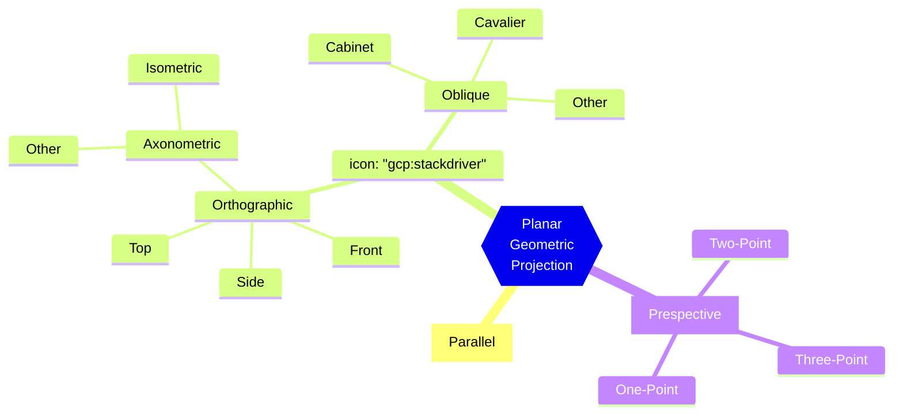

>[!tldr] Idea
>La fase di ***Projection Transform*** prende in input i vertici `3D` in `VCS` (Output del [[View Transform]]), e restituisce in output le coordinate di schermo `2D` visibili nello ***screen space***.

> Clipping #addLink 
- Il volume di spazio tra i piani di clipping anteriore e posteriore definisce *cosa può vedere la telecamera*.
- Gli oggetti che appaiono al di *fuori* del volume di vista ***non vengono disegnati***.
- Gli oggetti che *intersecano* il volume di vista ***vengono tagliati***.

## Le Proiezioni
---
>[!definizione]
>Si dice ***proiezione*** una [[Sistemi di Riferimento#Trasformazioni Geometriche|trasformazione geometrica]] con il dominio in uno spazio di dimensione $n$ e il codominio in uno spazio di dimensione $n-1$ (*o minore*).

La proiezione di un oggetto `3D` è definita da un insieme di rette di proiezione, dette *proiettori*.
- I proiettori hanno un origine comune, il ***centro di proiezione***.
- I proiettori passano per tutti i punti dell'oggetto e intersecano un ***piano di proiezione*** per formare la *proiezione*.

![[Projection.png]]

Questo tipo di proiezione (***proiezioni geometriche piane***) sono caratterizzate dal fatto che:
- I *proiettori* sono ***rette***.
- La *proiezione* è su di un ***piano***.

### Classi di Proiezione
> Ci sono due classi di vase in cui si possono suddividere le proiezioni geometriche piane.

#### Proiezioni Parallele
>[!info]
>Nelle ***proiezioni parallele*** la distanza tra il centro di proiezione e il piano di proiezione è ***infinita***.

I proiettori sono quindi tutti *paralleli*.
- Le linee *parallele nel modello tridimensionale,* **rimangono tali** nella proiezione.

##### Classificazione
> Le proiezioni parallele si classificano in base alla relazione che c'è tra la direzione di proiezione e la [[Sistema di Coordinate#^d4f7f8|normale]] al piano di proiezione.

>[!abstract] Proiezione Ortografica

Una proiezione si dice ***ortografica*** quando la direzione di proiezione *coincide* con la normale al piano di proiezione.

> ***Proiezioni ortografiche assonometriche***
- Sono proiezioni ortografiche, ma non essendo la direzione di proiezione allineata con un asse principale, mostrano facce diverse di un oggetto.

>[!tip] Proiezione Isometrica

Una proiezione si dice ***isometrica*** quando la direzione di proiezione è identificata da una delle ***bisettrici*** degli ottanti dello spazio cartesiano.

>[!caution] Proiezione Obliqua

Una proiezione si dice ***obliqua*** quando la direzione di proiezione ***non*** *coincide* con la normale al piano di proiezione.
- I proiettori possono formare **un angolo qualsiasi** con il piano di proiezione.

I più frequenti tipi di proiezione obliqua sono:
- ***Cavaliera***: La direzione di proiezione forma un angolo di $45^{\circ}$ con il piano di proiezione (linee ortogonali al piano *conservano la lunghezza*).
- ***Cabinet***: La direzione di proiezione forma un angolo di $\arctan(2)=63.4^{\circ}$.
#### Proiezioni Prospettiche
>[!info]
>Nelle ***proiezioni prospettiche*** la distanza tra il centro di proiezione e il piano di proiezione è ***finita***.

Proiezione più realistica, in quanto riesce a produrre il modo con cui nella realtà vediamo gli oggetti.
- Oggetti **più grandi** sono **più vicini**, oggetti **più piccoli** sono **più lontani**.
>[!warning] Attenzione
Le distanze uguali lungo una linea **non** vengono proiettate su distanze uguali sul piano dell'immagine.
- ***Non è una trasformazione affine***.

Gli angoli sono conservati **solo** su *piani paralleli al piano di proiezione*.

>[!check] Vanishing Point
>La proiezione di ogni insieme di linee parallele, non parallele al piano di proiezione, converge in un punto detto ***vanishing point*** (*punto di fuga*).

Il numero di questi punti è ***infinito***, come il numero delle possibili direzioni di fasci di rette.

Se l'insieme di linee parallele è a sua volta parallelo ad uno degli assi coordinati, il punto di convergenza si chiama ***axis vanishing point***.
- Di questi punti ce ne possono essere ***al più 3***.

> Le proiezioni si possono classificare in base al numero di ***vanishing point principali*** .

##### Classificazione sui Vanishing Points
>[!hint] 1 Vanishing Point

Se il piano di vista è parallelo ad un piano coordinato la prospettiva si dice ad $1$ ***punto di fuga***.

>[!help] 2 Vanishing Points

Si ha quando **nessuna** faccia dell'oggetto è *parallela al piano dell'immagine*, ma almeno un gruppo di linee parallele è ***perpendicolare ad esso***.
- In questo caso ci saranno $2$ ***punti di fuga*** (uno per ogni gruppo di linee parallele).

>[!summary] 3 Vanishing Points

Si ha nel resto dei casi.
- Il ***più comune***.

#### Riassunto

