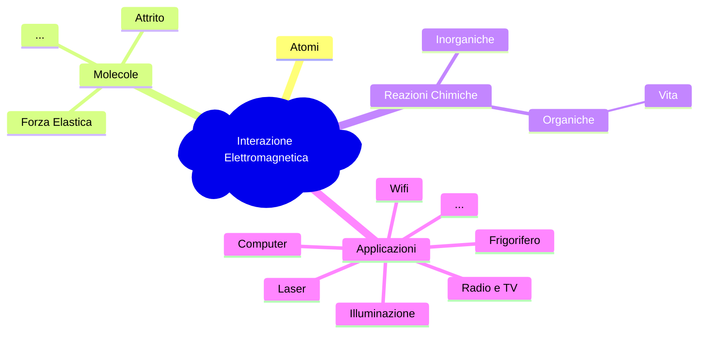

>[!info]
>L'***elettromagnetismo*** è la teoria che unifica la spiegazione di fenomeni elettrici e magnetici.

Tutto diventa interpretabile in termini di ***interazioni di cariche elettriche***, ferme o in moto relativo.

>[!check] Forza Elettromagnetica
>La forza elettromagnetica è una delle ***quattro forze fondamentali*** ([[Legge di Gravitazione|Gravitazione]], *Nucleare Debole*, *Elettromagnetica*, *Nucleare Forte*).

## Elettrostatica
---
>[!example] Esperimento
>Utilizzo bacchette di *vetro* ($v$) e *plastica* ($p$), con un **pendolo di torsione** verifico la presenza o meno di [[Leggi di Newton#Seconda Legge di Newton|forze]].
>>[!done] Le forze si manifestano dopo uno strofino
>>Seta con il vetro e coniglio con la plastica.

![[EsperimentoElettrostatica.png]]

>[!hint] Osservazioni

- Le bacchette si *attraggono* se una di ***plastica*** e una di ***vetro***.
- Si *respingono* se sono entrambe di ***plastica***.

> Esistono forze sia ***attrattive*** che ***repulsive***.

Strofinare con il panno ha come risultato di avere sulle bacchette cariche *positive* o *negative*.
Per una pura convenzione diciamo:
- $+=\text{v}$
- $-=\text{p}$

### Cariche Elettriche
>[!info]
>Esistono due tipi di ***carica elettrica*** *positiva* ($+$) e *negativa* ($-$) che normalmente si *compensano* nei corpi.

Lo strofinio provoca trasferimento di cariche da un corpo all'altro.
- Entrambi si elettrizzano con ***cariche opposte*** (Bacchetta e panno si attirano).

>[!done] Cariche dello stesso segno si ***respingono***, di segno opposto si ***attraggono***

### Elettrizzazione per Contatto
> Un corpo metallico (altamente [[Induzione Elettrostatica#^dc307d|conduttivo]]) dopo essere stato *caricato*, viene messo a contatto con altri corpi metallici.

Il corpo caricato trasferirà agli atri corpi parte della propria carica elettrica.

>[!check] Trasferimento
>Se i corpi sono uguali la carica si *suddivide* in ***parti uguali***.

![[ElettrizzazioneContatto.png]]

## Quantizzazione della Carica
---
>[!help] Carica
>Le **particelle elementari** o sono ***neutre*** o hanno una ***carica*** di modulo pari alla *carica dell'elettrone*.
>$$e=1.60218\times 10^{-19}\ C$$
>- $C$ è il Coulomb, unità di misura della carica elettrica nel [[Git-Obsidian/Fisica/Misurazione#Sistema Internazionale|S.I.]]

L'***elettrone*** ha carica $-e$, il ***protone*** ha carica $+e$ e il ***neutrone*** *non ha carica*.

> La carica di un qualsiasi oggetto può essere solo un multiplo $> 0$ o $<0$, di $e$.

$$
q=(N_{p}-N_{e})e
$$
Dato che $e$ è una quantità piccolissima, possiamo considerare la carica elettrica dei corpi macroscopici una ***quantità continua***.

## Legge di Conservazione della Carica
---
>[!quote]
>In un **sistema isolato** la [[Elettromagnetismo#Cariche Elettriche|carica elettrica]] totale è *costante nel tempo*.

La conservazione vale anche nelle interazioni tra particelle elementari.