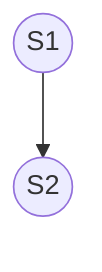

## Loop Optimization
---
>[!quote]
>Il $90\%$ del ***tempo di esecuzione*** è usato nel $10\%$ del codice.
>- Principalmente nei *loop*.

L'obbiettivo dell'ottimizzazione dei loop è nel trasformare il `loop`, rendendolo parallelizzabile, ma ***mantenendo la stessa semantica***.
- Nei sistemi [[6 - Processi, Schedule e Thread|single-threaded]], si ottimizza per migliore accesso alla [[Le Memorie|gerarchia di memoria]].

### Eseguire i Loop in Parallelo
```c title:example
for(i = 0; i < N; i++){
	foo(i);
}
```

>[!info]
>In alcuni casi le iterazioni del `loop` potrebbero essere eseguite in ***parallelo***.

Il numero di unità di esecuzione potrebbe essere molto inferiore rispetto al numero di iterazioni del `loop`.
- In questo caso ogni unità si prende a carico diverse iterazioni del `loop`.

### Data Dependence
>[!definizione]
> Due accessi alla memoria sono coinvolti in una ***data dependence*** se referenziano la *stessa locazione di memoria* e uno dei due è in **scrittura**.

Una dipendenza si denota con una semplice freccia tra i due;

- `S2` *dipende* da `S1`.

> ***Tipoligie***

>[!failure] Data-Flow or True Dependece

- `RAW`: *Read After Write*.

```c
a = b + c;
d = 2 * a;
```

>[!fail] Anti Dependece

- `WAR`: *Write After Read*.

```c
c = a + b;
a = 2 * a;
```

>[!abstract] Output Dependece

- `WAW`: *Write After Write*.

```c
a = k;
if(a > 0){
	a = 2 * c;
}
```

>[!caution] Control Dependece
>Un'istruzione `S2` ha una ***control dependece*** su `S1` se il risultato di `S1` determina se `S1` deve essere eseguito o no.

```c
if (a > 0){    // S1
	a = 2 * c; // S2
} else {
	b = 3;     // S3
}
```

### Teorema Fondamentale della Dipendenza
>[!check] Teorema
> "Any **reordering transformation** that preserves *every dependence* in a program preserves the meaning of that program".

Per riuscire a parallelizzare un `loop`:
- Trovare le ***dipendenze***.
- Nessuna dipendenza attraversa i ***confini di una iterazione***.

>[!hint] Intuitivamente

- Solo le variabili che sono **scritte** *potrebbero introdurre una dipendenza*.
- Se una variabile viene scritta viene anche letta in un'altra iterazione.

>[!example] Esempio

```c
for(i = 0; i < n; i++){
	a[i] = b[i] + c[i]; // S1
}
```

- Ogni iterazione ***non dipende dalla precedente***.
- Il `loop` è *completamente parallelizzabile*.

```c
for(i = 1; i < n; i++){
	a[i] = a[i - 1] + b[i]; // S1
}
```

- La variabile `{c} b[i]` può essere ignorata.
- Ogni iterazione dipende dalla precedente (`RAW`).
- Il `loop` **non** può essere parallelizzato *scritto in questo modo*.

```c
s = 0;
for(i = 0; i < n; i++){
	s = s + a[i]; // S1
}
```

- C'è una ***loop-carried dependence*** su `{c} s` che non può essere rimossa con trasformazioni banali.
	- Il `loop` deve essere completamente *ri-scritto* ([[Reduce]]).

### Rimozione delle Dipendenze
#### Loop Aligning
>[!summary] Idea
> Le *dipendenze*, in alcuni casi, possono essere rimosse ***allineando le iterazioni del loop***.

```c title:before
a[0] = 0;
for (i=1; i<n; i++) {
	a[i] = b[i-1] * c[i];
	d[i] = a[i-1] + 2;
}
```

![[LoopAligningBefore.png]]

```c title:after
a[0] = 0;
d[1] = a[0] + 2;        // Loop Alingning
for (i=1; i<n-1; i++) {
	a[i] = b[i-1] * c[i]; // Changed Indexes
	d[i+1] = a[i] + 2;    // Changed Indexes
}
a[n-1] = b[n-2] * c[n-1];
```

![[LoopAligningAfter.png]]

#### Loop Intergchange
>[!tldr] Idea
>Scambiando gli **indici** del `loop` potrebbe permettere di parallelizzare il `loop` *esterno*.

- Utile per aumentare la [[Partition#In base alla Dimensione|granularità del parallelismo]] (se appropriato).

> ***Procediment***
- Fisso l'indice di uno dei due `loop` e controllo le dipendenze parallelizzando l'altro indice.

```c title:"inner parallelization"
for (j=1; j<m; j++) {
	for (i=0; i<n; i++) {
		a[i][j] = a[i][j-1] + b[i];
	}
}
```

```c title:"outer parallelization"
for (i=0; i<n; i++) {
	for (j=1; j<m; j++) {
		a[i][j] = a[i][j-1] + b[i];
	}
}
```

#### Dipendenze Difficili
>[!missing] Dependece
> Alcuni `loop` non possono essere parallelizzati, né l'**esterno** né l'**interno**.

```c
for (i=1; i<n; i++) {
	for (j=1; j<m; j++) {
		a[i][j] = a[i-1][j-1] + 
		a[i-1][j  ] + 
		a[i  ][j-1];
	}
}
```

![[DifficultDependece.png]]

![[DifficultDependece1.png]]

>[!done] Soluzione

È possibile parallelizzare il `loop` ***interno*** scorrendo la matrice *diagonalmente*.
- ***Wavefront Sweep***.

```c
for (slice=0; slice < n + m - 1; slice++) {
	z1 = slice < m ? 0 : slice - m + 1;
	z2 = slice < n ? 0 : slice - n + 1;
	/* The following loop can be parallelized */
	for (i = slice - z2; i >= z1; i--) {
		j = slice - i;
		/* process a[i][j] … */
	}
}
```

### Conclusione
> Un `loop` può essere parallelizzato se ***non*** ci sono dipendenze che *attraversano le iterazioni* del `loop`.

>[!fail] Eliminazione delle Dipendenze
>Alcune dipendenze si possono "*eliminare*" attraverso:
>- Applicando delle ***trasformazioni*** al codice (*Reordering*, *Aligning*).
>- Utilizzando i [[Parallel Programming Patterns]].
>- Scorrendo le iterazioni "*diagonalmente*".

In alcuni casi le dipendenze ***non possono essere rimosse***.

>[!done] "Test" veloce per le dipendenze

Esegui il `loop` all'indietro. `{c icon} for(i=0;i<n; i++)` $\to$ `{c icon} for(i=n-1;i>=0; i--)`
- Se il programma è ancora corretto il `loop` *potrebbe* essere parallelizzabile.