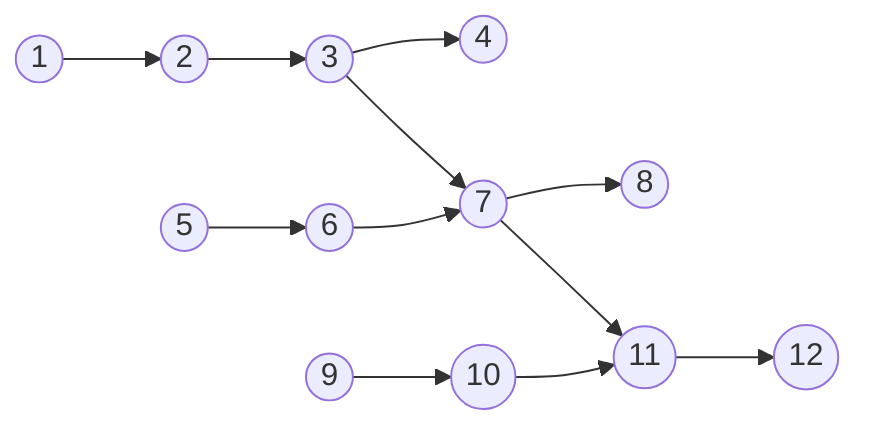

>[!question] Quanto veloce possiamo Eseguire?

> I task sono *perfettamente bilanciati*.
- Il tempo di esecuzione si divide per il numero di unità di esecuzione.

> I task *non sono bilanciati*.
- Il tempo di esecuzione è limitato dalla lunghezza del ***processo più lungo*** ([[Partition#Differenze|load imbalance]]).

> I task hanno una *dipendenza l'un l'altro*.
- Il tempo di esecuzione è determinato dal ***cammino critico***.

## Scalabilità
---
> La ***scalabilità*** ha diversi significati.

>[!failure] Quanto più veloce un problema può essere risolto con $p$ "workers" al posto di 1?

>[!hint] Quanto lavoro in più può essere fatto da $p$ "workers" invece di 1 (Stessa unità di tempo)?

>[!help] Che impatto sulle performance hanno i requisiti di comunicazione di una applicazione parallela?

>[!abstract] Quale frazione delle risorse è veramente usata per risolvere il problema?

## Speedup
---

> Siano $p, T_{\text{ser}},T_{\text{par}}(p)$, rispettivamente: il numero di unità esecutive indipendenti, il tempo di esecuzione seriale, il tempo di esecuzione con $p$ unità esecutive.

>[!definizione]
>Definiamo lo ***speedup*** $S(p)$ :
>$$S(p)=\displaystyle{\frac{T_{\text{ser}}}{T_{\text{par}}(p)}}\approx\displaystyle{\frac{T_{\text{par}}(1)}{T_{\text{par}}(p)}}$$

Nella definizione dello *speedup*:
- Cambia solamente il **numero di processori**, gli altri parametri rimangono uguali.
- La seconda formula è chiamata ***speedup relativo***.

>[!done] Caso Ideale

Nel caso ideale il programma parallelo richiede $1/p$ unità di tempo **rispetto al programma sequenziale**.
- $S(p)=p$ è il caso migliore dell'"*optimal speedup*"
- Realisticamente $S(p)\leq p$
>[!question] È possibile ottenere $S(p)>p$?

Lo ***speedup superlineare*** realisticamente non è possibile.
- $\displaystyle{\frac{T_{\text{par}}(1)}{p}}$ è un *limite inferiore* dello speedup.

$$
T_{\text{par}}(p)\geq\displaystyle{\frac{T_{\text{par}}(1)}{p}}\implies 1\geq \displaystyle{\frac{T_{\text{par}}(1)}{p\cdot T_{\text{par}}(p)}}\implies p\geq \underbrace{ \displaystyle{\frac{T_{\text{par}}(1)}{T_{\text{par}}(p)}} }_{ S(p) }
$$

Ci sono alcuni casi in cui si potrebbe osservare uno ***speedup superlineare***:
- Se vengono usati due **programmi diversi** per l'esecuzione seriale e parallela.
	- Il compilatore potrebbe compilare i codici in maniera differente.
- Se il problema viene diviso abbastanza per far stare un *sotto problema* interamente nella [[Cache]].
- Se il processore applica il [[Git-Obsidian/Architettura degli Elaboratori/Architetture a Confronto/Architetture Parallele#Parallelismo nel Chip|parallelismo eterogeneo]].
- Tramite l'utilizzo di [[Programmazione SIMD]].

### Porzioni non Parallelizzabili

>Supponiamo che una frazione $\alpha$ del tempo totale del programma seriale ***non può essere parallelizzato*** a causa di *limitazioni*, *bottlenecks* e *overhead*.

- $\alpha=0$: *Parallelizzazione perfetta*.
- $\alpha=1$: Programma *totalmente seriale*.

Supponiamo che il rimanente $1-\alpha$ tempo di esecuzione è ***completamente parallelizzabile***.

>[!info]
>Allora abbiamo che:
>$$T_{\text{par}}(p)=\alpha T_{\text{ser}}+(1-\alpha) \displaystyle{\frac{T_{\text{ser}}}{p}}$$

Allora abbiamo che lo ***speedup*** è dato da:
$$
S(p)=\displaystyle{\frac{T_{\text{ser}}}{\alpha T_{\text{ser}}+(1-\alpha) \displaystyle{\frac{T_{\text{ser}}}{p}}}}
$$
> Ora applichiamo il limite per $p\to \infty$.

Lo speedup massimo che può essere raggiunto è: $\displaystyle{\frac{T_{\text{ser}}}{\alpha\cdot T_{\text{ser}}}}$

>[!check] [[Prestazioni dei Calcolatori#Legge di Amdhal|Legge di Amdhal]]
>La ***legge di Amdhal*** indica qual è il *massimo speedup*.
>$$S(p)=\displaystyle{\frac{1}{\alpha+\displaystyle{\frac{1-\alpha}{p}}}}$$

Otteniamo uno *speedup asintotico* $\displaystyle\frac{1}{\alpha}$ quando $p\to \infty$.
- Se una frazione $\alpha$ del tempo di esecuzione totale è speso in una porzione seriale del programma, allora lo speedup massimo raggiungibile è $\displaystyle\frac{1}{\alpha}$ .

### Scaling Efficiency
>[!caution] Strong Scaling
>Nello ***strong scaling*** si aumenta il numero di processore $p$ mantenendo la dimensione totale del problema *costante*.

La **quantità di lavoro** rimane costante.
- La quantità di lavoro di una singola unità di esecuzione ***diminuisce*** all'aumentare di $p$.
>[!done] Goal
>L'obbiettivo è quello di ***ridurre*** il *tempo totale di esecuzione* aggiungendo più unità di esecuzione.

La ***Strong Scaling Efficiency*** ($E(p)$) si calcola con:
$$
E(p)=\frac{S(p)}{p}=\displaystyle{\frac{T_{\text{par}}(1)}{p\times T_{\text{par}}(p)}}
$$
$E(p)\in [0,1]$, con:
- $0$: Programma **completamente seriale**.
- $1$: Programma **perfettamente efficiente**.
All'aumentare di $p$, $E(p)$ tende a $0$.
- Il calcolo è ***indipendente*** dall'implementazione del programma.

---

>[!missing] Weak Scaling
>Nel ***weak scaling*** si aumenta il numero di processori $p$ mantenendo il *lavoro per unità di esecuzione costante*.

- La ***quantità di lavoro aumenta*** all'aumentare del numero di unità di esecuzione.
>[!done] Goal
>L'obbiettivo è quello di risolvere **problemi più grandi** nello stesso tempo.

La ***weak scaling efficiency*** ($W(p)$) si calcola:
$$
W(p)=\frac{T_{1}}{T_{p}}
$$
> Dove:
- $T_{1}$: è il tempo richiesto per completare **1 unità di lavoro** con **una unità di esecuzione**.
- $T_{p}$: è il tempo richiesto per completare $p$ **unità di lavoro** con $p$ **unità di esecuzione**.
$W(p)\in[0,1]$

> Sia $f(n_{p},p)$ la quantità di lavoro fatto da ogni unità di esecuzione e dati la dimensione del problema $n_{p}$ e $p$:

Vogliamo calcolare l'input size $n_{p}$ tale che:
$$
f(n_{p},p)=k
$$
>[!warning] Attenzione
>È necessario conoscere l'implementazione per assicurarsi che la ***quantità di lavoro sia costante***.

> ***Esempio***: Moltiplicazione matrice $\times$ matrice.

Data una dimensione $n_{p}$, la quantità di "*lavoro seriale*" richiesto per calcolare il prodotto matrice $\times$ matrice ($n_{p}\times n_{p}$) è $O(n_{p}^{3})$
- La versione [[OpenMP]] usa $p$ processori e esegue $f(n_{p},p)=\frac{n_{p}^{3}}{p}$ lavoro per *thread*

<u>Quindi</u>
$$
\begin{array}
\ \displaystyle\frac{n^{3}}{p}=k \\
n=\sqrt[3]{ p\times k } \\
n=\sqrt[3]{ p }\times k'
\end{array}
$$

>[!important] Importante
>Quando si mostrano dei risultati di performance, è buona prassi fornire le ***specifiche hardware del sistema*** su cui è stata fatta la misurazione.

> Per la [[La CPU|CPU]]
- Tipo di *processore* (fornitore, nome del modello, ecc.).
- Numero di *core*.
- Se la `CPU` utilizza il **multithreading simmetrico** (es. HyperThreading).
- *Frequenza* di clock.
- Quantità di `RAM`.
- [[3 - Livelli del Sistema Operativo#Introduzione|Sistema operativo]].
- Versione del compilatore e, possibilmente, flag di compilazione.

>Per la [[Schede Grafiche|GPU]]
- Tipo di `GPU` (fornitore, nome del modello, ecc.).
- Numero di *core*.
- *Frequenza* di clock.
- Quantità di *memoria* della `GPU`.
- Versione del compilatore e, possibilmente, flag di compilazione.