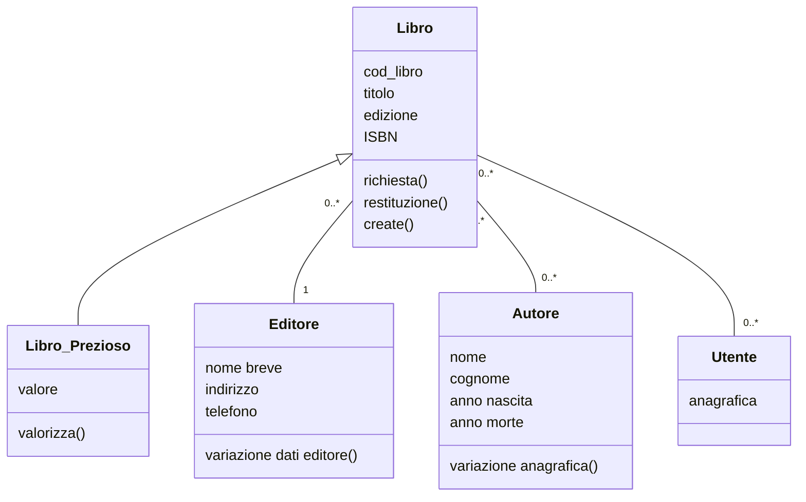
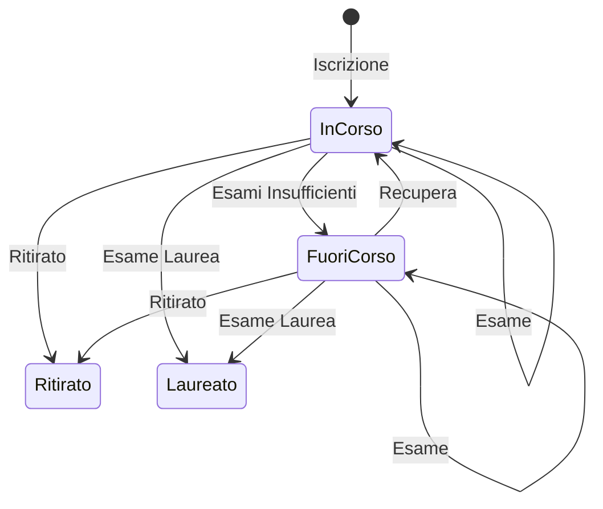

> Terza fase del [[Il Ciclo di Vita del Software|ciclo di vita del software]].

>[!definizione]
>L'analisi è lo **studio di un problema**, *prima* di intraprendere qualche azione

>[!hint] Obbiettivo
>Lo scopo dell'*analisi* è produrre un *documento* più o meno formale in cui vengono dichiarate le ***specifiche dei requisiti***.
>- Documento che diventerà *input* per le fasi successive.

L'oggetto dell'analisi è l'organizzazione nel suo complesso.
- Sottoinsiemi aziendali
- *Risorse*
- *Processi*
- Flussi *informativi*

L'analisi dei requisiti è anche vista come "***milestone***".
- Usato come *conferma dei requisiti* da parte del cliente.
- L'utente finale e il progettista si accordano sulle funzionalità messe a disposizione del software.

>[!cite] Qualità per la specifica dei requisiti

> ***Chiarezza***
- Ogni specifica deve indicare quanto più chiaramente le operazioni e i soggetti del progetto.

> ***Non Ambiguità***
- Il processo descritto deve essere definito in modo completo e dettagliato.

> ***Consistenza***
- Le specifiche non devono contenere punti contraddittori.

>[!warning] Importanza dei Requisiti
>Più tardi viene scoperto un errore nel ciclo di sviluppo del software, maggiore è il ***costo di riparazione***.

| Stadio        | Costo per la Correzione |
| ------------- | ----------------------- |
| Requisiti     | $0.1-0.2$               |
| Progettazione | $0.5$                   |
| Codifica      | $1$                     |
| Test          | $2$                     |
| Accettazione  | $5$                     |
| Manutenzione  | $20$                    |
## Cosa e Come Modellare
---
>[!cite] Metodo di Analisi
>Il processo di analisi è **incrementale** (avviene a step *iterativamente*) e porta per passi successivi alla stesura di un insieme di documenti in grado di rappresentare un modello dell'organizzazione e comunicare in modo non ambiguo, una descrizione esauriente, coerente e realizzabile dei vari aspetti ***statici***, ***dinamici*** e ***funzionali*** di un sistema informatico.

Differenti problemi richiedono differenti approcci e ***differenti strumenti di analisi***.

> Analisi orientata agli ***oggetti***
- Per gli aspetti **statici** del dominio.

> Analisi orientata alle ***funzioni***
- Per aspetti **funzionali**.

> Analisi orientata agli ***stati***
- Per aspetti **dinamici**.

### Analisi orientata agli Oggetti
>[!info]
>L'enfasi è posta sull'*identificazione* degli **oggetti** e sulle *interrelazioni* tra di loro.

Nel tempo le proprietà strutturali degli oggetti osservati **restano abbastanza stabili**, mentre l'uso che si fa degli oggetti può *mutare in modo sensibile*. 

> Usato per applicazioni orientate agli oggetti
- Come [[Git-Obsidian/DataBase/Introduzione#Database|DataBase]]
- L'aspetto più significativo è costituito dalle ***informazioni***.
### Analisi Orientata alle Funzioni
>[!info]
>L'obbiettivo è *rappresentare un sistema* come:
>- Un insieme di **flussi informativi**.
>- Una rete di **processi che trasformano flussi informativi**.

Corrisponde alla progressiva costruzione di una gerarchia funzionale.

> Usato per applicazioni orientate alle funzioni
- Come un *compilatore* o la *crittografia*.
- La complessità risiede nel tipo di ***trasformazione input-output*** operata.
### Analisi Orientata agli Stati
>[!info]
>Per alcune categorie di applicazioni può essere utile passare fin dall'inizio in termini di *stati operativi*, in cui si può trovare il sistema allo studio e ***transizioni di stato***.

Si studia la *dinamica* dell'oggetto.

> Usate per applicazioni orientate al controllo
- Come le *interfacce utente*.
- L'aspetto più significativo da modellare è la ***sincronizzazione*** fra diverse attività cooperanti nel sistema.

## Astrazione
---
>[!abstract] Il ruolo dell'astrazione
>Ci sono molteplici relazioni in gioco fra oggetti, funzioni e stati e molteplici *livelli di dettaglio*.

Gli ***oggetti*** possono essere descritti a partire da termini *molto generici* fino ad arrivare a *livello di dettaglio specifici*.

Le ***funzioni*** possono essere espresse inizialmente in *modo vago*, e *successivamente precisate*.

Gli ***stati*** possono essere descritti a un *elevato livello di astrazione* o *specificati in maggior dettaglio*.

### Meccanismi di Astrazione

>[!tip] Classificazione
>La ***classificazione*** consente di raggruppare in **classi** *oggetti*, *funzioni* o *stati* in base alle loro proprietà.

>[!missing] Generalizzazione
>La ***generalizzazione*** cattura le relazioni "***IS-A***", ovvero permette di astrarre le caratteristiche comuni fra più classi **definendo superclassi**.

>[!summary] Aggregazione
>L'***aggregazione*** esprime le relazioni "***PART-OF***" che sussistono tra *oggetti*, *funzioni* e *stati*.

> Oltre ai meccanismi citati è importante modellare le ***associazioni*** che sussistono fra le varie classi.

## Linguaggi per la Specifica dei Requisiti
---
>[!fail] Linguaggi Informali
>Il ***linguaggio naturale*** è alla base della comunicazione tra *analista* e *utente*, **non** può essere adottato come unico mezzo per produrre **documenti di specifica** a causa delle innumerevoli ambiguità.

>[!attention] Linguaggi Semiformali
>***Notazione grafica***, che presenta una sematica sfumata, accoppiata con descrizioniin *linguaggio naturale*.
>- Come [[Modello Entity-Relationship|schemi E/R]].

>[!done] Linguaggi Formali
>Sono linguaggi di specifica ***basati sulla logica dei predicati***.
>- Linguaggi di specifica algebrici.
>- Linguaggi concettuali per basi di dati.

