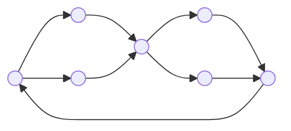

## Il Numero Ciclomatico
---
>[!tldr] Idea
>Il ***numero ciclomatico*** è una definizione operativa di complessità del flusso di controllo del programma.

È un metodo "***whitebox***", è necessaria la conoscenza dell'implementazione del software.

>[!definizione]
> Il ***numero ciclomatico*** di un [[I Grafi#Grafo Connesso|grafo fortemente connesso]] è il numero minimo di archi che occorre eliminare per trasformarlo in un [[Gli Alberi|albero]].

> Esempio

- **Numero ciclomatico**: $3$.

Si può calcolare come:
$$
\text{e} - \text{n} + 1
$$
> Dove
- $e$ è il numero di archi.
- $n$ è il numero dei nodi.

Un programma ***ben formato*** ha sempre un nodo iniziale e uno terminale.
- Si rende *fortemente connesso* il grafo del flusso di controllo aggiungendo un arco orientato che va ***dal nodo terminale al nodo iniziale***.

>[!caution] Alternativa
>Il ***numero ciclomatico*** del programma, è il numero ciclomatico del grafo $G$ modificato.
>- Esprime il numero di *cammini linearmente indipendenti nel grafo di controllo*.

$$
\text{v}(G)=e-n+2
$$
### Teorema di Millis
>[!cite] Teorema
>$$\text{v}(G)=d+1$$
>Dove:
>- $d$ è il numero dei punti di decisione del programma.

Se il programma ha procedure, il numero ciclomatico dell'intero grafo è dato dalla ***somma dei numeri ciclomatici*** dei singoli grafi indipendenti.
$$
\text{v}(G)=e-n+2p
$$
Dove
- $e$ e $n$ sono il numero di archi e nodi del grafo nel suo insieme.
- $p$ è il numero di *grafi indipendenti*.

>[!important] Raccomandazione
>La ***complessità ciclomatica*** di un modulo non dovrebbe superare il valore $10$.

## Constructive Cost Model
---
>[!info] `CO.CO.MO.`
>Il **CO**nstructive **CO**st **MO**del ed è un modello matematico per stimare costi, tempo e risorse necessari per lo sviluppo di un progetto software.

>[!tldr] Idea
>Si calcola una ***stima iniziale*** dei *costi* di sviluppo in base alla dimensione del software da produrre, poi ***la si migliora*** sulla base di un insieme di parametri.

### Modelli
> Esistono tre diversi modelli di `COCOMO` che si differenziano per la precisione con cui vengono stimati i diversi valori:

#### Basic COCOMO
>[!abstract] Basic
>È il più *facile da calcolare* ma anche il **meno preciso**, la stima viene fatta partendo dalla dimensione del software da sviluppare calcolata in `KDSI` ([[Metriche Dimensionali#Lines of Code|LoC]]).

#### Intermediate COCOMO
>[!caution] Intermediate
> Calcola lo *sforzo di sviluppo* (**effort**) del software come *funzione della grandezza del programma* (espressa in `KDSI`), e su un insieme di "*indici di costi*", detti ***Cost-driver***.

> 1. 

Stima della ***dimensione del software***:
- Calcolata come [[Metriche Dimensionali#Lines of Code|LoC]].
- Può essere fatta sulla base dell'esperienza oppure usando una *tecnica analitica* ([[Metriche Funzionali#Function Points|Function Points]]).

> 2. 

Determinazione della ***classe del software***:
- I **sw** sono divisi in tre categorie con caratteristiche di difficoltà crescente.
- Per ogni categoria è stata sviluppata una diversa formula (***empiricamente***) per il calcolo del costo, espresso in ***mesi uomo***.

| Category      | Formula                         |
| ------------- | ------------------------------- |
| Organic       | $M_{Nom}=3.2\times KDSI^{1.05}$ |
| Semi-Detached | $M_{Nom}=3.0\times KDSI^{1.12}$ |
| Embedded      | $M_{Nom}=2.8\times KDSI^{1.2}$  |

> Esempio

|                                 | Organic    | Semi-Det.       | Embedded  |
| ------------------------------- | ---------- | --------------- | --------- |
| Presenza di vincoli di progetto | *Limitata* | *Considerevole* | *Elevata* |

> 3. 

Applicazione degli ***stimatori di costo***:
$$
M=M_{Nom}\times\prod_{i=1}^{15}c_{i}
$$
#### Advanced/Detailed COCOMO
>[!important] Advanced
>Incorpora tutte le caratteristiche del `COCOMO` intermedio con una **valutazione dell'impatto dei vari costi per** [[Il Ciclo di Vita del Software|ogni passo]] del processo di ingegneria del software.