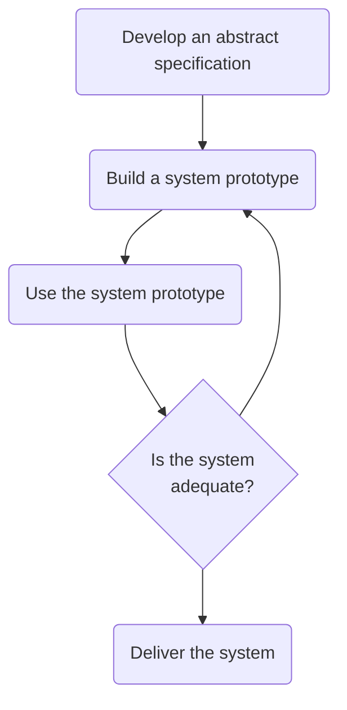

>[!info]
> I ***modelli evolutivi*** sono *modelli iterativi* di [[Produzione|produzione del software]], caratterizzati in modo da consentire lo sviluppo di **versioni sempre più complete del software**.

Adatto a sistemi software che ***evolvono nel tempo*** e i requisiti cambiano durante lo sviluppo.
- Usato quando è impossibile realizzare un prodotto completo e competitivo nei *tempi dettati dal mercato*.
- Si realizza una versione limitata per **rispondere alla pressione della concorrenza**.

Si fa largo uso di ***tecniche di prototipazione***.
## Prototipazione
---
>[!cite] Prototipo
>Un ***prototipo*** è una versione approssimata, parziale (funzionante), dell'applicazione che deve essere sviluppata.

Un prototipo non è necessariamente del codice, potrebbe essere:
- Una presentazione **powerpoint**.
- Un *mockup*.
- etc...

>[!hint] Obbiettivi
> Un prototipo software permette di ***animare e dimostrare i requisiti***.
> È utile se le specifiche dell'utente non sono chiare.

L'uso principale consiste nell'aiutare i clienti e gli sviluppatori a capire meglio i requisiti inizialmente vagli.

>[!done] Benefici
- Vengono ***evidenziati equivoci*** tra gli utenti e gli sviluppatori.
- Si evidenziano ***funzionalità mancanti*** o confuse.
- Un sistema funzionante è disponibile presto nel processo.

![[Prototyping.png]]

### Prototipazione Evolutiva
>[!tldr] Idea
>L'obbiettivo della ***prototipazione evolutiva*** è di fornire un *sistema funzionante* all'utente finale.

Lo sviluppo parte con i requisiti meglio capiti.
- I software prodotto vale circa il $14-15\%$ del prodotto finito.
>[!quote] Il prodotto viene fatto evolvere nel prodotto finale senza gettarlo.

>[!warning] Criticità
- I cambiamenti continui tendono a corrompere il sistema.
- Si deve accettare che il *tempo di vita del sistema sia corto*.

>[!failure] Refactoring
>Il ***refactoring*** è la soluzione alla corruzione del sistema.
>È un processo di ristrutturazione del codice esistente per migliorare la struttura interna ***senza modificarne il comportamento***.

^f6e995

### Prototipazione Usa e Getta
>[!tldr] Idea
>L'obbiettivo del ***prototipo usa e getta*** è di validare o derivare i requisiti del sistema.

Il processo di prototipazione parte con i requisiti che non sono ben capiti.
- Il software prodotto vale circa il $5-10\%$ del prodotto finito.

È usata per ridurre il ***rischio dei requisiti incerti***.
- Il prototipo è sviluppato da una specifica iniziale, consegnato per sperimentazione e quindi **gettato**.

>[!warning] Criticità
- Il prototipo **non** deve essere considerato un sistema finale.
- Il prototipo non è ben strutturato e sarebbe difficile da mantenere.
