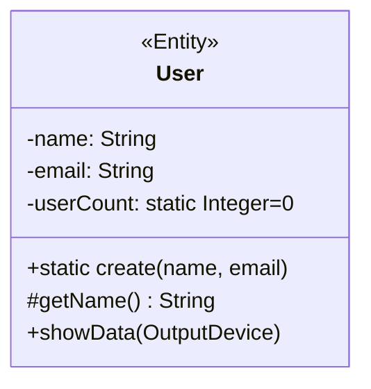
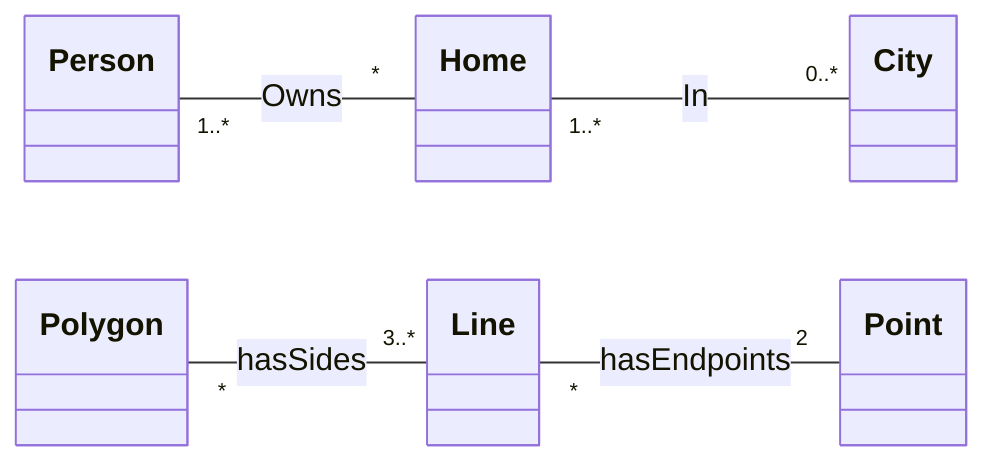
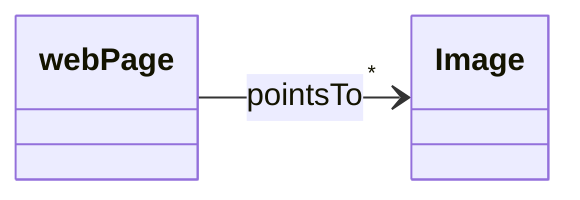
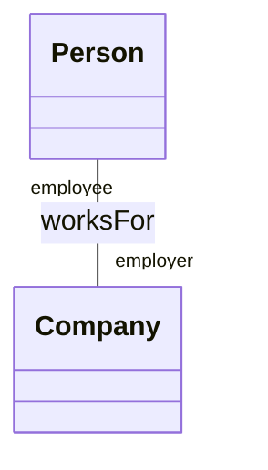

## Diagramma delle Classi
---
>[!info]
>Nucleo fondamentale di [[UML]].
>I ***class diagram*** descrivono la struttura statica del sistema in termini di classi e loro interazioni reciproche.

### Elementi
>[!help] Classe
>Una ***classe*** descrive un gruppo di oggetti con *proprietà*, *comportamento* e *relazioni* **comuni**.

>[!todo] Attributi
>Un ***attributo*** è un valore che caratterizza gli oggetti di una classe.

>[!caution] Operazione
>Un'***operazione*** è una trasformazione che può essere *applicata* a (o *invocata da*) gli oggetti di una classe.
>- Ogni operazione ha come argomento implicito l'oggetto destinazione.


#### Notazione
>[!abstract] Per gli attributi della classe

```
visibilità nome tipo : molteplicità = valoreDefault
```

> ***Visibilità***
- Pubblica `+`
- Privata `-`
- Protetta `#`
- Package `~`

> ***Molteplicità***
- Per esempio: `String [5]`

> ***Tipo***
- `Integer`, `UnlimitedNatural`, `Real`
- `Boolean`
- `String`

> ***Ambito***
- Istanza
- Classe (*attributi statici*)
 
>[!caution] Per le operazioni della classe

```
visibilità nome (parametro, ...): tipoRestituito
```

- Il nome, i parametri e il tipo restituito costituiscono la ***signature***.

> ***Parametri***

```
direzione nomeParametro: tipoParametro=valoreDefault
```

> ***Direzione***
- `in`: Parametro passato ma **non modificato**.
- `out`: Parametro solo in **uscita**.
- `inout`: Parametro passato in input e **modificato** nell'operazione.
- `return`: Indica **valori multipli di ritorno**.

### Relazioni tra Classi
- **Dipendenza**: 
![[Dependency.svg|150]]

- **Associazione**: linea *senza punte*.
- **Aggregazione**: Relazione "***part-of***" (*debole*).
![[Aggregation.svg|150]]

- **Generalizzazione**: Per gerarchie "*is-a*".
![[Generalization.svg|150]]

- **Raffinamento**
![[Implementation.svg|150]]

- **Composizione**: Relazione "***part-of***" (*forte*).
![[Composition.svg|150]]

### Associazione
>[!definizione]
>Una ***associazione*** è una connessione tra classi, tipicamente bidirezionale.

> ***Molteplicità***
- Esattamente $1$: `1`
- Opzionale $1$: `0..1`
- Da $x$ a $y$ inclusi: `x..y`
- Solo i valori $a,b,c$: `a,b,c`
- $1$ o più: `1..*`
- $0$ o più: `*`, abbreviazione di  `0..*`



Si segue il ***flusso grafico*** per la lettura:
- "Una persona ha $0$ o più case".
- "Una città ha una o più case" (*almeno una*).


È possibile specificare il ***verso di lettura*** di una associazione, definire ***associazioni monodirezionali*** o *specificare ruoli*.
- Raramente nella [[Analisi dei Requisiti|fase di analisi]] capita di dovere mettere una direzione all'associazione, mentre nella [[Progettazione|fase di progettazione]] capiterà **sempre**.

- *Associazione monodirezionale*


- *Associazione con ruoli specificati*
Nelle ***associazioni unarie***, è importante inserire i ***ruoli***, insieme alle cardinalità.

#### Vincoli
> È possibile specificare ***vincoli*** e ***classi associative*** alle relazioni.

>[!fail] Vincolo di Esclusività

![[OrConstraint.svg]]

>[!check] Vincolo di Propriety

![[ProprietyConstraint.svg]]

>[!note] Vincolo Annotazione
>Serve per esprimere ***vincoli tra relazioni*** altrimenti non esprimibili

![[AnnotationConstraint.svg]]

>[!summary] Vincolo di Classe Associativa
>L'identità delle istanze della ***classe associativa*** è stabilita solo dalle identità degli oggetti alle sue estremità.

![[AttributeConstraint.svg]]

Una associazione in `UML` può avere delle *istanze duplicate* tranne nel caso che sia presente una ***classe associativa***.
- La classe associativa, inserisce un ***vincolo di unicità*** dell'istanza.

#### Associazione Qualificata
>[!info]
>Le ***associazioni qualificate*** *riducono* un’associazione **molti-a-molti** a una del tipo **uno-a-uno**, specificando un attributo che permette di selezionare un unico oggetto destinazione svolgendo il ruolo di identificatore.

![[QualifiedAssociation.svg]]

#### Associazioni n-arie
>È possibile definire ***associazioni*** $n$-*arie*.

>[!definizione] Istanza Associazione
> Ogni ***istanza dell'associazione*** è una tupla formata da $n$ oggetti delle rispettive classi.

In questi casi è necessario inserire l'elemento grafico ***rombo*** al centro della relazione $n$-*aria*.
- I numeri di istanze dell'associazione quando è fissato un solo oggetto sono ***implicite***, assunte essere "*tutti a molti*".

### Elementi Derivati
>[!info]
>Un ***elemento derivato*** può essere *calcolato* a partire da un altro ma viene mostrato, per *motivi di chiarezza* o per scelte di progettazione, nonostante non aggiunga alcuna **ulteriore informazione semantica**.

- Viene indicato posizionando uno ***slash*** (`\`) prima del nome dell'elemento derivato.

Gli elementi derivati possono essere:
- ***Attributi***.
- ***Associazioni***.

![[DerivateElement.svg]]
