## Diagramma delle Classi
---
>[!info]
>Nucleo fondamentale di [[UML]].
>I ***class diagram*** descrivono la struttura statica del sistema in termini di classi e loro interazioni reciproche.

### Elementi
>[!help] Classe
>Una ***classe*** descrive un gruppo di oggetti con *proprietà*, *comportamento* e *relazioni* **comuni**.

>[!todo] Attributi
>Un ***attributo*** è un valore che caratterizza gli oggetti di una classe.

>[!caution] Operazione
>Un'***operazione*** è una trasformazione che può essere *applicata* a (o *invocata da*) gli oggetti di una classe.
>- Ogni operazione ha come argomento implicito l'oggetto destinazione.

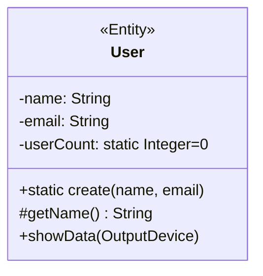
#### Notazione
>[!abstract] Per gli attributi della classe

```
visibilità nome tipo : molteplicità = valoreDefault
```

> ***Visibilità***
- Pubblica `+`
- Privata `-`
- Protetta `#`
- Package `~`

> ***Molteplicità***
- Per esempio: `String [5]`

> ***Tipo***
- `Integer`, `UnlimitedNatural`, `Real`
- `Boolean`
- `String`

> ***Ambito***
- Istanza
- Classe (*attributi statici*)
 
>[!caution] Per le operazioni della classe

```
visibilità nome (parametro, ...): tipoRestituito
```

- Il nome, i parametri e il tipo restituito costituiscono la ***signature***.

> ***Parametri***

```
direzione nomeParametro: tipoParametro=valoreDefault
```

> ***Direzione***
- `in`: Parametro passato ma **non modificato**.
- `out`: Parametro solo in **uscita**.
- `inout`: Parametro passato in input e **modificato** nell'operazione.
- `return`: Indica **valori multipli di ritorno**.

### Relazioni tra Classi
- **Dipendenza**: 
![[Dependency.svg|150]]

- **Associazione**: linea *senza punte*.
- **Aggregazione**: Relazione "***part-of***" (*debole*).
![[Aggregation.svg|150]]

- **Generalizzazione**: Per gerarchie "*is-a*".
![[Generalization.svg|150]]

- **Raffinamento**
![[Implementation.svg|150]]

- **Composizione**: Relazione "***part-of***" (*forte*).
![[Composition.svg|150]]

### Associazione
>[!definizione]
>Una ***associazione*** è una connessione tra classi, tipicamente bidirezionale.

> ***Molteplicità***
- Esattamente $1$: `1`
- Opzionale $1$: `0..1`
- Da $x$ a $y$ inclusi: `x..y`
- Solo i valori $a,b,c$: `a,b,c`
- $1$ o più: `1..*`
- $0$ o più: `*`, abbreviazione di  `0..*`

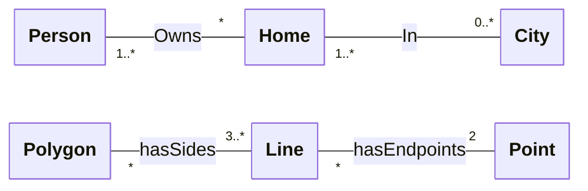

Si segue il ***flusso grafico*** per la lettura:
- "Una persona ha $0$ o più case".
- "Una città ha una o più case" (*almeno una*).


È possibile specificare il ***verso di lettura*** di una associazione, definire ***associazioni monodirezionali*** o *specificare ruoli*.
- Raramente nella [[Analisi dei Requisiti|fase di analisi]] capita di dovere mettere una direzione all'associazione, mentre nella [[Progettazione|fase di progettazione]] capiterà **sempre**.
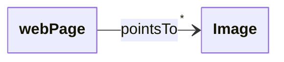
- *Associazione monodirezionale*

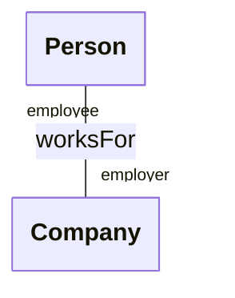
- *Associazione con ruoli specificati*
Nelle ***associazioni unarie***, è importante inserire i ***ruoli***, insieme alle cardinalità.

#### Vincoli
> È possibile specificare ***vincoli*** e ***classi associative*** alle relazioni.

>[!fail] Vincolo di Esclusività

![[OrConstraint.svg]]

>[!check] Vincolo di Propriety

![[ProprietyConstraint.svg]]

>[!note] Vincolo Annotazione
>Serve per esprimere ***vincoli tra relazioni*** altrimenti non esprimibili

![[AnnotationConstraint.svg]]

>[!summary] Vincolo di Classe Associativa
>L'identità delle istanze della ***classe associativa*** è stabilita solo dalle identità degli oggetti alle sue estremità.

![[AttributeConstraint.svg]]

Una associazione in `UML` può avere delle *istanze duplicate* tranne nel caso che sia presente una ***classe associativa***.
- La classe associativa, inserisce un ***vincolo di unicità*** dell'istanza.

#### Associazione Qualificata
>[!info]
>Le ***associazioni qualificate*** *riducono* un’associazione **molti-a-molti** a una del tipo **uno-a-uno**, specificando un attributo che permette di selezionare un unico oggetto destinazione svolgendo il ruolo di identificatore.

![[QualifiedAssociation.svg]]

#### Associazioni n-arie
>È possibile definire ***associazioni*** $n$-*arie*.

>[!definizione] Istanza Associazione
> Ogni ***istanza dell'associazione*** è una tupla formata da $n$ oggetti delle rispettive classi.

In questi casi è necessario inserire l'elemento grafico ***rombo*** al centro della relazione $n$-*aria*.
- I numeri di istanze dell'associazione quando è fissato un solo oggetto sono ***implicite***, assunte essere "*tutti a molti*".

### Elementi Derivati
>[!info]
>Un ***elemento derivato*** può essere *calcolato* a partire da un altro ma viene mostrato, per *motivi di chiarezza* o per scelte di progettazione, nonostante non aggiunga alcuna **ulteriore informazione semantica**.

- Viene indicato posizionando uno ***slash*** (`\`) prima del nome dell'elemento derivato.

Gli elementi derivati possono essere:
- ***Attributi***.
- ***Associazioni***.

![[DerivateElement.svg]]

### Aggregazione e Composizione
>[!help] Aggregazione
>L'***aggregazione*** è un caso speciale di associazione con semantica "*part-of*".
>Sia l'aggregazione intera sia le singole parti ***esistono indipendentemente***.

Viene rappresentata con un ***rombo bianco***.
![[Aggregation.svg]]

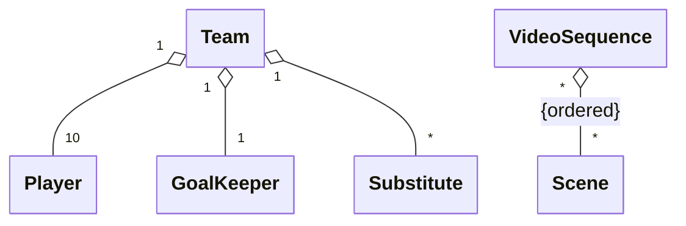

Informa il progettista che deve ***connettere le due classi per riferimento***.

>[!caution] Composizione
> Una ***composizione*** è una aggregazione in cui il tutto "*possiede*" le sue parti.
> - Le parti *esistono* solo in **relazione al tutto**.
> - Ogni parte appartiene esattamente a *un tutto*.

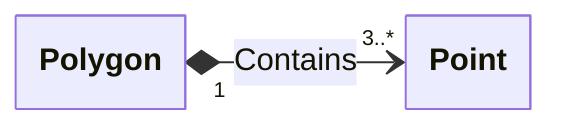

In un diagramma di progettazione, indica al programmatore che l'oggetto "`Polygon`" deve contenere un oggetto "`Punto`".

### Generalizzazione
>[!info]
>La ***Generalizzazione*** è un caso speciale di associazione con semantica "*is-a*".

Tutti gli attributi, le operazioni e le relazioni della *superclasse* vengono ***ereditati*** dalle ***sottoclassi***.

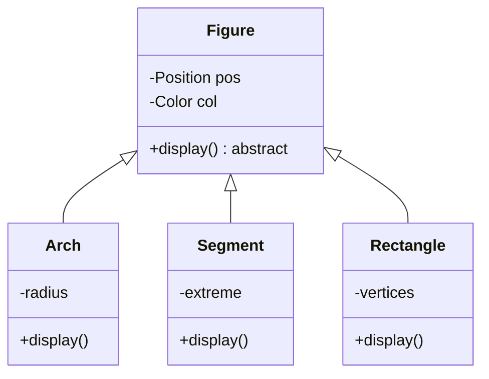

È supportata l'***ereditarietà multipla***.
Possono essere indicati insiemi di generalizzazione e vincoli (*overlapping*, *disjoint*, *complete*, *incomplete*).

>[!abstract] Classi Astratte
>Le ***classi astratte*** sono classi che *non possono* essere instanziate da oggetti.
>- Sono utili come radici di gerarchie di specializzazione

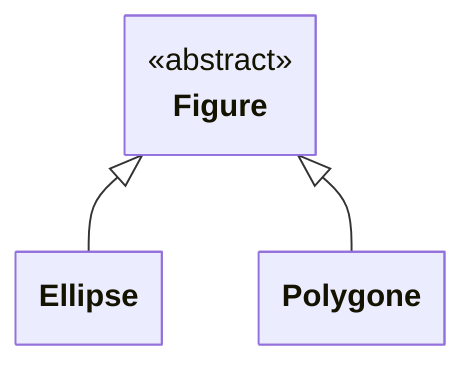

>[!Powertyping]
>Un ***powertype***  è una (meta)classe le cui istanze sono classi che *specializzano un'altra classe*.
>- Nel *powertype* c'è una istanza corrispondente a *ciascuna sottoclasse*.

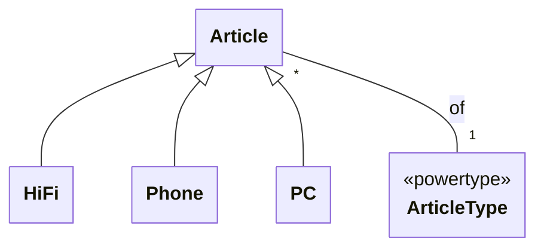

### Dipendenza
![[UML#^46e719]]

>[!tip] Classi
>Nel caso delle classi, una dipendenza indica che una classe ***cliente*** *dipende da alcuni servizi* di una ***classe fornitore***.

- Lo [[UML#Meccanismi di Estendibilità|stereotipo]] più comunemente usato è `<<use>>`.

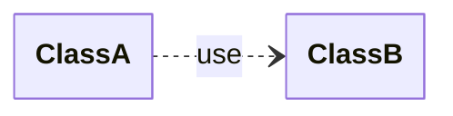

- Più specificamente, si può rappresentare il fatto che un'operazione della classe cliente ha argomenti che appartengono al tipo di un'altra classe (`<<parameter>>`).

### Template
>[!info]
>Un ***template*** è utilizzato per descrivere una classe in cui uno o più parametri formali **non sono istanziati**.

Un ***template*** definisce una *famiglia di classi* in cui ogni classe è specificata istanziando i parametri con i valori attuali.
- **Non** è utilizzabile direttamente.

### Raffinamento
>[!definizione]
>Il ***raffinamento*** esprime una relazione tra due descrizioni dello stesso concetto a livelli diversi di astrazione.

- Tra un tipo astratto e una classe che lo realizza (*realizzazione*).
- Tra una classe di **analisi** e una di **progetto**.
- Tra una implementazione *semplice* e una *complessa* della stessa cosa.

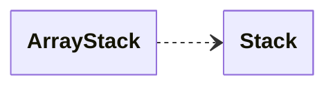

### Interfaccia
>[!definizione]
>Una ***interfaccia*** è un insieme di funzionalità *pubbliche* identificate da un nome.
>- Specifica le operazioni pubbliche di una classe, componente, pacchetto o altre entità, *separando le specifiche dall'implementazione*.

L'interfaccia **non** ha alcuna specifica di struttura interna (*attributi*, *stato* o *associazioni*).
- Solo **operazioni astratte**.

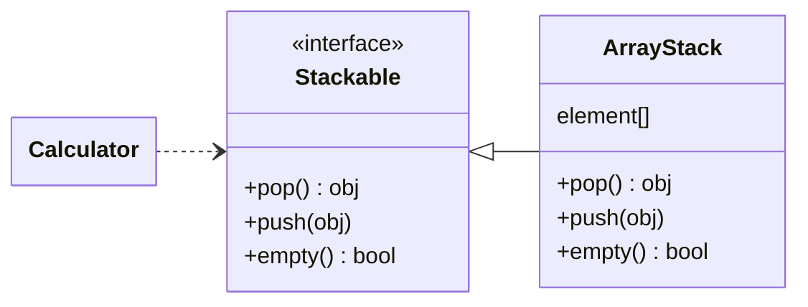

> ***Lollypop Notation***

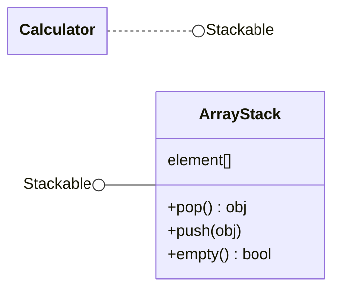

## Analisi vs Progettazione
---
>[!note] Classi di Analisi
>Le ***classi di analisi*** rappresentano un'astrazione nel dominio del problema.
>Corrispondono chiaramente a *concetti concreti del mondo*.
>- Indicano gli attributi che *probabilmente* saranno inclusi nelle ***classi di progettazione***.

>[!abstract] Classi di Progettazione
>Le ***classi di progettazione*** hanno le loro specifiche complete, possono essere direttamente implementate.
>Nascono dal dominio del problema per *raffinamento delle classi di analisi*.

### Identificare gli Elementi
>[!note] Classi d'Analisi

Le *classi d'analisi* corrispondono a entità fisiche e a **concetti del dominio applicativo**.
> Evitare:
- Soluzioni implementative
- Classi ridondanti, irrilevanti e vaghe
- Classi "*onnipotenti*"
- Gerarchie di specializzazione profonde

>[!caution] Associazioni d'Analisi

Le associazioni sono tipicamente indicate da ***verbi*** che esprimono:
- Collocazione fisica (*contenuto in*).
- Azione (*gestisce*).
- Comunicazioni (*parla a*).
- Proprietà (*possiede*).

Evitare le associazioni irrilevanti o che esprimono ***soluzioni implementative***.
Deve descrivere una *proprietà* strutturale del dominio, **non un evento transitorio**.

>[!summary] Attributi

Le *proprietà* di classi e associazioni sono ***attributi***.

> Concetti da fare:
- **Omettere** o **evidenziare** gli attributi derivati.
- Se una proprietà *dipende dalla presenza di un'associazione*, rappresentarla con un attributo dell'associazione.
- **Non** aggiungere agli attributi gli *identificatori degli oggetti*, a meno che non risultino esplicitamente dalle specifiche.


>[!tip] Classi di Progettazione

Con le ***classi di progettazione*** si specifica esattamente come le classi assolveranno le loro responsabilità.

Ciascuna classe deve essere:
- **Completa**: deve fornire ai clienti tutti i servizi.
- **Sufficiente**: i metodi devono essere esclusivamente finalizzati allo scopo della classe.
- **Essenziale**: non mettere a disposizione più di un modo per effettuare la stessa operazione.

>[!caution] Associazione di Progettazione

Le associazioni bidirezionali o le classi associative ***non sono direttamente implementabili***.
> Le associazioni di progettazione *devono* specificare:
- Nome
- Verso di navigabilità
- Molteplicità a entrambi gli estremi
- Nome del ruolo destinazione

## Da Diagramma delle Classi di Analisi a Progettazione
---
1. ***Ricopiare le classi***
	- Possibilmente mantenendo le *posizioni relative*.
2. Valutare se aggiungere altre classi.
	- Associazioni $n$-arie.
3. Controllare la presenza di un ***contenitore***.
	- Una classe con *una unica istanza*.
4. ***Ordinare le query*** in ordine di frequenza.
	- La più frequente **DEVE** essere *ottimizzata*.
5. Inserire le *associazioni* (tutte "***part-of***") secondo la frequenza delle operazioni.
	- Ricordarsi sempre di **aggiornare le cardinalità**.
	- Si parte dal contenitore e si creano associazioni *secondo la query*.
6. Verificare che tutte le associazioni abbiano un *verso*.
	- Aggiungerle *coerentemente*.
7. Verificare che dal contenitore ***tutte le classi siano raggiungibili***.


>[!warning] Nota Bene
>La soluzione dell'esercizio è ***UN*** solo diagramma completo.