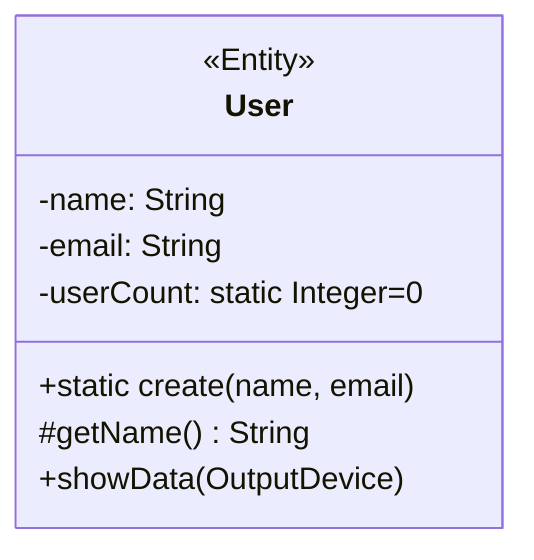
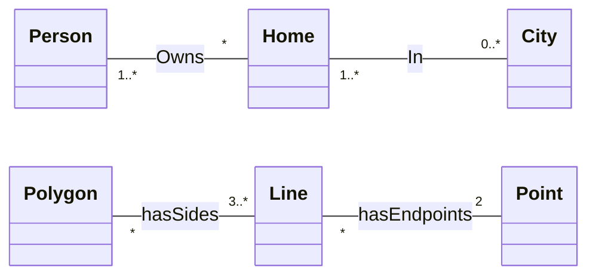
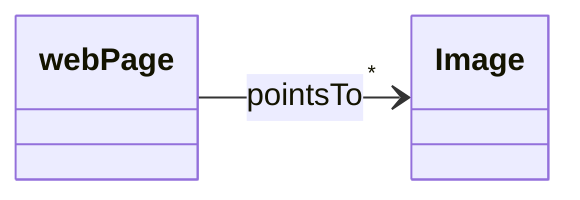

## Diagramma delle Classi
---
>[!info]
>Nucleo fondamentale di [[UML]].
>I ***class diagram*** descrivono la struttura statica del sistema in termini di classi e loro interazioni reciproche.

### Elementi
>[!help] Classe
>Una ***classe*** descrive un gruppo di oggetti con *proprietà*, *comportamento* e *relazioni* **comuni**.

>[!todo] Attributi
>Un ***attributo*** è un valore che caratterizza gli oggetti di una classe.

>[!caution] Operazione
>Un'***operazione*** è una trasformazione che può essere *applicata* a (o *invocata da*) gli oggetti di una classe.
>- Ogni operazione ha come argomento implicito l'oggetto destinazione.


#### Notazione
>[!abstract] Per gli attributi della classe

```
visibilità nome molteplicità : tipo = valoreDefault
```

> ***Visibilità***
- Pubblica `+`
- Privata `-`
- Protetta `#`
- Package `~`

> ***Molteplicità***
- Per esempio: `String [5]`

> ***Tipo***
- `Integer`, `UnlimitedNatural`, `Real`
- `Boolean`
- `String`

> ***Ambito***
- Istanza
- Classe (*attributi statici*)
 
>[!caution] Per le operazioni della classe

```
visibilità nome (parametro, ...): tipoRestituito
```

- Il nome, i parametri e il tipo restituito costituiscono la ***signature***.

> ***Parametri***

```
direzione nomeParametro: tipoParametro=valoreDefault
```

> ***Direzione***
- `in`: Parametro passato ma **non modificato**.
- `out`: Parametro solo in **uscita**.
- `inout`: Parametro passato in input e **modificato** nell'operazione.
- `return`: Indica **valori multipli di ritorno**.

### Relazioni tra Classi
- **Dipendenza**
![[Dependency.svg|150]]
- **Associazione**: linea *senza punte*.
- **Aggregazione**
![[Aggregation.svg|150]]
- **Generalizzazione**
![[Generalization.svg|150]]
- **Raffinamento**
![[Implementation.svg|150]]
- **Composizione**
![[Composition.svg|150]]

### Associazione
>[!definizione]
>Una ***associazione*** è una connessione tra classi, tipicamente bidirezionale.

> ***Molteplicità***
- Esattamente $1$: `1`
- Opzionale $1$: `0..1`
- Da $x$ a $y$ inclusi: `x..y`
- Solo i valori $a,b,c$: `a,b,c`
- $1$ o più: `1..*`
- $0$ o più: `*`



È possibile specificare il ***verso di lettura*** di una associazione, definire ***associazioni monodirezionali*** o *specificare ruoli*.

