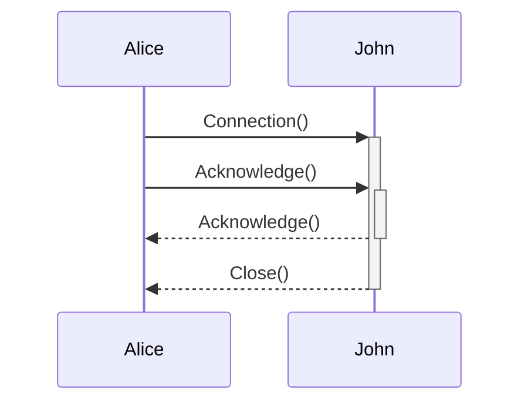
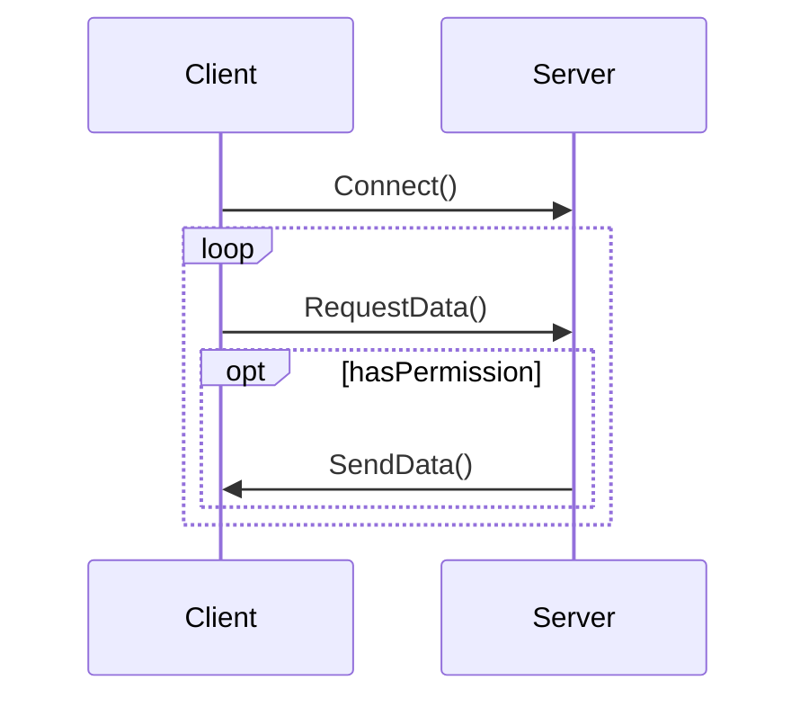

## Diagrammi di Interazione
---
>[!info]
> I ***diagrammi di interazione*** rappresentano come gli oggetti comunicano durante un certo *scenario*.

> Esistono quattro tipi di diagrammi di interazione.
- Ognuno rivolto a un particolare aspetto.
- Sono in realtà tutti equivalenti.

1. ***Diagramma di Sequenza***
2. Diagramma di Comunicazione.
3. Diagramma di Sintesi dell'interazione.
4. Diagramma di Temporizzazione.

### Terminologia
>[!caution] Interazione
>Un'***interazione*** è un'unità di comportamento di un classificatore che ne costituisce il contesto.

>[!tip] Contesto
>Può essere dato dall'intero sistema, da un sottosistema, da un [[Use Case Diagram|caso d'uso]], da un'operazione o da una classe.

Contesti più frequenti
- *Diagramma Casi d'uso* (specifico caso d'uso).
- Operazione (esprime l'algoritmo).

>[!failure] Linea di Vita
>La linea di vita è come un'istanza  di un classificatore (solitamente oggetto) partecipa all'interazione

> Sintassi: `nome [selettore] : tipo`
- Il selettore è *opzionale* e mostra tra tutti gli oggetti alcuni specifici.
- Le linee di vita sono ***disegnate con lo stesso simbolo*** del loro classificatore.
- Non rappresentano *specifiche istanze* ma modi in cui le ***istanze partecipano all'interazione***.
- Possono avere una "***coda***" a forma di *riga verticale tratteggiata*.

>[!quote] Messaggio
>Un ***messaggio*** rappresenta un tipo specifico di comunicazione istantanea tra due linee di vita in un'interazione.
>Trasporta informazione.

> 3 tipi di messaggio
1. ***Messaggi di Chiamata***
	- Invocazione di un'operazione.
2. ***Messaggi di Creazione***
3. ***Messaggi di distruzione***

Per ogni *messaggio di chiamata* **ricevuto** da una linea di vita, ***deve*** esistere un'*operazione* corrispondente nel classificatore di quella linea di vita.

> Modalità di messaggio:
- **Messaggio sincrono**: Il mittente aspetta che il destinatario ritorni. (*chiamata di procedura*).
![[Interaction.svg|150]]

- **Messaggio asincrono**: Il mittente continua l'esecuzione.
![[AsyncMessage.svg|150]]
- **Messaggio di ritorno**: Il destinatario restituisce il controllo al mittente.
	- Può avere del contenuto (*Valore di ritorno* della procedura).
![[Dependency.svg|150]]
- **Creazione di un Oggetto**: Si crea un'istanza del classificatore destinatario.
![[CreationMessage.svg|150]]
- **Distruzione di un Oggetto**
![[DestructionMessage.svg]]
### Diagramma di Sequenza
>[!abstract] Sequence Diagram
>I ***diagrammi di sequenza*** mostrano le interazioni tra linee di vita come una *sequenza di messaggi ordinati*.

Ha due dimensioni:
- La ***dimensione verticale*** rappresenta il *tempo*.
- La ***dimensione orizzontale*** rappresenta le *linee di vita*.

Un'***attivazione*** (*rettangolo* sulla linea di vita) mostra il periodo durante il quale una linea di vita esegue un'azione.

> È possibile specificare:
- **Nodi decisionali**.
- **Iterazioni**
- **Attivazioni annidate**.
>[!hint] Consiglio
>È consigliato ***descrivere il flusso*** tramite un'insieme di note poste accanto agli elementi.

>[!caution] Cambiamento di Stato
>Quando un'istanza riceve un messaggio, il suo [[State Diagram|stato]] *può cambiare*.

Lo stato delle istanze **può essere mostrato** sulle linee di vita.

>[!important] Vincoli
>Un ***vincolo*** (`{constraint}`) posto sulla linea di vita indica una *condizione sulle istanze* che deve essere vera da quel punto in avanti.

- `{ A op. B > value}`.