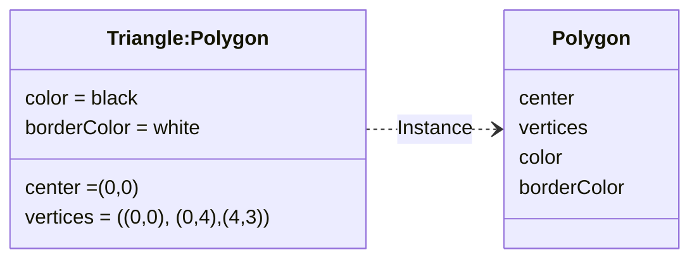

![[UML#^a4f60f]]
## Diagramma degli Oggetti
---
>[!info]
>Il ***diagramma degli oggetti*** è la il modo di rappresentare *una istanza* di un [[Class Diagram]].

L'utilizzo è limitato a mostrare ***esempi di strutture dati***.

Poiché il *diagramma delle classi* può contenere anche istanze, il diagramma degli oggetti può essere considerato come un ***caso particolare di diagramma delle classi***.
- Dove compaiono solo oggetti.
### Componenti
>[!Oggetto]
>Un ***Oggetto*** rappresenta una particolare istanza di una **classe**.

- Il nome "triangle" deve essere sottolineato per indicare che è una istanza di poligono.