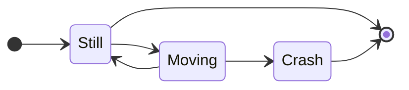
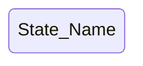
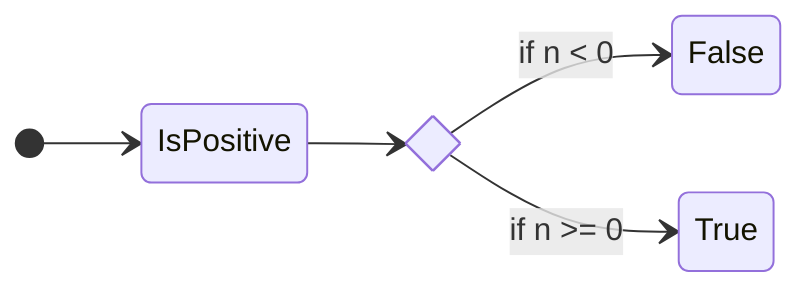
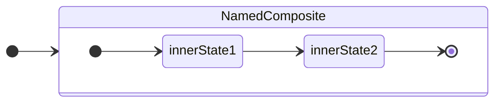
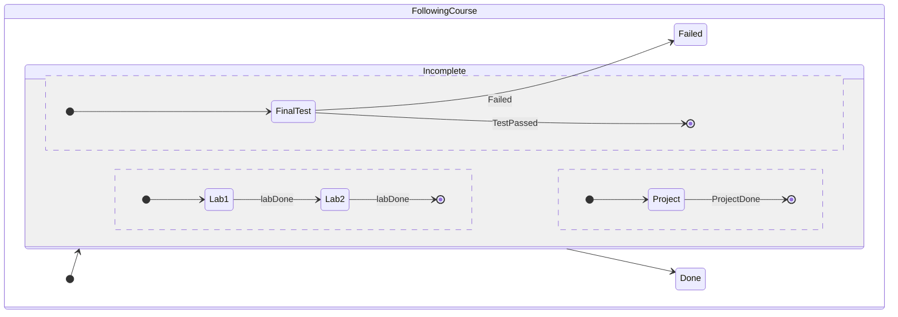

![[UML#^4004eb]]
## Diagramma di Stato
---
>[!info]
>I ***diagrammi di stato*** descrivono in modo esaustivo l'*evoluzione temporale* delle istanze di un classificatore, in risposta alle interazioni con altri oggetti.

Diagramma di ***tipo funzionale***

> Ogni classe può avere associato un diagramma di stato.

[[UML]] adotta la ***notazione di Harel***:
- Esprime sottostati, stati composti, parallelismo, stati storici, etc...

> L'inizio del diagramma è denotato da un "***cerchio***" nero.

- Il diagramma "*finisce*" in un doppio cerchio concentrico.

Uno stato è rappresentato da un *rettangolo* con gli ***angoli arrotondati***.

### Stati ed Eventi
>[!cite] Stato
>Lo ***stato*** di un oggetto in un certo istante è un'astrazione dell'*insieme dei valori* dei suoi **attributi** e dei suoi **collegamenti**.

Le differenti configurazioni di valori e collegamenti vengono ***raggruppate in stati*** a seconda di *come incidono* sul *comportamento* macroscopico dell'oggetto.

>[!failure] Evento
>Un ***evento*** provoca la *transizione* tra uno stato e l'altro.
>- Un oggetto rimane in uno **stato** per un *tempo finito non istantaneo* corrispondente all'intervallo tra due eventi.
>
>Un *evento* avviene a un preciso istante di tempo e si assume che abbia ***durata nulla***.

> Uno stato può contenere *azioni* e *attività*:
- ***Azioni***: Sono operazioni istantanee, atomiche e non interrompibili (associate a transazioni attivate da eventi).
- ***Attività***: Operazioni che richiedono un certo tempo per essere completate (*possono essere interrotte* da un evento).

Modalità di rappresentazione:
- `do/activity`
- `entry/action`: *Abbreviazione* usata se tutte le *transazioni* in entrata eseguono la **stessa azione**.
- `exit/action`: *Abbreviazione* usata se tutte le *transazioni* in uscita eseguono la **stessa azione**.
- `event(parameters)[condition]/action`: Semplificazione del diagramma, usato se un evento **non cambia** lo stato ma abbina un'azione (*ciclico*).

#### Tipi di Eventi
>[!important] Evento di ***Variazione***

- Si verifica nel momento in cui una condizione *diventa vera*.
- È denotato da una **espressione booleana**.

>[!check] Evento di ***Chiamata***

- È l'*invocazione* di una specifica **operazione** nell'istanza del classificatore.
- È l'evento "*classico*".

>[!tldr] Evento ***Temporale***

- Si verifica allo *scadere di un periodo di tempo*.
	- `when(data=01-01-2008)`: Specifica il ***momento*** della transizione.
	- `after(10sec)`: Specifica che la transizione deve ***avvenire dopo*** $10sec$ dall'entrata dell'automa nello stato attuale (si può anche specificare anche con `since`).

>[!warning] Evento di Segnale

- Si verifica quando un oggetto riceve un *oggetto segnale* da un altro oggetto.
- Usato in applicazioni [[7 - Scheduler#Scheduling Real-Time|real-time]].

### Transazioni
>[!definizione]
>Una ***transazione*** marca il passaggio di un oggetto da uno stato a un altro, ed è ***sempre associata*** a uno o più eventi, e opzionalmente condizioni e azioni.

Una *condizione* è una espressione booleana che **deve risultare vera** affinché la transazione possa avvenire.
Una *azione* è un'***operazione istantanea*** non interrompibile che viene eseguita all'atto della transazione.

### Selezione
>[!caution] Pseudo-Stato di Selezione
>Consente di ***dirigere il flusso*** nell'automa secondo le *condizioni specificate* sulle transizioni di uscita.

### Stati Compositi
>[!tip] Definizione
>Uno ***stato composito*** è uno stato che contiene altri stati annidati, organizzati in uno o più automi.

Ogni stato annidato ***eredita tutte le transizioni*** dello stato che lo contiene.

Lo pseudo-stato finale di un automa viene applicato ***solo a quell'automa***.

