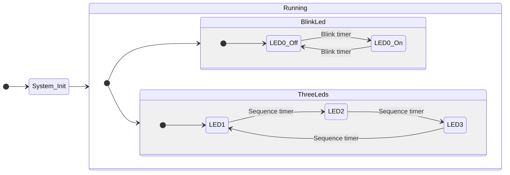
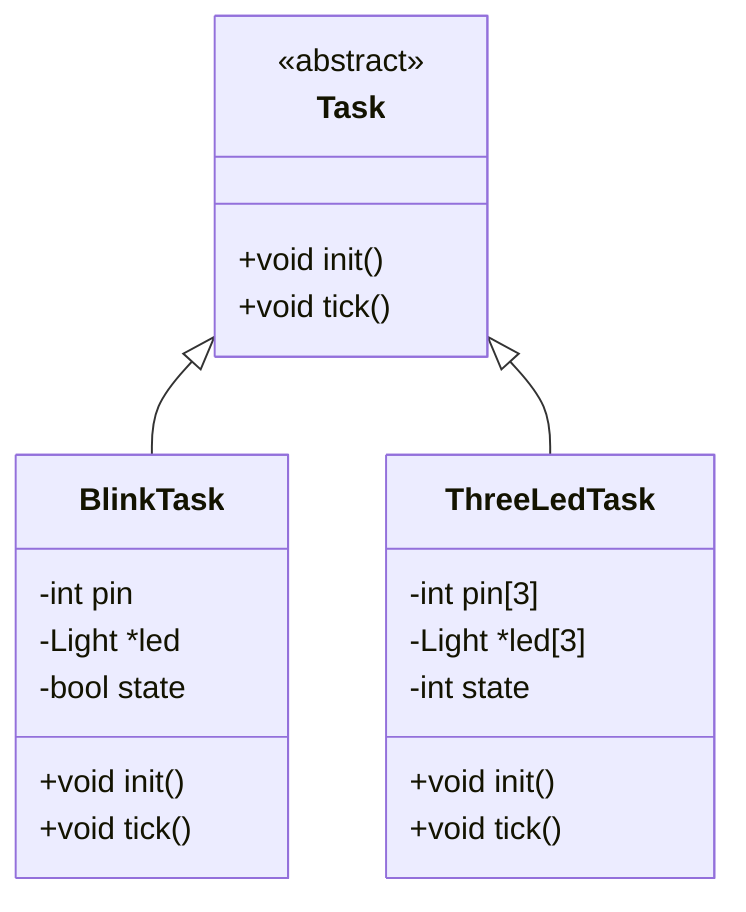
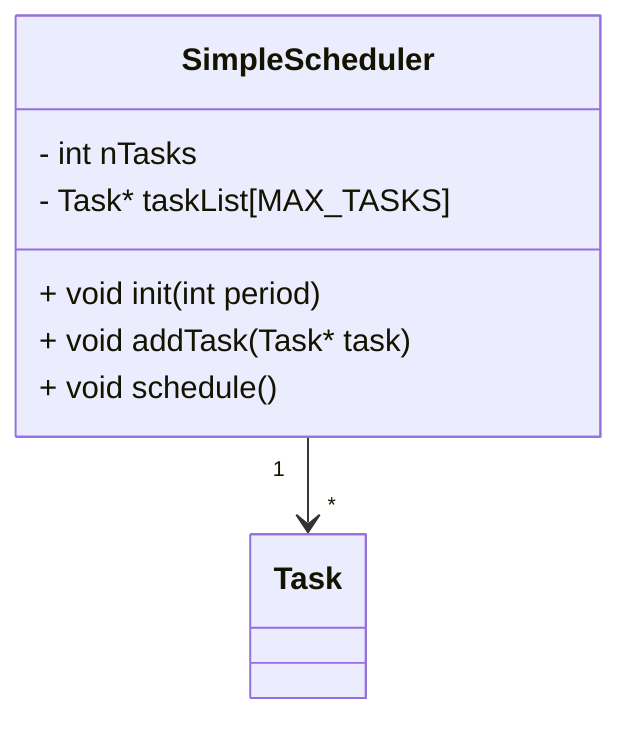

>[!question] Problema
>Design e modellazione di un ***software embedded complesso***.

C'è bisogno di modi per decomporre e modularizzare i comportamenti e le funzionalità.

## Architetture Task-Based
---
>[!tldr] Idea
>Il comportamento di un software [[../Sistemi Embedded|embedded]] è decomposto in un insieme di ***task concorrenti***.

Ogni **task** rappresenta una specifica *unità di lavoro ben definita* da eseguire.
- Il comportamento di ogni **task** può essere descritto da una [[Finite State Machines|FSM]].
- Il comportamento **globale** è il risultato dell'esecuzione e interazione di `FSM` [[../../Sistemi Operativi/Teoria/8 - Concorrenza|concorrenti]].
>[!example] Esempio

> *Led show*: Un led lampeggiante ogni $500ms$, tre led che si accendono/spengono in sequenza con un intervallo di $500ms$.
- Potrebbe essere modellato come una singola `FSM`.
>[!fail] Conterrebbe un elevato numero di stati

>[!done] È molto più semplice modellarla come una composizione di 2 `FSM`



>[!hint] Vantaggi

- Complessità ridotta
- Debugging più facile

>***Modularità***:
- Ogni **task** è un modulo indipendente.
- *Riusabilità*.

### Implementazione
>[!tldr] Idea
>Si introduce una classe astratta `{cpp icon} Task` con:
>- Metodo `init()` per inizializzare il **task**, chiamato *solo una volta*.
>- Metodo `tick()` equivalente al metodo `step()` nelle `FSM`.
>	- ***Incapsula*** il comportamento del task.
>	- Chiamato periodicamente (periodo $p$).

Ogni task è una ***implementazione concreta della classe astratta***.



```cpp
Timer timer;
BlinkTask blinkTask(2);
ThreeLedsTask threeLedsTask(3,4,5);
void setup(){
	blinkTask.init();
	threeLedsTask.init();
	timer.setupPeriod(500);
}
void loop(){
	timer.waitForNextTick();
	blinkTask.tick();
	threeLedsTask.tick();
}
```

### Gestione di Periodi Diversi
>[!info]
>È necessario tenere traccia del periodo di ogni **task**.

Si implementa un **task** [[../../Sistemi Operativi/Teoria/7 - Scheduler|scheduling]] che chiama ogni **task** con il proprio periodo.



- Strategia: [[../../Sistemi Operativi/Teoria/7 - Scheduler#Round Robin|round robin]] cooperativo.
- Il **task** dovrà controllare se è passato il periodo corretto per l'esecuzione.

>[!Caution] Nota Bene
>L'esecuzione della funzione `tick()` deve sempre avere una durata minore del ***periodo dello schduler***.

### Dipendenza tra Task
> I singoli **task** possono avere [[../../High Performance Computing/Parallelizzare i Loop#Data Dependence|dipendenze]] che richiedono varie forme di interazione.

>[!failure] Dipendenze Temporali

>[!caution] Dipendenze Produttori/Consumatori
- Un task $T_{1}$ necessita informazioni prodotte da $T_{2}$.

>[!info] Dipendenze Data-Oriented
- $T_{1}$ e $T_{2}$ devono condividere dei dati.

Queste ***dipendenze***, nel nostro caso, si possono risolvere tramite delle *variabili condivise*.
#### Problemi
>[[../../Sistemi Operativi/Teoria/8 - Concorrenza#Race Condition|Race Condition]].

Nel nostro caso (task ***cooperativi***) non ci possono essere *race conditions*.
- Ogni *task* è eseguito dallo scheduler in sequenza.
- L'esecuzione è **atomica** dal punto di vista del sistema.

>[!warning] However
>L'esecuzione di **task** a tick multipli può essere alternata da altri **task**.

Potrebbe portare a delle "*corse di alto livello*".

>[[../Elementi del Microcontroller/Power Circuit|!done]]

Se il periodo dello scheduler è abbastanza largo:
- Ad ogni ciclo lo scheduler dopo aver eseguito il ***task***, entra in "*sleep*" fino al raggiungimento del timer del prossimo `tick`.

### Scheduling
#### Overrun Exception
>[!definizione]
>Il sistema si trova in una ***overrun exception*** quando il tempo di esecuzione di una azione *eccede il periodo*.

Chiamato `timer-overrun` se lo scheduler è **time-based** e usa gli interrupt.
- In questo caso un interrupt viene generato prima della conclusione del precedente.

> Queste eccezioni possono essere individuate facendo una analisi delle line di codice [[../../Architettura degli Elaboratori/Assembly/Istruzione Assembly|assembly]].
- Tramite ***stime*** del tempo totale delle azioni.

Si controlla se nel caso peggiore dell'esecuzione la *durata eccede il periodo*.

>[!summary] Utilizzo della `CPU`
>Il parametro di utilizzo della `CPU` è la percentuale di tempo in cui la `CPU` è usata per eseguire un task.
>$$U=\frac{T_{CPU}}{T_{tot}}\cdot100$$

La Worst Case Execution Time (`WCET`) è il **tempo di esecuzione di un periodo** nel caso ***peggiore***.

Nel caso che $U>100\%$ una ***overrun exception*** potrebbe accadere.
>[!note] Per risolvere possiamo
>- Aumentare il **periodo**.
>- **Ottimizzare** la sequenza di istruzioni per ridurre il `WCET`.
>- Spezzare lunghe sequenze in **azioni più piccole**.
>- Usare un [[../Sistemi Embedded#Processore|microcontroller]] **più veloce**.
>- **Rimuovere** funzionalità dal sistema.

>[!hint] Osservazione

>Caso di multipli task da eseguire
- Il `WCET` è la somma dei `WCET` dei ***task individuali***.

> Caso periodi differenti per task
- Il `WCET` può essere calcolato considerando gli `hyper-periods`.
	- Periodi lunghi quanto il ***minimo comune multiplo dei periodi***.

$$
U=\displaystyle{\frac{\frac{H}{T_{1}}\cdot T_{1\text{WCET}}+\frac{H}{T_{2}}\cdot T_{2\text{WCET}}+\dots}{H}}\cdot100
$$
>[!warning] Attenzione
>Anche se $U<100$ se ci sono più task un overrun può ***comunque accadere***.

##### Jitter
>[!missing] Definizione
>Il [[../../Reti/Introduzione/Servizi#Proprietà|jitter]] è il delay che c'è tra il tempo in cui il **task** è *pronto* ad essere eseguito e l'***effettiva esecuzione***.

Diverse strategie di scheduling possono portare a diversi valori di **jitter**.
- Dare priorità ai [[../../Sistemi Operativi/Teoria/7 - Scheduler#Shortest Job First|task più corti]] minimizza il **jitter**.

#### Deadline
>[!definizione]
>La ***deadline*** è definita come l'intervallo di tempo in cui un **task** deve avere concluso *dal momento in cui è pronto*.

Se un **task** non è eseguito entro la deadline, accade un ***Missed Deadline Exception***, che risulta in un *system failure*.
- Se la deadline non è specificata, è di default il *periodo*.

#### Priorità Dinamica e Statica
>[!info]
>La [[../../Sistemi Operativi/Teoria/7 - Scheduler#Scheduling a Priorità|priorità]] decide l'ordine con cui i **task** vengono eseguiti.

> ***Statica***
- Se la priorità non cambia nel tempo.

> ***Dinamica***
- Se cambia durante l'esecuzione.

Concetto fondamentale nei [[../../Sistemi Operativi/Teoria/7 - Scheduler#Scheduling Real-Time|sistemi real time]].

#### Task non Periodici
>[!abstract] Sporadic Task
>I ***sporadic o aperiodic task*** sono *task* che sono eseguiti a momenti arbitrari.

Lo scheduler deve avere le capacità di gestire i ***task aperiodici***, tramite:
- Inserimento e rimozione di task in maniera **dinamica**.
- Assegnamento *dinamico della priorità*.