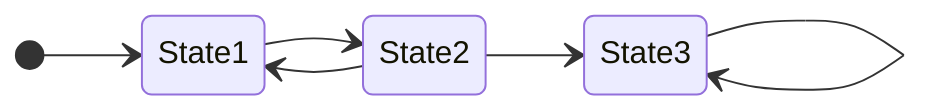
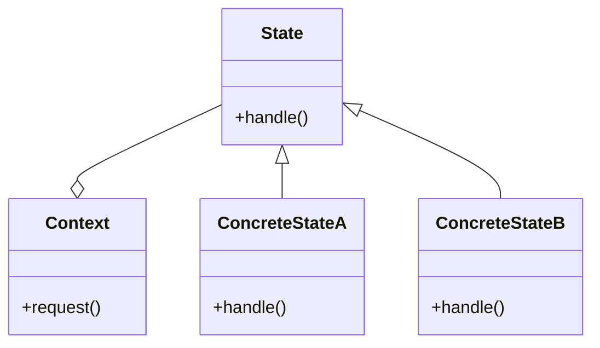

## Concetti
---
### Reactions
>[!info]
>Le *dinamiche di un sistema discreto*, può essere descritto da una serie di step chiamati ***reactions***.

Ogni reazione ha un tempo di durata uguale a $0$.

Le ***reaction*** di un sistema discreto sono innescate dall'ambiente dove il sistema risiede.
- Quando vengono innescate da eventi, sono chiamate "***event-triggered***".

>[!question] Evento
>Un ***evento*** è uno stimolo o un occorrenza esterna che può innescare un cambiamento di stato.
>- Per definizione un evento *non ha durata*.

^4073b9

### Valuation
>[!caution] Valuation degli Input e Output
>L'esecuzione di una *reaction* porta ad una ***valuation*** degli input e output.

Una ***variabile*** è associata ad ogni segnale di input.
- La ***valuation*** dell'input consiste nell'*assegnamento* del valore del segnale in quel momento alla variabile.
- Lo stesso si applica per i *segnali in output*.

### State
![[State Diagram#^8553e8]]

Formalmente definiamo lo stato come una "***codifica di tutto ciò che è accaduto che ha un effetto sulle reazioni degli input correnti o futuri***".

## Finite State Machine
---
>[!tldr] State Machine
> Una ***macchina a stati*** è un modello di un sistema con dinamiche discrete che ad ogni [[#Reactions]] mappa una [[#Valuation]] degli input o output.

- La mappa può dipendere dallo stato corrente.

>[!definizione] Finite State Machine
>Una ***macchina a stati finiti*** è una macchina dove l'insieme degli [[#State|stati]] possibili è un [[Concetti Base#Modi per identificare insiemi|insieme finito]].

Se il numero di stati è *ragionevolmente piccolo*, le macchine a stati finiti possono essere rappresentate usando lo [[State Diagram]].



### Transizioni
>[!info]
>Le ***transizioni*** tra stati governano le dinamiche discrete di una macchina a stati e la mappatura di *input valuation* a *output valuation*.

Una [[State Diagram#Transazioni|transizione]] è rappresentata da una freccia curva che *collega due stati*.

Le transizioni sono caratterizzate da una **condizione** e una **azione**.

> *Condizione*:
- Condizione (*guard*) determina **se** una transizione può essere fatta su una reazione.
- Rappresentata da un **predicato** ([[Algebra di Bool|espressione booleana]]), che valuta se la transizione deve avvenire o meno.

> *Azione*:
- Una azione specifica quali **output** sono prodotti ad ogni reazione.
- È un assegnamento di valori alle porte in uscita (*potrebbe non esserci*).

### FSM Sincrone e Asincrone
>[!caution] Asynchronous `FSM`
> Nelle `FSM` ***asincrone*** (anche dette *Event-Triggered* `FSM`) la valutazione avviene ogni volta che c'è un evento in input.

>[!summary] Synchronous `FSM`
>Nelle `FSM` ***sincrone*** (*Time-triggered* `FSM`) la valutazione avviene ad intervalli regolari chiamati *periodi*.

Il periodo determina la **frequenza di lavoro** della macchina.

>[!question] Dato uno schema, come riconoscere se è sincrono o asincrono?

> ***Non è possibile***
- Lo schema non fornisce informazioni riguardo l'implementazione, potrebbe essere o *asincrono* o *sincrono*.

Il comportamento di un [[Sistemi Embedded|sistema embedded]] è tipicamente ***time-oriented***.
- Il tempo è spesso presente nelle condizioni e nelle azioni.
- Viene spesso definito un **comportamento periodico**.

Le `FSM` sono state introdotte per fornire un modo efficace per gestire il tempo.
- Semplificando i comportamenti ***time-oriented***.

I [[Timers|timer programmabili]] sono tipicamente usati per implementare ***time-triggered*** `FSM`.
#### Input Sampling
> [[Rappresentazione dei Suoni#Campionamento|Sampling]].

>[!warning] Attenzione
>Scegliere il *periodo* è una scelta **critica** nel design di una `FSM` ***sincrona***.
>>[!abstract] Deve essere *abbastanza piccolo* per non perdere l'evento.
>
>>[!todo] Deve essere *abbastanza grande* per evitare rallentamenti del sistema.

>[!done] Soluzione

Segliere il periodo di sampling come il **M**inimum **E**vent **S**eparation **T**ime (`MEST`).
- `p < MEST`.
- Scegliendo il periodo **minore** del `MEST` abbiamo la garanzia che tutti gli *eventi vengano rilevati*.
### Input Output Modelling
>[!abstract] Variabili di Input

- Le variabili di input sono ***modificate dall'ambiente esterno***.

>[!missing] Variabili di Output

- Le variabili di output sono ***modificate dalla macchina*** attraverso *azioni* per controllare l'ambiente esterno.

Oltre all'`I/O` le variabili possono essere usate per definire in modo flessibile lo ***stato globale della macchina***.

### Implementazione
>[!help] Schema Generale

```cpp
/* global vars used by the machine */
int a0, b0, ...;
/* 
	variable keeping track of the state
*/ 
enum States {…} state;

/* procedure implementing the step of the state machine */
void step(){ 
	switch(state) {
		case States::state1:
			break;
			...
		default:
			break;
	}
}

loop(){
	step();
}
```

>[!hint] Osservazioni
>È presente:
>- Una rappresentazione ***esplicita degli stati***.
>- Una variabile che ***mantiene lo stato corrente***.
>
>La funzione `{c icon} step()` controlla quali transizioni *sono abilitate* in base allo stato corrente.

>[!warning] Attenzione

Le computazioni in relazione alle azioni devono **sempre terminare**.
- Teoricamente *dovrebbero essere istantanee*.

#### State Pattern
> [State Pattern](https://refactoring.guru/design-patterns/state)

>[!info]
>"*State is a behavioral design pattern that lets an object alter its behavior when its internal state changes. It appears as if the object changed its class*".


### Extended Finite State Machine
>[!hint] Info
>Le `EFSM` sono `FSM` dove le variabili sono usate anche per ***descrivere lo stato***, per rendere più concisa e efficiente la descrizione generale.

In questo caso le azioni possono anche includere *cambiamenti sulle variabili di stato*.
> ***State Space Size***
- Il *numero totali di stati* può essere calcolato considerando tutte le possibili configurazioni di variabili di stato.
$$
|states| = N\cdot p^{m}
$$
Dove:
- $n$ è il numero di **stati**.
- $m$ è il numero di **variabili** usate per *descrivere gli stati*.
- $p$ sono i possibili insiemi di valori che possono essere assegnati alle variabili.

### Macchina di Moore e Mealy
>[!abstract] Mealy Machines

> Concetto chiave:
- Le *azioni* sono specificate nelle **transizioni**.

>[!help] Moore Machines

> Concetto chiave:
- Le *azioni* sono specificate all'**interno dello stato**.
