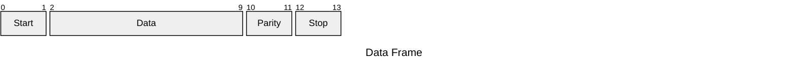

![[MicrocontrollerElements.png]]

## Architettura della CPU
---

![[La CPU]]

## Le Memorie
---
![[Organizzazione della Memoria#Memoria Principale]]

![[Organizzazione della Memoria#ROM]]

## Basic Control Architecture
---
>[!failure] Super-Loop
>Il ***super loop*** è la più semplice architettura di controllo adottata per la programmazione di [[Sistemi Embedded#Processore|microcontroller]].

Non richiede alcun *supporto hardware*.

>[!tldr] Idea

- Inizializzazione.
- **Loop infinito**.

```c
#include "X.h"

void main(void) {
	X_Init();
	while(1)
	{
		X();
	}
}
```

>[!done] Pro
- Semplicità.
- Affidabile e sicuro.
- Efficiente.

>[!fail] Contro
- Timing poco accurato.
- Poco flessibile.

> Semplici regole per le routine
- Più sono pesanti, più il sistema sarà lento e meno reattivo.
- Dovrebbero fare scorrere il `super loop` velocemente.

## Input Output
---
>[!abstract] PIN
> Ogni microcontroller, contiene un insieme di ***pin*** che possono essere usati per guidare l'input e l'output.

I `PIN` sono tipicamente ***general purpose***, possono essere programmati come **input** o **output**, in *base alle necessità*.

I pin possono essere [[Il Calcolatore e i Numeri Binari#I sistemi Digitali|analogici]] o [[Il Calcolatore e i Numeri Binari#I sistemi Digitali|digitali]].
- Un ***pin digitale*** può assumere solo due valori `HIGH` o `LOW` (`1` o `0`).
- Un ***pin analogico*** può assumere un qualsiasi valore nel range `0..5V` ([[Potenziale Elettrico#Potenziale Elettrico|Volt]]).
	- Valori compresi tra `GND` e `VCC`.

>[!caution] Conversione
>La conversione è fatta dal `ADC` (analog to digital converter) che mappa un *voltaggio continuo* in un ***range di valori discreti***.

>[!help] Parametri di riferimento per i `PIN`

> ***Voltaggio***: [[Potenziale Elettrico#Potenziale Elettrico|Volt]]

> ***Corrente***: [[Corrente Elettrica#Ampere|Ampere]]


Oltre ad essere general purpose, alcuni `PINs` hanno delle ***funzioni aggiuntive*** che possono essere attivate:
- Dette `PIN` [[Multiplexing|multiplexed]] functions 
>[!example] Esempi
- **Interfacce seriali**.
- **Interrupt**.
- etc...
### Porte
>[!info]
>Il ***microcontroller*** interagisce con i `PIN` attraverso le ***porte***.
>- Come per i `PIN` le *porte* possono essere sia di *input* che di *output*.

Una porta è gestita da uno o più `SRF` (***S***pecial ***P***urpose ***R***egisters).
- Ha il compito di mantenere lo ***stato*** (il valore corrente) e la configurazione (**input**/**output**).

### Impostare, Scrivere e Leggere un PIN
>Ci sono delle `API` per il funzionamento dei `PIN`.

`{c icon} pinMode()`
- Serve per impostare la *direzione* del `PIN` (**input**/**output**).

`{c icon} digitalWrite()`
- Per impostare il valore di un `PIN` **output**.

`{c icon} digitalRead()`
- Per leggere il valore di un `PIN` **input**.

`{c icon} int analogRead(int PIN)`
- Per leggere un valore analogico in un `PIN` specifico.

>[!hint] Dettaglio: I delay
>`{c icon} delay()` è una procedura che esegue un [[10 - Sezioni Critiche#Busy-Waiting|busy waiting]] per un numero specificato di millisecondi.

```c title:delay()
void delay(unsigned long ms)
{
	unsigned long start = millis();
	while(millis() - start <= ms);
}
```

### Pulsewidth Modulation
>[!definizione]
>Il `PWM` è un metodo per ***simulare*** un segnale analogico in output sui `PIN` **digitali**.

L'output è definito dal ***duty cycle***.
- Il ***duty cycle*** è un valore percentuale che rappresenta il periodo in cui il segnale è `HIGH`.
- Il valore medio del voltaggio è dato dalla seguente equazione: $\text{duty-cycle}\cdot VCC$.

### Interrupt
>[!info]
>Gli [[Interfacciamento di Periferiche#Interrupt|interrupt]] sono un meccanismo fondamentale usato dai microcontroller per reagire ad eventi innescati da **dispositivi esterni**.

Una `CPU` fornisce diversi `PIN`, chiamati `IRQ` (interrupt request), per ***ricevere dei segnali di interrupt***.

>[!warning] Interrupt disabilitati
>Quando gli interrupt sono disabilitati, tramite le funzioni `noInterrupts()` (*enable*) e `interrupts()` (*disable*), il sistema **non reagisce ad eventi esterni**.

Queste funzioni devono essere usate con ***cautela***.
- Si vuole avere una "***interrupt latency***" *bassa*. (tempo usato per reagire ad un interrupt).
#### Handling interrupts in Wiring
> `API`:
- `attachInterrupt(intNum, ISR, mode)`, where
    - `intNum`: interrupt number
    - `ISR`: pointer to handler `void (*func)(void)`
    - `mode`:
        - `CHANGE/RISING/FALLING` $\rightarrow$ at change `HIGH` $\leftrightarrow$ `LOW`
        - `LOW/HIGH` $\rightarrow$ when the state is `LOW` or `HIGH`
- `digitalPinToInterrupt(numPin)` helps finding `intNum` for the previous function

```c
#define BTN_PIN 2
volatile int count = 0;
int prev = 0;

void setup() {
	Serial.begin(9600);
	attachInterrupt(digitalPinToInterrupt(BTN_PIN), inc, CHANGE);
}

void loop() {
	noInterrupts();
	int current = count;
	interrupts();
	if (current != prev) {
		Serial.println(current);
		prev = current;
	}
}

void inc() {
	count++;
}
```
## Timers
---
> I ***Timers*** sono usati per implementare *funzionalità di alto livello*.

>[!done] Soluzione Più semplice
>Nel caso più semplice un timer è implementato tramite un counter, ***incrementato a livello hardware***.

```c title:"millis() using timers"
unsigned long millis()
{
	unsigned long m;
	uint8_t oldSERG = SERG;
	
	cli();
	m = timer0_millis; // variable that contains the value of the timer0 counter
	SERG = oldSERG;
	
	return m;
}
```

>[!danger] Watch Dog Timer
>Il ***Watch Dog Timer*** è un timer che conta fino ad un valore specificato, dopodiché un segnale è prodotto per **riavviare il sistema**.

In un normale funzionamento, il *watch dog timer*, riceve periodicamente un segnale prima di raggiungere il **threshold**, resettando il counter.
- Se non riceve un segnale, significa che il microprocessore ha incontrato un problema ([[9 - Condivisione di Risorse#Deadlock|deadlock]]) e deve essere resettato.

### Timers e Pulsewidth Modulation
>[!warning] Attenzione
>Dobbiamo prestare particolare attenzione alle interferenze quando si usano i timer e i `PWM`.

Se usiamo `{c} Timer1` direttamente, non possiamo utilizzare i `PIN` `9` e `10` per `PWM`.
- Potrebbero andare in conflitto (es. librerie per i servo motori #addLink).

## Bus e Protocolli
---
> I protocolli per scambiare i dati possono essere molto complessi, in base al dispositivo esterno.

Per questo motivo sono state introdotte delle interfacce di comunicazione specifiche, bus e protocolli.

>[!note] Tipologie
>Due tipi principali **seriale** e **parallelo**.

> ***Seriale***:
- Invio di uno stream di `bit` in modo sequenziale in un singolo canale.

> ***Parallelo***:
- Permette il trasferimento di più `bit` allo stesso momento tramite più canali.

![[BUS dei Calcolatori#BUS Sincroni e Asincroni]]

>[!abstract] BAUD Rate
>La velocità di trasmissione in `bit`$/\sec$ 

A livello hardware, un `BUS` seriale è composto da due *linee*:
- Una per trasmettere i `bit`.
- Una per ricevere i `bit`.

Uno dei componenti principali di un sistema seriale è `UART` (***U***niversal ***A***synchronous ***R***eceiver ***T***ransmitter).
	- Ha il compito di [[BUS dei Calcolatori#Arbitraggio del BUS|arbitrare]] i dati che arrivano e che partono dalle interfacce seriali.
#### Data Frame
> Ogni blocco di dato è trasmesso in un pacchetto chiamato ***frame***.

I frame sono creati ***aggiungendo delle sincronizzazioni***.


>[!warning] Attenzione
>Prestare attenzione all'"[[Definizioni_Architettura#Ordinamento dei `BYTE`|endianess]]".

#### Libreria Seriale
> `Serial`class is an extension of `Stream` and includes methods such as:
- `{c}begin()`, `{c}end()`
- `{c}read()`, `{c}readBytes()`, `{c}readBytesUntil()`, `{c}peek()`, `{c}available()`
- `{c}parseFloat()`, `{c}parseInt()`
- `{c}write()`, `{c}flush()`
- `{c}print()`, `{c}println()`
- `{c}setTimout()`
- `{c}serialEvent()`

```c
char data;

void setup()
{
	Serial.begin(9600);
}

void loop()
{
	if(Serial.available())
	{
		data = Serial.read();
		Serial.print(data);
	}
}
```

#### Protocollo Bus
>[!todo] $I^{2}C$
>Il protocollo "***eye to see***" è un protocollo standard per i `BUS`.

Buone velocità, minimizzando il numero di `PIN` richiesti.
- Anche detto `TW` (Two Wire) poiché usa solo $2$ linee per la comunicazione (**data** e **clock**).

Ha una architettura di tipo [[BUS dei Calcolatori#Master e Slave|master e slave]].
- La comunicazione è sempre iniziata dal **master**.
- Il messaggio è ricevuto da tutti gli **slave**, solo il *target slave* reagisce al messaggio.

##### SPI
>[!abstract] SPI
>Il `BUS` ***SPI*** implementa un protocollo seriale ***full-duplex*** che permette una comunicazione bidirezionale tra il *master* e gli *slaves*.

**Non** è uno *standard ufficiale*.

## Power Management
---
>[!help] Controllo dell'energia
>Il ***power management*** è una funzionalità importante supportata dalla maggior parte dei *microcontroller*.
>- Da la possibilità di sfruttare la modalità "*lower power consumption*" (**sleep mode**).

> 5 modalità.
- Idle Mode.
- ADC Noise Reduction Mode.
- Power-save Mode.
- Standby Mode.
- Power-down Mode.