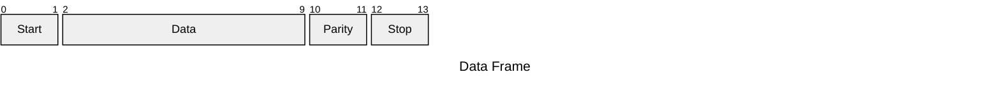

## Bus e Protocolli
---
> I protocolli per scambiare i dati possono essere molto complessi, in base al dispositivo esterno.

Per questo motivo sono state introdotte delle interfacce di comunicazione specifiche, bus e protocolli.

>[!note] Tipologie
>Due tipi principali **seriale** e **parallelo**.

> ***Seriale***:
- Invio di uno stream di `bit` in modo sequenziale in un singolo canale.

> ***Parallelo***:
- Permette il trasferimento di più `bit` allo stesso momento tramite più canali.

![[../../Architettura degli Elaboratori/Architettura del Calcolatore/BUS dei Calcolatori#BUS Sincroni e Asincroni]]

In interfacce seriali asincrone, non c'è una linea per il clock, la sincronizzazione avviene tramite un ***protocollo*** per assicurare una trasmissione *senza errori*.

Il protocollo può essere configurato attraverso alcuni parametri che devono essere concordati da entrambe le parti della comunicazione.

>[!abstract] BAUD Rate
>La velocità di trasmissione in `bit`$/\sec$ 

A livello hardware, un `BUS` seriale è composto da due *linee*:
- Una per trasmettere i `bit`.
- Una per ricevere i `bit`.

Uno dei componenti principali di un sistema seriale è `UART` (***U***niversal ***A***synchronous ***R***eceiver ***T***ransmitter).
- Ha il compito di [[../../Architettura degli Elaboratori/Architettura del Calcolatore/BUS dei Calcolatori#Arbitraggio del BUS|arbitrare]] i dati che arrivano e che partono dalle interfacce seriali.
#### Data Frame
> Ogni blocco di dato è trasmesso in un pacchetto chiamato ***frame***.

I frame sono creati ***aggiungendo delle sincronizzazioni***.


>[!warning] Attenzione
>Prestare attenzione all'"[[../../Definizioni/Definizioni_Architettura#Ordinamento dei `BYTE`|endianess]]".

#### Hardware Seriale
> A livello hardware un bus asincrono seriale è composto da due linee.

Una che trasmette i `bit` e una che li riceve.

![[../../Internet of Things/Elementi del Microcontroller/attachements/SerialLine.png]]

#### Libreria Seriale
> `Serial`class is an extension of `Stream` and includes methods such as:
- `{c}begin()`, `{c}end()`
- `{c}read()`, `{c}readBytes()`, `{c}readBytesUntil()`, `{c}peek()`, `{c}available()`
- `{c}parseFloat()`, `{c}parseInt()`
- `{c}write()`, `{c}flush()`
- `{c}print()`, `{c}println()`
- `{c}setTimout()`
- `{c}serialEvent()`

```c
char data;

void setup()
{
	Serial.begin(9600); // baud rate
}

void loop()
{
	if(Serial.available())
	{
		data = Serial.read();
		Serial.print(data);
	}
}
```

#### Protocollo Bus
>[!todo] $I^{2}C$
>Il protocollo "***eye to see***" è un protocollo standard per i `BUS`.

Buone velocità, minimizzando il numero di `PIN` richiesti.
- Anche detto `TW` (Two Wire) poiché usa solo $2$ linee per la comunicazione (**data** e **clock**), rispettivamente `SDA` (*Serial Data Line*) e `SCL` (*Serial Clock Line*).

Ha una architettura di tipo [[../../Architettura degli Elaboratori/Architettura del Calcolatore/BUS dei Calcolatori#Master e Slave|master e slave]].
- La comunicazione è sempre iniziata dal **master**.
- Il messaggio è ricevuto da tutti gli **slave**, solo il *target slave* reagisce al messaggio.
- Tutti i dispositivi condividono le due linee (dati e clock)

> ***Velocità di Trasferimento***
- Supporta diverse modalità, tra cui la Standard Mode a $100 Kbit/s$ e versioni Low-speed a $10 Kbit/s$.

##### Funzionamento
> Tipicamente è il Microcontroller che inizializza la comunicazione.

>[!abstract] Schema tipico di comunicazione

1.  Invio di un bit di START da parte del Master;
2.  Invio dell'identificativo a 7 bit del dispositivo Slave;
3.  Definizione dell'operazione (bit di lettura 0 o scrittura 1) per interagire con i registri;
4. Riscontro dello Slave tramite un bit di ACK (attivo a 0);
5. Trasferimento dei dati: in scrittura il Master invia byte e riceve ACK, in lettura riceve byte e invia ACK;
6. Chiusura della sessione tramite un bit di STOP inviato dal Master.
##### SPI
>[!abstract] SPI
>Il `BUS` ***SPI*** implementa un protocollo seriale ***full-duplex*** che permette una comunicazione bidirezionale tra il *master* e gli *slaves*.

**Non** è uno *standard ufficiale*.

Si differenzia dal $I^{2}C$, poiché vengono usate linee diverse per inviare e ricevere dati.
- Una linea per il clock (`SCK` shared serial clock)
- Una linea per inviare dati dal master allo slave (`MOSI`)
- Una linea per inviare dati dal slave allo master (`MISO`)
- Una linea specifica viene usata per decidere con quale slave il master deve comunicare (`SS`).

Ci sono diversi modi con cui si possono connettere più slaves ad un master:
- Usando multiple line `SS`
- Usando una connessione a daisy chaining.