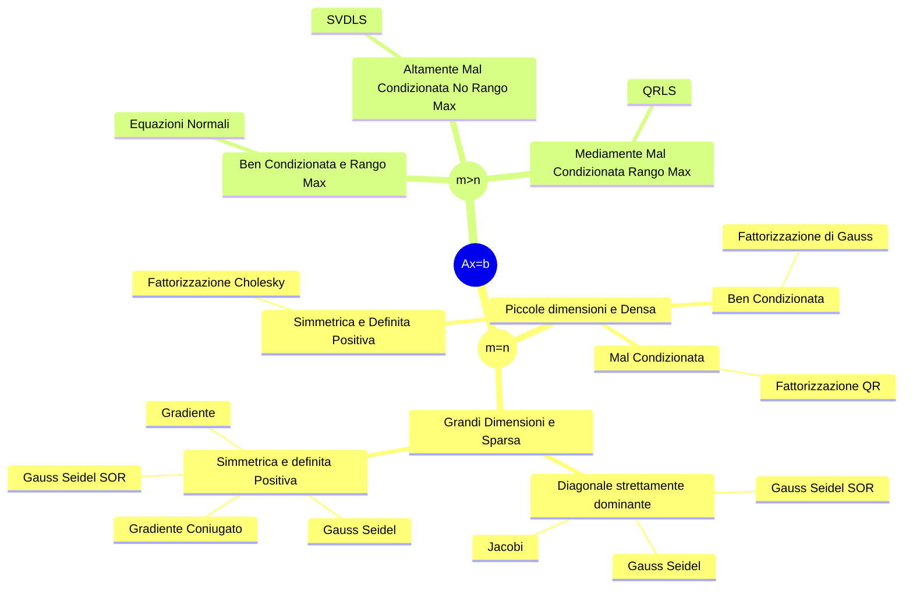

## Generalità sui Sistemi Lineari
---
>[!abstract] Ricordo

![[I Tre Usi delle Matrici#Sistemi Lineari]]


> Consideriamo un sistema lineare:

$$
\begin{cases}
a_{11}x_{1}+a_{12}x_{2}+a_{13}x_{3}+\dots+a_{1n}x_{n}=b_{1} \\
a_{21}x_{1}+a_{22}x_{2}+a_{23}x_{3}+\dots+a_{2n}x_{n}=b_{2} \\
a_{31}x_{1}+a_{32}x_{2}+a_{33}x_{3}+\dots+a_{3n}x_{n}=b_{3} \\
\vdots \\
a_{m1}x_{1}+a_{m2}x_{2}+a_{m3}x_{3}+\dots+a_{mn}x_{n}=b_{m}
\end{cases}
$$
>[!question] Obbiettivo
>Noti i coefficienti $a_{ij}, \quad i=1,\dots,m,j=1,\dots,n$ e le componenti del vettore noto $b_{i}, \quad i=1,\dots,m$ si vuole individuare il vettore $x$ incognito di $n$ componenti che soddisfa **contemporaneamente** le $m$ *relazioni lineari*.

In formato matriciale: $Ax=b$
- Con $A\in \mathbb{R}^{m\times n}, x\in\mathbb{R}^n,b\in\mathbb{R}^m$
$$
\underbrace{ \begin{bmatrix}
a_{11} & a_{12} & \dots & a_{1n} \\
a_{21} & a_{22} & \dots & a_{2n} \\
\vdots & \vdots & \ddots & \vdots \\
a_{m1} & a_{m2} & \dots & a_{mn} \\
\end{bmatrix} }_{ A }\underbrace{ \begin{bmatrix}
x_{1} \\
x_{2} \\
\vdots \\
x_{n}
\end{bmatrix} }_{ x }=
\underbrace{ \begin{bmatrix}
b_{1} \\
b_{2} \\
\vdots \\
b_{m}
\end{bmatrix} }_{ b }
$$
>[!hint] Soluzioni
>Un sistema lineare si dice ***compatibile*** se ammette *almeno una soluzione*, si dice ***incompatibile*** altrimenti.

#### Interpretazione Geometrica
> Consideriamo sistemi lineari $A\in\mathbb{R}^{2\times 2},b\in\mathbb{R}^2, x\in\mathbb{R}^2$

>[!caution] Punto di Intersezione tra due Rette

$$
\begin{cases}
2x+2y=7 \\
x+y=3
\end{cases}
$$

```functionplot
---
title: 
xLabel: 
yLabel: 
bounds: [-2,2,0,8]
disableZoom: false
grid: true
---
f(x)=-3/2x+7/2
g(x)=-x+3
```
> ***Una soluzione***

>[!abstract] Rette coincidenti

$$
\begin{cases}
3x+2y=7 \\
6x+4y=14
\end{cases}
$$

```functionplot
---
title: 
xLabel: 
yLabel: 
bounds: [-2,2,0,8]
disableZoom: false
grid: true
---
f(x)=-3/2x+7/2
g(x)=-3/2x+7/2
```
> ***Infinite soluzioni***

>[!abstract] Rette parallele

$$
\begin{cases}
3x+2y=7 \\
6x+4y=5
\end{cases}
$$

```functionplot
---
title: 
xLabel: 
yLabel: 
bounds: [-2,2,0,8]
disableZoom: false
grid: true
---
f(x)=-3/2x+7/2
g(x)=-3/2x+5/2
```
> ***Nessuna soluzione***

## Risoluzione Sistemi
---
![[Risoluzione di Sistemi#Ruchè-Capelli]]

#### Casi
> Se $m<n$

>[!quote] Abbiamo ***più*** incognite che relazioni.
>Il sistema si dice ***indeterminato***
- Se indichiamo con $k$ il *rango*: $rg(A)=k$ e $k<n$ allora il sistema ammette $\infty^{n-k}$ **soluzioni**.

> Se $m>n$

>[!quote] Abbiamo ***meno*** incognite che relazioni.
>Lo chiamiamo sistema ***sovradeterminato***.

>Se $m=k$

>[!quote] Il numero di incognite è ***uguale*** al numero di relazioni.
>Il sistema si dice ***normale*** e sotto opportune ipotesi ammette **una e una sola soluzione**.

#### Matrici Singolari
>[!definizione]
>Sia $A\in\mathbb{R}^{n\times m}$, la matrice è detta ***non singolare*** se soddisfa una delle seguenti *condizioni equivalenti*:
>1. $\det(A)\neq 0$
>2. Esiste la [[8 - Matrici Invertibili#Matrice Inversa|matrice inversa]] $A^{-1}$ di $A$
>3. $\text{rank}(A)=n$
>
><u>Altrimenti $A$ è singolare</u>

![[Risoluzione di Sistemi#Insieme delle Soluzioni]]

>[!warning] Nota
>Il metodo dell'inversa risulta ***poco efficiente*** e anche ***poco accurato***

> Esempio $7x=21$

Il metodo restituisce la seguente soluzione:
$$
x=7^{-1}\cdot21=0.142857\cdot 21=2.99997
$$

#### Soluzione Basata sul Metodo di Cramer
> Un metodo ben noto è basato sul [[Risoluzione di Sistemi#Metodo di Cramer|metodo di Cramer]].

$$
x_{1}=
\displaystyle{\frac{\det\begin{pmatrix}
b_{1} & a_{12} & \dots & a_{1n} \\
b_{2} & a_{22} & \dots & a_{2n} \\
\vdots & \vdots & \ddots & \vdots \\
b_{n} & a_{n2} & \dots & a_{nn} \\
\end{pmatrix}}{\det\begin{pmatrix}
a_{11} & a_{12} & \dots & a_{1n} \\
a_{21} & a_{22} & \dots & a_{2n} \\
\vdots & \vdots & \ddots & \vdots \\
a_{n1} & a_{n2} & \dots & a_{nn} \\
\end{pmatrix}}}
$$
$$
x_{2}=
\displaystyle{\frac{\det\begin{pmatrix}
a_{11} & b_{1} & \dots & a_{1n} \\
a_{21} & b_{2} & \dots & a_{2n} \\
\vdots & \vdots & \ddots & \vdots \\
a_{n1} & b_{n} & \dots & a_{nn} \\
\end{pmatrix}}{\det\begin{pmatrix}
a_{11} & a_{12} & \dots & a_{1n} \\
a_{21} & a_{22} & \dots & a_{2n} \\
\vdots & \vdots & \ddots & \vdots \\
a_{n1} & a_{n2} & \dots & a_{nn} \\
\end{pmatrix}}}
$$
- $\dots$

>[!danger] Metodo ad alta complessità computazionale
>Questo metodo comporta una [[Complessità di Algoritmi|complessità computazionale]] di circa $O((n+1)!)$.

## Mappa Concettuale
---

![[LinearSystems.jpg]]


