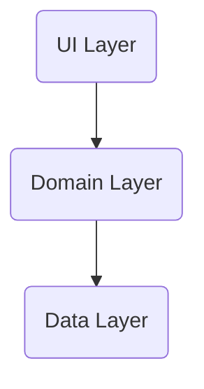

> [[Introduzione ad Android|Android]] utilizza un file system simile a quelli basati su disco di altre piattaforme.

Il sistema offre diverse opzioni per salvare i dati dell'app.
- App-Specific Storage
- Shared Storage
- Preferences
- Database

La scelta del tipo di storage da utilizzare dipende in base agli ***specifici bisogni***.

>[!question] Quanto spazio richiedono i dati?

>[!question] Quanto deve essere affidabile l'accesso ai dati?

>[!question] Che tipo di dati devi archiviare?

>[!question] I dati devono essere privati alla tua app?


## Categorie di Storage Location
---
>[!abstract] Internal Storage
>Lo ***storage interno*** è sempre disponibile anche se spesso più piccola di dimensione rispetto a quella *esterna*.

>[!caution] External Storage
>Lo storage esterno è un volume rimuovibile come `SD` card.

Sono rappresentati in android usando il *path*: `/sdcard`.

---

Le app vengono archiviate nella ***memoria interna*** per impostazione *predefinita*.
- Se le dimensioni dell'`APK` sono molto grandi si può indicare una preferenza nel [[Manifest]] dell'app per installare l'app nella ***memoria esterna***.

```xml
<mainfest
    android:installLocation="preferExternal">
	...
</manifest>
```

Per ogni app, android, fornisce due directory interne accessibili solo dall'app stessa:
- Una per contenere file persistenti (`filesDir`).
- Una per contenere l'app [[Cache]] (`cacheDir`).

>[!done] Pro
- Altre app non possono accedere a queste directory.

>[!fail] Contro
- Lo spazio riservato è piccolo.

Per accedere e memorizzare file persistenti si può usare la `File` `API`.
```kt
// filesDir
val file = File(context.filesDir, fileName)

// cacheDir
File.createTempFile(fileName, null, context.cacheDir)
```

Se non c'è abbastanza spazio nella memoria interna, si può usare quella esterna, android fornisce altre due directory:
- Una per contenere file persistenti (`externalFilesDir`).
- Una per contenere l'app cache (`externalCacheDir`).

>[!warning] Attenzione
>I file in queste directory ***non sono garantiti*** come *accessibili*.
>La scheda esterna potrebbe essere estratta dal dispositivo.

>[!check] Nota sui contenuti multimediali
> È importante utilizzare *nomi di directory* forniti da `API` come `DIRECTORY_PICTURES`.
> Questi nomi assicurano che i file siano **trattati correttamente dal sistema**.


### Permessi di accesso
> Android definisce le seguenti autorizzazione per l'accesso in lettura e scrittura alla memoria esterna:

- `READ_EXTERNAL_STORAGE`
- `WRITE_EXTERNAL_STORAGE`
- `MANAGE_EXTERNAL_STORAGE`

Nelle versioni vecchie di android le app **dovevano dichiarare** l'autorizzazione `READ_EXTERNAL_STORAGE` per accedere a qualsiasi file al di fuori delle directory specifiche dell'app.
- Le versioni più recenti si basano sullo ***scope*** di un file.

Questo modello di archiviazione basato sullo scope migliora la privacy dell'utente.

#### Scoped Storage
> Per offrire agli utenti un maggiore controllo sui propri file, di default le app destinate ad android `10+` hanno ***scoped access*** alla memoria esterna.

Queste app hanno accesso solo alla [[#App Specific Storage]] su memoria esterna.

>[!help] Scope
> Divide i [[Permessi|permessi]] nei seguenti livelli di accesso:
> - Accesso ***read and write*** ai propri file senza necessità di permessi.
> - Accesso in ***lettura*** ai media delle altre app con il permesso `READ_EXTERNAL_STORAGE`'.
> - Accesso in ***scrittura*** ai media delle altre app, solo con il *diretto consenso dell'utente* (ad eccezione della galleria di sistema).
> - ***Nessun accesso*** alle directory di storage esterno di altre app.
## App Specific Storage
---
>[!hint] Info
>Archivia i ***file destinati esclusivamente all'uso dell'app***, in directory dedicate all'interno di un volume di archiviazione interno.

Solo l'app è in grado di accedere a questi dati, tutte le *altre applicazioni non hanno accesso a questo storage*.

>[!important] Attenzione
- Se l'app viene disinstallata, i dati salvati in questo archivio **verranno persi**.

>[!help] Sicurezza
>Per una maggiore sicurezza è possibile utilizzare la ***Security Library*** per criptare i file.

## Shared Storage
---
>[!hint] Info
>Archivia i file che l'app intende ***condividere*** con altre app.

> Es.
- File multimediali, documenti, etc...

Android fornisce `API` per l'archiviazione e l'accesso ai seguenti tipi di dati condivisibili:
- Contenuti Multimediali (`MediaStore`).
- Documenti e altri file (`StorageAccessFramework`).
- Dataset (`BlobStoraManager`).

### Media
>[!help] Media Store
>Il framework fornisce un indice ottimizzato nelle raccolte multimediali, chiamato ***Media Store***, che consente di recuperare e aggiornare più facilmente questi media.

Anche dopo la disinstallazione dell'app questi file ***rimangono sul dispositivo***.

Per interagire con *media store*, si può utilizzare un oggetto `ContentResolver`:

> Il sistema esegue automaticamente la scansione del volume di archiviazione esterno e **aggiunge** file multimediali alle seguenti *raccolte ben definite*:
- `Images`: Fotografie e screenshot archiviati nelle directory `DCIM/` e `Pictures/`, vengono aggiunti nella tabella `MediaStore.Images`
- `Videos`: Archiviati nelle directories `DCIM/`, `Movies/` e `Pictures/`, vengono aggiunti nella tabella `MediaStore.Video`.
- `Audio Files`: Memorizzati nelle directory `Alarms/`, `Audiobooks/`, `Music/`, `Notifications/`, `Podcasts/` e `Ringtones`, vengono aggiunti alla tabella `MediaStore.Audio`.
- `Downloaded Files`: File archiviati nella directory `Downloads/` disponibili (da android $10+$) nella tabella `MediaStore.Downloads`.

Il media store include anche una raccolta chiamata `MediaStore.Files`.
- Il contenuto dipende dal fatto che l'app utilizzi l'archiviazione [[#Scoped Storage|scoped]].
- Se l'archiviazione con scope è abilitata la raccolta mostra solo le foto, i video e i file ***creati dall'app***.


## Preferences
---
>[!hint] Info
>Archivia ***dati primitivi***, privati in coppie *chiave-valore*.

### Data Store
> `DataStore` è una soluzione di archiviazione dati nuova, fortemente basata su `{kt icon} Kotlin` e `Flow`.

Fornisce due diverse implementazioni:
- ***Proto DataStore***, memorizza oggetti tipizzati.
- ***Preferences DataStore***, memorizza coppie chiave-valore in modo asincrono.

>[!summary] Regole
- ***Non creare mai*** più di un'istanza di `DataStore` per un determinato file nello stesso processo.
- Il tipo generico di `DataStore` ***deve essere immutabile***.
- ***Non mescolare*** mai gli utilizzi di `SingleProcessDataStore` e `MultiProcessDataStore` per lo stesso file.

>[!help] Creazione

```kt
val Context.dataStore: DataStore<Preferences> by preferencesDataStore(name = "settings")
```

>[!hint] Lettura

```kt
val EXAMPLE_COUNTER = intPreferenceKey("example_counter")

val exampleCounterFlow: Flow<Int> = context.dataStore.data.map{
	preferences ->
	preferences[EXAMPLE_COUNTER] ?: 0
}
```

## Database
---
>[!hint] Info
>Android fornisce la possibilità di ***archiviare i dati strutturati*** in un [[Git-Obsidian/DataBase/Introduzione|database]] privato utilizzando la libreria di persistenza `Room`.

`Room` offre uno strato di *astrazione* su `{sqlite icon} SQLite` per consentire un accesso fluido al database sfruttando la sua piena potenza.

>[!question] Utilizzo possibile

Il database interno potrebbe essere sfruttato come [[Cache]] quando il dispositivo non è in grado di accedere alla rete.
- In questo modo, l'utente è in grado di navigare i contenuti della app anche se *offline*.

	
## View Model
---
>[!info]
> La classe `ViewModel` è ***business logic*** o ***screen level state holder***.
> Espone lo stato all'interfaccia utente e incapsula la logica di business.

Il suo vantaggio principale è che memorizza nella cache lo stato e lo "*persiste*" attraverso le modifiche alla configurazione.
- L'interfaccia utente non deve recuperare nuovamente i dati durante la navigazione tra le [[Activity]].

![[ViewModelLogic.png]]

La ***repository*** è utilizzata per gestire *più data source*.
- Una classe `Repository` astrae l'accesso a più data source.
- `Repository` non fa parte delle librerie di **Architecture Components** ma il suo utilizzo è consigliato per la separazione del codice.
- Una classe `Repository` fornisce una `API` pulita per l'***accesso ai dati al resto dell'applicazione***.

>[!abstract] Principi di Architettura
>Una ***architettura dell'app ben progettata*** ti aiuta a scalare l'app.
>I principi architetturali più comuni sono:
>- ***Separation of Concerns***, afferma che l'app è suddivisa in classi di funzioni, ciascuna con responsabilità separate.
>- ***Driving*** `UI` ***from a Model***, afferma che dovresti guidare l'interfaccia da un modello, preferibilmente persistente.

> L'architettura consigliata è la seguente:


Dove:
- Il ***livello UI*** è un livello che visualizza i dati dell'app sullo schermo, ma è indipendente dai dati.
- Il ***livello dati*** è un livello che archivia, recupera ed espone i dati dell'app.

Il livello dell'interfaccia utente è costituito dai seguenti componenti:
- `UI` **elements**: Componenti che visualizzano i dati sullo schermo (***composables***).
- **State Holders**: Componenti che contengono i dati, li espongono all'interfaccia e gestiscono la logica dell'app (`ViewModel`).

>[!definizione] View Model
>Il componente `ViewModel` contiene ed espone lo stato utilizzato dall'interfaccia utente.
>- Archivia i dati relativi all'app che **non vengono distrutti** quando l'attività viene distrutta e ricreata dal framework android.

Lo stato dell'interfaccia è costituito dai dati dell'applicazione trasformati dal `ViewModel`.
- Consente all'app di seguire il principio di "Driving `UI` from a Model".
- Fornisce una comoda `API` per la **persistenza dei dati**.

### Persistenza
> Quando crei un'istanza di `ViewModel`, gli passi un oggetto che implementa l'interfaccia `ViewModelStateOwner`.

Può trattarsi di una *destinazione di Navigation*, di un *grafico di Navigazione* o di una [[Activity]].
- Il View Model viene limitato al ciclo di vita del `ViewModelStoreOwner`.

>[!failure] ViewModel Life Cycle
>Il ***ciclo di vita*** di un `ViewModel` è legato direttamente al suo **scope**.
>Un view model rimane in memoria fino a quando il `ViewModelStoreOwner` a cui è limitato scompare.

![[ViewModelPersistent.png]]

### View Model e Jetpack Compose
> Quando si usa Jetpack Compose, `ViewModel` è il mezzo principale per esporre lo stato dell'interfaccia utente ai composable.

>[!important] Importante
>***Non è possibile*** definire un `ViewModel` come Composable.

Per aggiungere un view model:

```kt
// create a class that extends ViewModel
import androidx.lifecycle.ViewModel

class MyClassViewModel:ViewModel(){}

// In the UI package, add a model class for the UI State
data class MyClassUIState{
	val currentValue: String=""
}
```

### State Flow
>[!definizione]
> `StateFlow` è un data holder ***observable flow*** che emette gli aggiornamenti di stato correnti e nuovi.

La sua proprietà `value` riflette il *valore dello stato corrente*.
- Uno `StateFlow` può essere esposto da `MyClassUIState` in modo che i componenti `@composable` possano ascoltare gli aggiornamenti dello stato della `UI`.

```kt
import kotlinx.coroutines.flow.MutableStateFlow

// MyClass UI State
private val _uiState = MutableStateFlow(MyClassUiState())

// Backing propriety to avoid state updates from other classes

val uiState: StateFlow<MyClassUIState>
```