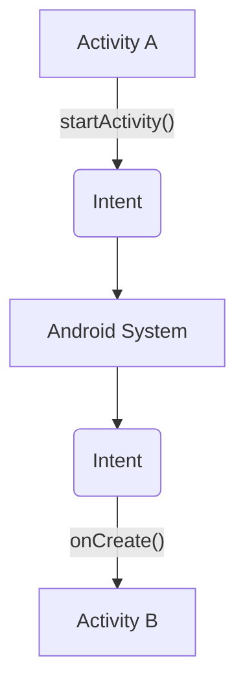

![[Fondamenti#Intent]]

## Casi d'Uso
---
### Avvio di un'Activity
> È possibile avviare una nuova istanza di un'[[Activity]] passando un *intent* al metodo `startActivity()`.

>[!done] L'***intent*** descrive l'attività da avviare e trasporta tutti i dati necessari.

Se si desidera ricevere un risultato dall'activity, si deve utilizzare `registerForActivityResult()`.

### Avvio di un Service
> È possibile avviare un [[Service]] per eseguire un'operazione una tantum passando un'*intent* al metodo `startService()`.

>[!done] L'***intent*** descrive il servizio da avviare e trasporta tutti i dati necessari.

>[!warning] Attenzione
>Per garantire la sicurezza:
>- Usare sempre [[#Tipi di Intent|explicit intent]] per l'avvio di un *service*.
>- **Non** dichiarare gli intent filter per i propri servizi.

L'uso di un intent implicito è un rischio per la sicurezza, **non si può essere certi di quale servizio risponderà** e l'utente non può vedere quale servizio viene avviato.

### Consegna Broadcast
> Si può inviare un broadcast ad altre app passando un *intent* a `sendBroadcast()` o `sendOrderedBroadcast()`

## Tipi di Intent
---
>[!abstract] Explicit Intent
>Specificano ***quale applicazione soddisferà*** l'*intent*, fornendo il nome del pacchetto dell'app di destinazione o il nome completo della classe del componente.

In generale si utilizza un **intent esplicito** per avviare un componente nella propria app.

>[!hint] Implicit Intent
>Non si nomina un componente specifico, ma si dichiara invece un'***azione generale da eseguire***, che consente a un componente di un'altra app di gestirlo.

> Esempio: Mostrare all'utente una posizione su una mappa
- È possibile usare un *intent* implicito per richiedere che un'altra app mostri la posizione sulla mappa.
>[!question] Quale app? Dipende da quelle installate

>[!example] Flusso logico
1. L'activity $A$ crea un intent con una descrizione dell'azione e lo passa a `startActivity()`.
2. Il sistema [[Introduzione ad Android|android]] cerca tutte le app un intent filter che corrisponde all'intent.
3. Il sistema avvia l'attività di corrispondenza invocando il metodo `onCreate()` passando l'*intent*.



>[!info] Manifest
>Quando si usa un ***intent implicito*** il sistema android trova i componenti appropriati confrontando il contenuto dell'intent con gli ***intent filter*** dichiarati nel file [[Manifest#Intent Filter|manifest]] di altre app sul dispositivo.

Se sono compatibili **più applicazioni**, il sistema visualizza una *finestra di dialogo* in modo che l'utente possa scegliere quale app utilizzare.

Il sistema fornisce un *implicit intent* al componente dell'app solo se l'intent può passare attraverso uno degli **intent filter**.

## Creazione di un Intent
---
>[!todo] Oggetto
>Un ***oggetto intent*** contiene informazioni che il sistema android utilizza per determinare *quale componente avviare*.

>[!summary] Informazioni contenute in un intent
1. Component Name
2. Action
3. Data
4. Category
5. Extras
6. Flag

> Le prime 4 proprietà rappresentano le ***caratteristiche che definiscono un intent***.
- Leggendo queste quattro proprietà, il sistema android è in grado di risolvere *quale componente dell'app dovrebbe avviare*.
### Component Name
>[!tldr] È il nome del componente da avviare

È opzionale, ma è quell'informazione che rende un *intent* un ***explicit intent***.
- Senza il nome l'intent è *implicit*, il sistema deciderà quale componente deve ricevere l'intent in base alle altre informazioni.

### Action
>[!tldr] Una stringa che definisce l'azione generica da eseguire

Come *view* o *pick*.
Determina la struttura del resto dell'intent, in particolare le informazioni contenute dei [[#Data|dati]] e negli [[#Extra]].

> Esempi comuni:
- `ACTION_VIEW`: si usa quando si hanno informazioni che un'activity può mostrare all'utente.
- `ACTION_SEND`: conosciuto come ***share intent***, si usa quando si dispone di dati che l'utente può condividere tramite un'altra app.

>[!attention] Definizione
>Se si definiscono delle action nuove, assicurarsi di includere il nome del pacchetto come prefisso:
>`{kt icon} const val ACTION_TIMETRAVEL = "com.example.action.TIMETRAVEL"`

### Data
>[[../../Tecnologie Web/Architettura del Web#URI|URI]] che fa riferimento ai dati su cui agire e/o al [[../../Reti/Application Layer/Posta Elettronica#MIME|MIME Type]] del dato

Il tipo di dato fornito è solitamente **dettato dall'azione dell'intent**.
- Se l'azione è `ACTION_EDIT` i dati devono contenere l'`URI` del documento da modificare.

Alla creazione di un intent è importante specificare il `MIME Type`.
- Aiuta il sistema **android** a trovare il componente più adatto.

### Category
>[!tldr] Informazioni aggiuntive sul tipo di componente che dovrebbe gestire l'intent

Qualsiasi numero di descrizioni di categoria può essere inserito in un intent, ma la maggior parte degli intent *non richiede alcuna categoria*.

### Extra
>[!tldr] Sono coppie chiave-valore che contengono informazioni aggiuntive necessarie per eseguire l'azione richiesta

> Esempio: invio di un'e-mail
- Si può specificare il destinatario con la chiave `EXTRA_EMAIL` e l'oggetto con la chiave `EXTRA_SUBJECT`.


### Flags
>[!tldr] Funzionano come metadati per l'intent

I flag possono indicare al sistema android ***come avviare un'attività*** e come trattarla dopo il lancio.

### Esempio
>[!abstract] Implicit Intent

> Supponiamo di aver creato un service denominato `DownloadService` per scaricare un file dal [[../../Tecnologie Web/Architettura del Web|web]].

Può essere avviato dal seguente codice
```kt
val downloadIntent= Intent(this, DownloadService::class.java).apply{
	data = Uri.parse(fileUrl)
}

startService(downloadIntent)
```

Avvia esplicitamente la classe `DownloadService` nell'app.

>[!hint] Explicit Intent

> Supponiamo di avere dati da poter condividere ad altre app.

Creiamo un *intent* con l'azione `ACTION_SEND` e aggiungiamo [[#Extra]] che specificano il contenuto da condividere.
- Sarà l'utente a decidere a quale app condividere il contenuto.

```kt
val sendIntent = Intent(Intent.ACTION_SEND)

// Verify the original intent will resolve to at least one activity
if (sendIntent.resolveActivity(packageManager) != null) { 
	startActivity(arg) 
}
```

#### Package Manager
>[!help] Classe
>La classe ***Package Manager*** fornisce dei metodi per determinare che componenti sono in grado di rispondere ad un *intent*.

Esempio:
- `queryIntentActivities()` restituisce una lista con ***tutte le activity*** che possono eseguire l’intent passato come argomento.
- `queryIntentServices()` fa la stessa cosa per i **service**.

