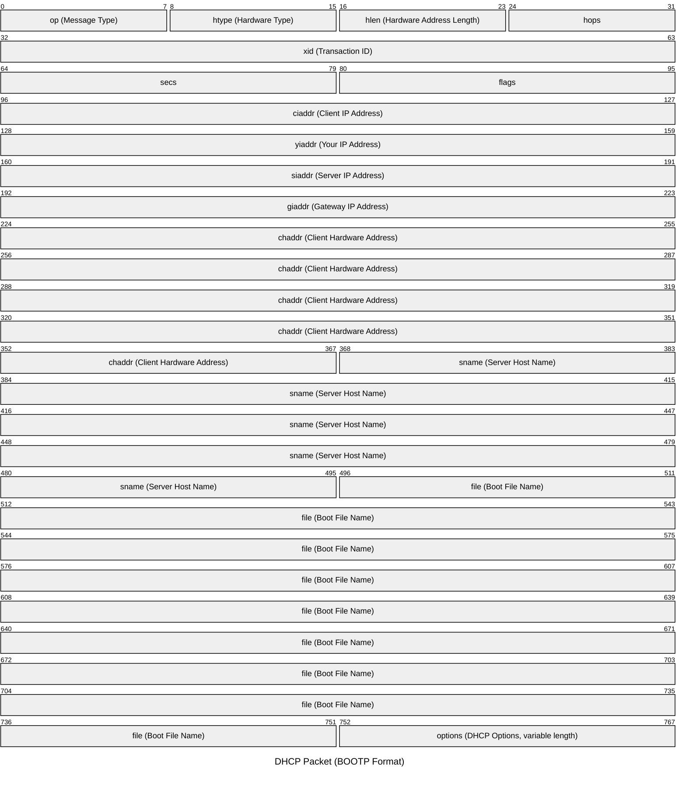

## Dynamic Host Configuration Protocol
---
>[!cite] [RFC 2131](https://www.rfc-editor.org/rfc/rfc2131.html)
>Il `DHCP` è un protocollo di livello [[Protocolli Applicativi|applicativo]] che utilizza la [[Livello di Trasporto#Numero di Porta|porta]] $67$.
>Introduce la capacità di ***allocare automaticamente*** [[Protocollo IP|indirizzi IP]] *riutilizzabili* e altre configurazioni aggiuntive.

Il protocollo fornisce un *indirizzo* `IP` ad un **host** interno alla rete che lo richiede.
- L'indirizzo viene scelto da una ***address pool***.
- È possibile stabilire degli ***indirizzi fissi*** per un host, inserendo l'[[Struttura del Data Link#Medium Access Control|indirizzo fisico]].
### Funzionamento
>[!hint] Discovery
>Il client che deve ricevere l'indirizzo `IP` **manda un messaggio** [[Reti IP#Broadcast|broadcast]] alla rete (`DHCP discover`).

- Tipicamente mandato usando l'[[UDP]].
- L'obbiettivo di "***scoprire***" i server `DHCP` disponibili.

>[!abstract] Offer
>Il server che riceve la "*discover*" risponde con un messaggio chiamato `DHCP offer`.

- L'*offer* contiene un indirizzo `IP` disponibile nella ***address pool*** e altri parametri di configurazione come:
	- [[Protocollo IP#Netmask|Subnet]], [[DNS]], [[Routing#Ruolo del Gateway|Default Gateway]].

>[!question] Request
>Al ricevimento di più *offer* (dai vari server `DHCP`) il client **ne sceglie una**.
>Il client dovrà poi ***avvertire il server*** che gli ha inviato l'offerta con un messaggio `DHCP request`.

Analogamente verrà inviato un `DHCP decline` ai server la cui richiesta *è stata rifiutata*.

>[!done] Acknowledgment
>Dopo che il server riceve la *request*, invia al client un messaggio di ***acknowledgement*** (`DHCP ACK`).

Viene confermata l'allocazione della richiesta.

Il client, ricevuto l'`ACK` configura la ***sua interfaccia network***.
- Fase di *bound*.

>[!caution] Fase di Lease
>Dopo il bound, inizia la ***fase di lease***, durante la quale l'`IP` sarà **valido**.

Una volta finito il **tempo di lease** possono avvenire:
- `DHCP release`: L'`IP` non sarà più valido.
- `DHCP renew`: Viene **rinnovata la validità** (Attraverso una `DHCP Request`).
	- `REBIND`: Rinnovamento *avvenuto con successo*.
	- `DHCPNACK`: Rinnovamento *rifiutato*.

![[DHCP.png]]

### Pacchetto
