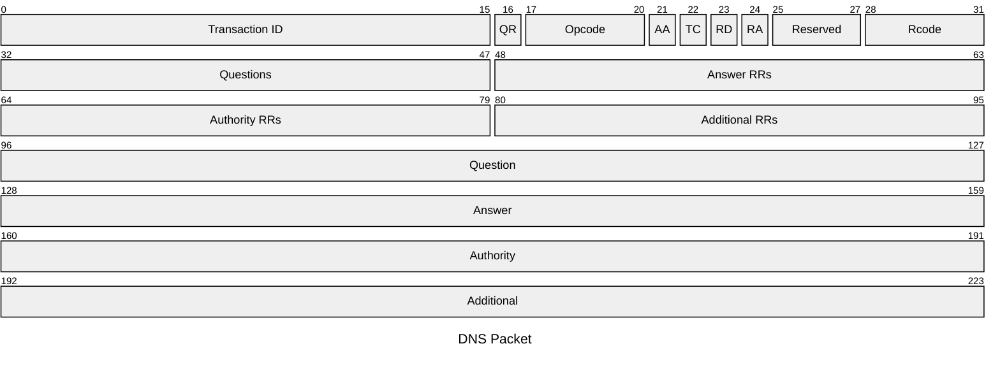

## Nomi Simbolici
---
>Affinché un calcolatore possa parlare con altri calcolatori, esso deve essere equipaggiato con almeno una ***interfaccia di rete***: deve avere associato un [[Protocollo IP|indirizzo IP]]

>[!todo] Nome del Calcolatore
>Ad un calcolatore può essere associato un ***nome simbolico***.
>- Una sequenza di stringhe alfanumeriche *separate da punti*.
>	- `deisnet.deis.unibo.it`

>[!question] Perché un nome simbolico?

Un nome simbolico rende ***più facile*** l'utilizzo agli esserei umani.

## Domain Name System
---
>[!cite] Concetto
>Il ***D***omain ***N***ame ***S***ystem consente la traduzione di un [[Protocollo IP|indirizzo IP]] in un ***domain*** e viceversa.
>Utilizza la [[Livello di Trasporto#Numero di Porta|porta]] $53$.
>>[!help] Ruolo
>>Il `DNS` ha un ruolo *fondamentale* nel funzionamento di internet:
>>- Consente di ***identificare e raggiungere*** i server e le risorse in modo *efficiente*.
>>
>>Senza il `DNS` sarebbe necessario ricordare e immettere manualmente gli *indirizzi IP* per accedere ad una qualsiasi risorsa in **rete**.
>>- Rendendo la navigazione in internet ***molto più complessa e meno accessibile***.

>[!danger] Problema
>**Come fare a gestire un database con tutti i nomi degli host di internet?**

>**Soluzione**:
- Suddividere il dominio in più "**zone**"
### Albero Gerarchico
#### Livelli di Dominio
>[!abstract] Domini di Primo Livello (**TLD**)
>I ***domini di primo livello*** (**T**op **L**evel **D**omain) formano la zona radice del *domain name system*.
>- Indirizzi come `.com`, `.net`, `.it`, `.uk` e `.org`.

>[!help] Domini di Secondo Livello e inferiore
>Sotto i *domini di primo* livello nella gerarchia `DNS`.
>- Stanno direttamente a sinistra ai domini di primo livello all'interno del nome
>	- `google.com`, `yahoo.com`, *etc...*

>[!missing] Subdomain
>I ***subdomain*** sono usati per distinguere il *tipo di contenuto presentato*.
>Sono usati dal ***Search Engine Optimization*** per migliorare la navigazione.
>>[!example] Esempio: *Google*
>>- `mail`
>>- `docs`
>>- `drive`
>>- `calendar`
>>- *etc...*
>

L'assegnatario di un dominio è ***responsabile*** della gestione di eventuali ***sottodomini***.

![[DNSHierarchy.png]]

### Nome di un Server
>[!quote] Nome
>Il ***nome di un host*** è una sequenza dei nomi di dominio a partire dal più esteso a destra
>- `deisnet.deis.unibo.it`
>
>I nomi dei domini sono assegnati da [[Enti Importanti#^a9b820|IANA]]
>>[!danger] **Non** devono esistere due nomi uguali per host *diversi*.

### Funzionamento
>Il `DNS` è strutturato in un albero gerarchico che consiste in diversi `DNS` server.

>[!hint] `DNS` Resolver
>Per convertire un nome in un [[Protocollo IP|indirizzo IP]], l'host deve essere equipaggiato con un programma specifico detto ***name resolver***.
>Quando un client deve risolvere un *nome* invia una richiesta al `DNS` ***resolver*** per tradurre il domain.

La gerarchia `DNS` comprende un **enorme insieme di record** la cui gestione pratica non può che basarsi sull'implementazione **distribuita** della funzione di associazione  *nome-indirizzo*

>[!help] Name Server
>Sparsi per la rete sono disponibili server specializzati per associare *indirizzi IP* a nomi di dominio, denominati ***Name Server*** che svolgono la funzione di *risoluzione dei nomi* (***name resolution***) 

#### Zona
>[!definizione] Definizione
>Una ***zona*** è definita come un sottoalbero della gerarchia `DNS` con un *name server* responsabile della risoluzione dei nomi di dominio corrispondenti ai **nodi del sottoalbero**

![[DNSZone.png|600]]

I name server di una zona sono detti ***autorevoli*** (*authoritative*)
#### Risoluzione del Nome
>[!example] Esempio

>Ipotizziamo che l'host $A$ desideri inviare un messaggio all'host $B$, di nome `hostB.dom3.dom2.dom1`, e debba quindi recuperare l'**indirizzo IP** di quest'ultimo

La ***risoluzione del nome*** avviene nei seguenti passi:
1. L'host $A$ (*client*) invia un'interrogazione (*query*) al ***Name Server*** *locale*, il quale fornisce l'indirizzo ***IP*** richiesto **se ne è a conoscenza**, altrimenti richiede informazioni al ***root name server***.
2. Il **root name server** che riceve la *query*, presumibilmente, non è a conoscenza diretta dell'informazione richiesta
	-  Individua un *Name server* di primo livello del dominio `dom1` cui **rivolgere nuovamente la richiesta**.
3. Il *Name Server di primo livello*, se non a conoscenza della risposta, individua un ***NS*** di *secondo livello* del dominio `dom2.dom1` a cui **rivolgere la richiesta**.
4. Così via fino a che un *Name server*  interrogato non dispone dell'***indirizzo IP*** richiesto, che viene trasferito al **Name server locale** che lo inoltra al *client richiedente*

>[!caution] Risoluzione Iterativa e Ricorsiva
>>[!info] Iterativa
>>Nella procedura iterativa è il ***Name Server*** *locale* che genera tutte le query interrogando i **Name Server di tutti i livelli**
>
>>[!abstract] Ricorsiva
>>Nella procedura ricorsiva, il ***root name server*** interroga il ***TLD*** *Name Server* che a sua volta interroga un **NS** di secondo livello ecc...

![[IterativeSearch.png|600]]

- *Procedura Iterativa di Risoluzione*

![[RecursiveSearch.png|600]]

- *Procedura Ricorsiva di Risoluzione*

### Formato dei Messaggi
>[[ISO-OSI#Trasferimento dei Dati|PDU]] del protocollo `DNS` diviso in due:

>[!quote] Header
>Contenente **informazioni** riguardo al **body**.

>[!abstract] Body
>Contenente le **informazioni** del protocollo (*richiesta* o *risposta*)

>[!info] Identifier
> L'***identifier*** contiene il codice che consente di **associare univocamente** un messaggio di *risposta* a uno specifico messaggio di *domanda*.

>[!Flags]
>Il formato ha diversi ***flags***, i più importanti riportati di seguito:
>- **QR**: $1$ `bit` Distingue un messaggio di richiesta (**QR**$=0$) da uno di risposta (**QR**$=1$).
>- **Rcode**: $4$`bit` In un messaggio di **risposta**, indica la *motivazione della mancata risposta* a una richiesta ricevuta.

>[!abstract] QDcount
>Indica il numero di record **RR** (*resource record*) richiesti nel **successivo campo question**.

>[!help] ANcount
>Indica il numero di record **RR** forniti nel **successivo campo answer**.

>[!summary] NScount
>Indica il numero di record **RR** forniti da altri *name server autorevoli* presenti nel **successivo campo authority**.

>[!hint] ARcount
>Indica il numero di record **RR** presenti nel **successivo campo additional** relativi alla richiesta ricevuta

#### Formato della Domanda
>[!cite] Contenuto nel Body
>***Qname***:
>- Un nome di dominio per cui si effettua la richiesta
>
> ***Qtype***:
> - Tipo della richiesta
> 
> ***Qclass***:
> - Classe della domanda

#### Formato della Risposta
>[!abstract] Contenuto nel Body
>***Name***:
>- Un nome di dominio per cui si effettua la richiesta.
>
>***Type***:
>- Tipo della risposta.
>
>***TTL***:
>- **Time To Leave**
>- Durata in secondi del tempo per il quale la risposta può essere mantenuta in memoria
