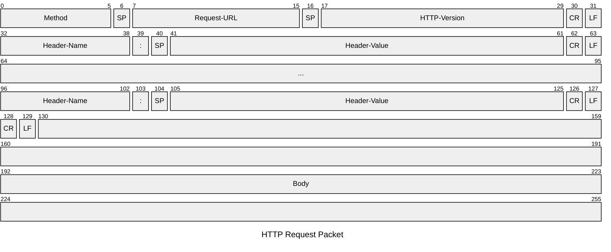
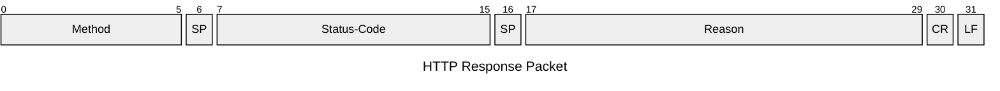

## World Wide Web
---
>[!info]
>Il ***world wide web***, denominato `WWW`, è costituito da un enorme numero di *documenti*, chiamate pagine *web*, mutuamente correlati per mezzo di collegamenti ipertestuali detti ***hyperlink***.

Una **pagina web** è immagazzinata in un server web.
- Contiene una *collezione di oggetti* indirizzabili tramite collegamenti
- Raggiungibile con il proprio *identificatore*

> La modalità di accesso ad un elemento del web, viene specificata mediante un [[URL]]
## Hypertext Transfer Protocol
---
>[!info] HTTP
>***Hypertext Transfer Protocol*** \[RFC2616\] è il protocolli di [[Protocolli Applicativi|livello applicativo]] che definisce le modalità di interazione tra client e server e il formato dei messaggi che questi si scambiano.

*HTTP* è il protocollo utilizzato nell'applicazione **client-server** `WWW`.
- Utilizza la [[Livello di Trasporto#Numero di Porta|porta]] $80$ o la **porta** $443$ (*HTTPS*)

Regola lo scambio tra **web server** e **web client**.
- Rispettivamente *sito web* e *browser*.

>[!hint] Browser
>Il **browser** è il programma utilizzato *lato client* che inoltra le **richiesta** di una pagina al *web server*.
>Il suo compito è quello di ***presentare i dati ricevuti***.

>[!caution] Web Server
>Il ***web server*** è il programma *lato server* che contiene le **pagine web** del sito.
>*Risponde* alle richieste del client.
>- I più famosi sono **APACHE** e **IIS**.

### Formato dei Messaggi
> Il protocollo **HTTP** regola le modalità di interazione tra il *client* (**browser**) e il *server web*.

**HTTP**, in accordo con il paradigma *client-server* è composto da una ***richiesta*** e da una ***risposta***

>[!important] Dialogo Stateless
>**HTTP** si basa su un dialogo di tipo ***stateless***
>- **Non** si tiene memoria delle transazioni *precedenti*.
>
>>[!done] Soluzione
>> È possibile implementare in ***modalità stateful*** tramite l'utilizzo di ***cookies*** e ***tickets***.

Ciascun messaggio è formato da una intestazione (***header***) seguita da un corpo (***body***) del messaggio.

>[!header]
>L'***intestazione*** è composta da una **serie di righe di testo** terminate da caratteri di fine linea.
>- `CR` (*Carriage Return*), `LF` (*Line Feed*)

>[!summary] Body
>Il ***corpo*** in genere contiene i dati da *trasferire* come una pagina *HTML* o altri contenuti.

>Intestazione e corpo sono separati da una ***riga vuota***
#### Messaggi di Richiesta
>[!question] Request
>La ***richiesta*** è formata da 3 parti:
>- Una *prima riga di richiesta*.
>- Una *Intestazione* (***header***).
>- Un *Corpo* (***body***).

- *Ignora i Bit*

Nella sezione *metodo* è descritto il ***tipo di richiesta*** voluto.

Una o più righe di **intestazione** possono seguire la riga di richiesta.
- Ciascuna riga *specifica* con maggior precisione la *richiesta* che viene inoltrata al server.

>[!header]
>Ogni riga di intestazione è costituita da:
>- **Nome**, che specifica il valore assunto dall'intestazione
>- Due separatori: `:` e `sp` (*space*)
>- Il **valore** dell'intestazione.
##### Tipi di Richiesta
> Nel protocollo **HTTP** vige la regola del ***CRUD*** (*Create*, *Read*, *Update*, *Delete*)

I metodi definiti dal protocollo **HTTP** sono otto:

>[!abstract] GET
>Il metodo `get` è utilizzato per **richiedere** una pagina web al server (***Lettura***).
>- Lasciato vuoto il **corpo** del messaggio.

>[!todo] POST
>Il metodo `post` è utilizzato per **inviare informazioni aggiuntive** relative a una pagina specificata nel campo ***URL***.
>- Indica nell'**URL** la risorsa che *gestirà* i *dati* presenti nel messaggio.

>[!help] PUT
>Il metodo `put` serve ad inviare al server un **documento da memorizzare** nella locazione indicata nel campo ***URL***.

>[!fail] DELETE
>Il metodo `delete` è usato per la **rimozione** dal web della pagina indicata nell'***URL*** (*se autorizzato*).

>[!example] HEAD
>Richiesta di ***solo header*** del messaggio.
>- Usata unicamente per la ***diagnostica***.
 
>[!hint] TRACE
> Il metodo `trace` serve a richiedere l'***eco*** del messaggio inviato, per poter svolgere *operazioni di debug*.

>[!caution] CONNECT
>Il metodo `connect` richiede la **connessione** al server attraverso un *proxy*.

>[!example] OPTIONS
>Il metodo `options` serve a *richiedere al server* informazioni sulle **opzioni di comunicazione** disponibili per la pagina web indicata dal campo ***URL***

#### Messaggi di Risposta
>[!tldr] Response
>Il ***formato della risposta*** differisce esclusivamente nella **prima riga**.
>- La prima riga contiene una *riga di stato*.
>
>Questa riga contiene tre campi separati dal carattere "*space*" (`sp`)
>- **Versione**
>- **Codice di Stato**
>- **Frase**

##### Codici di Stato
> Il codice è rappresentato da un numero a *tre cifre* delle quali la prima indica la ***classe della risposta***.

>[!info] $1\ \_\ \_\quad$ Info
>I *codici* indicano che la risposta ha ***contenuto informativo***.

>[!done] $2\ \_\ \_\quad$ Success
>I *codici* indicano che la richiesta del client è stata **ricevuta**, **compresa** e **accettata**.

>[!caution] $3\ \_\ \_\quad$ Redirect
>I *codici* indicano che viene richiesta un'**ulteriore azione** da parte del client per **soddisfare la richiesta** inoltrata

>[!error] $4\ \_\ \_\quad$ Client Error
>I *codici* indicano un **errore** nella richiesta da parte del **client**.

>[!missing] $5\ \_\ \_\quad$ Server Error
>I *codici* indicano un **errore** nella richiesta da parte del **server**.

### Cookie
> Per rendere **HTTP** *stateful*, sono stati introdotti i cookie

>[!definizione] Definizione
>I ***cookie*** sono informazioni di testo che *identificano* il browser nei confronti di un server.
>Sono usati principalmente per:
>- Gestione delle **sessioni**.
>- **Personalizzazione**.
>- **Monitoraggio**.

I server **HTTP** possono impostare i cookie con il campo di intestazione della risposta *Set-Cookie*.
- Possono anche essere impostati lato client tramite `{js icon} JavaScript`.

>[!abstract] Composizione
>I **cookies** sono composti da un *nome* un *valore* e alcune *meta-informazioni*:
>- L'**origine**.
>- La **data** di scadenza.
>- Politiche di **sicurezza**.

I browser invieranno nuovamente i cookie al server in base al suo **scopo**.
- L'**ambito** è l'origine in cui è stato creato ciascun cookie.
- Se un cookie denominato "*foo*" viene impostato da "`www.google.com`" **non** può essere inviato a `www.microsoft.com`.

Alcune ***politiche di sicurezza***:
- Secure/HTTP *only*
- SameSite
	- None
	- Strict
	- Lax (Default on chrome)

>[!example] Tipologie di cookies
>- Cookies di ***sessione***
>- Cookies di ***profilazione***