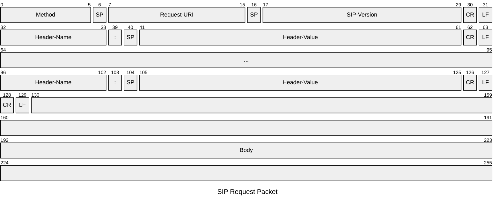
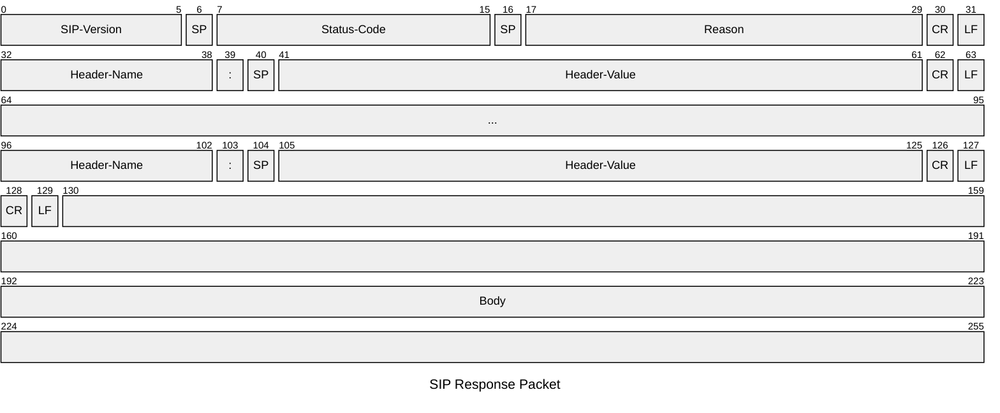

## VoIP
---
>[!info] Voice over [[Protocollo IP|IP]]
>Il protocollo ***VoIP*** è un protocollo di telefonia *digitale* su rete **IP**.

>Rispetto alla telefonia tradizionale:
- Riduzione dei *costi*
- Maggiore *flessibilità*
- Integrazione con *altri servizi digitali*

Per funzionare il protocollo richiede:
- *Digitalizzazione* e *compressione* del **segnale** vocale.
- *Terminale* e *segnalazione* connessi a rete **IP**.
- Rete **IP** per il trasporto.

![[VoIP.png]]

>[!abstract] IP Trunking
>L'**IP trunking** è una tecnologia **IP** basata su collegamenti della rete di trasporto, usata per trasmettere suoni (*voce*) su una *rete* **IP** piuttosto che una rete dedicata alla telefonia.

>[!help] Telefonia IP
>Tecnologia **IP** per la fornitura del servizio di telefonia.
>Ha ***impatto*** sulla rete di **accesso** e sulla rete di **trasporto**.

### Standard
>[!missing] Standard *ITU* basato su $H.323$
> Uno standard **ambizioso** e **completo**.
>- Conseguentemente **complesso**.
>
>Ormai *Obsoleto*.

>[!hint] Standard *IETF* basato su protocollo SIP
>Struttura gerarchica a domini.
>Ogni organizzazione controlla il ***proprio dominio telefonico***.
>- I domini comunicano tramite rete **IP**.
>
>>[!note] Integrato in IMS e parte del VoLTE.

>[!abstract] Standard basato su protocollo proprietario
>Usati da applicazioni come *WhatsApp* e *Telegram*.
>Sfruttano una tecnologia ***Peer-To-Peer***.
>- Tutti gli utenti appartengono alla stessa rete.

#### Session Initiation Protocol
> Il ***SIP*** è un protocollo di segnalazione progettato per *inizializzare*, *modificare* e *terminare* sessioni multimediali interattive.

>[!quote] Protocollo testuale simile all'[[HTTP]]

##### Componenti Principali

![[SIP.png|500]]

>[!help] User Agent

- Composto da *User Agent Client* e *User Agent Server*.

>[!abstract] Registrar Server

- Riceve le *registrazioni* degli utenti.

>[!caution] Proxy/Redirect Server

- Inoltra le richieste **SIP** ad altri server (*proxy*).
- Fornisce al client un **nuovo indirizzo** per il destinatario (*redirect*).

> I gateway si identificano come terminali.
- Hanno il compito di "***tradurre***" i messaggi tra l'*endpoint* (user agent) e altri protocolli.

>[!caution] Protocollo Stateful su base Transazione
>Una ***transazione*** è un messaggio di andata e ritorno.
>Approccio:
>- *Request Iniziale* e attesa di *final response*.
>- Provisional Responses
>	- Informazioni aggiuntive **potenzialmente inaffidabili.**
>
>>[!hint] I messaggi sono correlati tra di loro tramite un **ID**

![[StatefulSIP.png]]

>[!abstract] Dialogo
>Il dialogo si compone di ***diverse transazioni***.

![[Dialog.png|400]]

>[!caso particolare]
>Le transaction "**INVITE**" richiedono un ***three way handshake***.

##### Indirizzamento in SIP
> Gli *indirizzamenti* in **SIP** seguono lo schema base per gli [[Indirizzamento#In Internet|URI]].

>[!info] Ruoli del SIP URI
>Definire nominalmente un utente (***naming***)
>- `sip:user:password@host:port;uri-parameters?headers`
>
>Fornire le informazioni per contattare un utente
>- `sip:bob@137.204.57.10`

>[!example] Esempi

> Domain o Indirizzo IP

- `sip:unibo.test`
- `sip:192.168.42.1`

> SIP URI da chiamare

- `sip:bob@unibo.test`

> SIP Contact Address

- `sip:bob@192.168.42.1:1234`

> Service Identifier

- `sip:voicemail@service.com`
- `sip:user@anonymizer.org`

>[!help] Parametri
>I parametri nell'*URI* possono portare informazioni aggiuntive
>- `sip:bob@unibo.test;maddr=10.0.0.1`

##### Sintassi del Messaggio
> Molto simile al messaggio [[HTTP]]

> ***Request***:

>[!abstract] Start Line
>***Request-Line***
>Contiene informazioni *essenziali* per il messaggio.
>1. *Method*
>	- `INVITE`, `ACK`, `BYE`, `CANCEL`, ...
>
>2. [[Indirizzamento#In Internet|URI]].
>
>3. Versione `SIP`.

>[!cite] Header
>Specifica le ***intestazioni*** del messaggio.
>>[!note] Formato
>>`field-name:field-value`
>>I campi possono essere estesi su *più linee*, l'ordine dei campi non è rilevante.
>>- Tranne nel caso in cui due campi hanno lo stesso nome.

>[!tl;dr] Body
>Contenuto del messaggio **SIP** (*email*, *HTTP*).
>>[!attention] Contenuto
>>Il contenuto è definito dall'**header**.
>>- Tipi *multipart* ([[Posta Elettronica#MIME|MIME]])
>>- Tipi di *default* (**Text**)

> ***Response***:

>[!abstract] Start Line
>***Status-Line***
>Contiene la versione **SIP** e lo status-code.
>- Contiene anche una descrizione testuale dello status code

>[!cite] Header
>Specifica le ***intestazioni*** del messaggio (*transaction*, *dialog*, ...).

>[!tl;dr] Body
>Contenuto del messaggio **SIP**.
>
>>[!fail] Generalmente omesso

| Status Code | Significato                           |
| ----------- | ------------------------------------- |
| 1xx         | Provisional; *In ricerca*, *squillo*. |
| 2xx         | Success                               |
| 3xx         | Redirection                           |
| 4xx         | Client Error                          |
| 5xx         | Server Error                          |
| 6xx         | Global Failure                        |

>[!summary] Tipi di Risposte
>***Risposta Provvisoria***
>- Non terminano una transaction (**1xx**)
>
>***Risposta Definitiva***
>- Terminano una transaction (**2xx**,**3xx**,**4xx**,**5xx**,**6xx**)

### Call Flow

![[CallFlow.png]]

> ***Fasi Principali***
- Il *Proxy Server* elabora l'`INVITE` e coinvolge l'***UAS***
- Il **dialogo** viene stabilito tramite scambio di `INVITE`, `RINGING`, `OK`, e `ACK`.

>[!Help] User Registration
>Il client invia `REGISTER` al *server*.
>Il "*Registrar*" salva le informazioni di **registrazione** in un [[Git-Obsidian/DataBase/Introduzione|Database]].

>[!abstract] User Location
>Il ***SIP*** *server* chiede al **Location** server dove trovare il chiamato.
>- Il location server ritorna una **lista di indirizzi** (*contact address*).
>- SIP **proxy** o **redirect** processa la richiesta in accordo con la lista di indirizzi trovata.

### IP Multimedia Sub-System
> Architettura funzionale per realizzare *servizi multimediali* su reti **IP**.

Originariamente formulata per ***3GPP Rel-5***.
- Utilizza il **SIP** per la segnalazione
- Prevede tutte le funzionalità per gestire la comunicazione fra ***diversi domini di servizio***.

>[!tip] Architettura

![[IPMultimediaSubSystem.png|500]]

##### VoLTE Terminal
>[!info] ISIM
>***Integrated SIM*** card (**S**ervice **I**dentity **M**odule)
>Una SIM *direttamente integrata nel dispositivo*.
>- **IMPI** (**IP M**ultimedia **P**rivate **I**dentity)
>	- Contiene le *informazioni sul dominio dell'operatore* con cui è stato sottoscritto il contratto.
>- **IMPU** (**IP M**ultimedia **P**ublic **I**dentity)
>	- *Identità pubblica* rilasciata per essere raggiunta dagli altri.

>**SIP UE** (Interno allo smartphone)
- Gestisce la segnalazione **SIP**
##### Home Subscriber Server
>[!abstract] HSS
>L'**HSS** è il database contenente le informazioni per gestire le chiamate
>- Contiene il **profilo** dell'utente.
>- Gestisce le **procedure di autenticazione**.
>- Gestisce le **procedure di autorizzazione**.

##### Call Session Control Function
> Tre tipi di **CSCF**

>[!caution] Proxy
>Può trovarsi nella **visited network**
>- È il primo punto di contatto, redirige i messaggi **SIP** oppportunamente

>[!question] Interrogating
>È il ***nodo di bordo*** del dominio di servizio.
>Raggiungibile grazie al [[DNS]]
>- Assegna alle richieste di servizio il relativo ***S-CSCF***

>[!tip] Serving
>Il ***SIP server*** che gestisce la segnalazione
>- Gestisce la registrazione degli utenti e la comunicazione con **HSS** per avere i profili di servizio.
>- Gestisce le **policy dell'operatore**.
