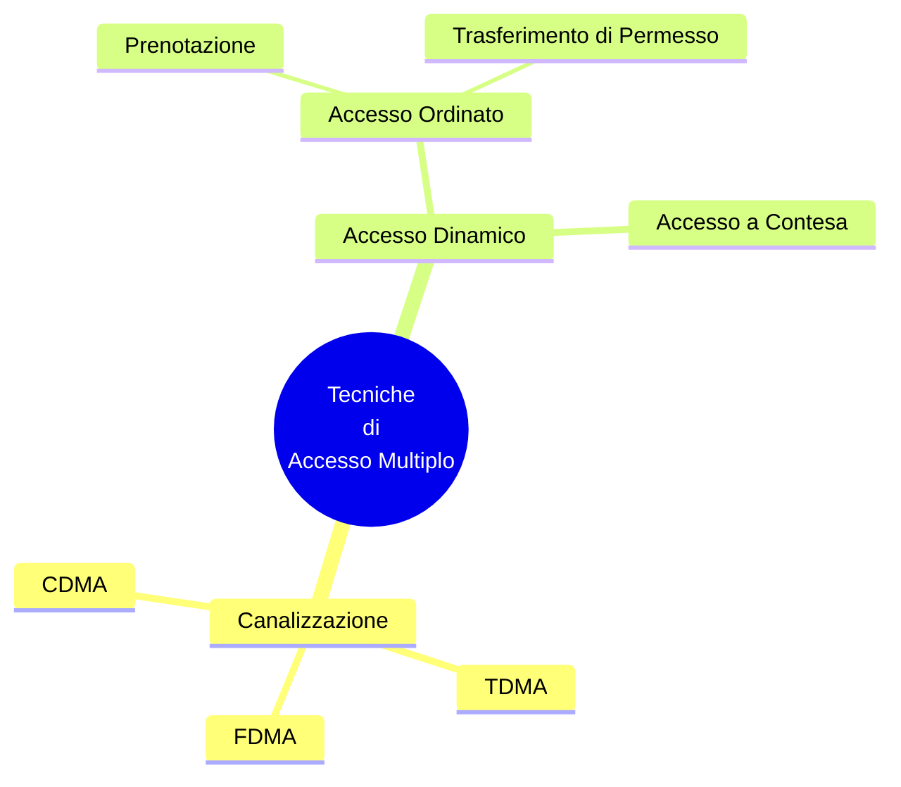

## Local Area Network
---
>[!definizione]
>Una `LAN` è una [[Infrastrutture di Telecomunicazioni|Infrastruttura di Telecomunicazioni]] che consente ad apparati indipendenti di comunicare in un'*area limitata*.

Le `LAN` sono *reti di calcolatori* e devono essere implementate scegliendo protocolli par tutti gli strati dell'[[ISO-OSI|OSI]].
- Le dimensioni limitate rendono convenienti soluzioni particolari per gli strati $1$ e $2$.

### Topologie
> Per le `LAN` inizialmente si sono usate le [[Topologie di Rete|topologie punto-multipunto]].

>[!example] Topologie
- A **BUS** unidirezionale
- A **BUS** bidirezionale
- A doppio **BUS**
- Ad anello
>[!hint] Caratteristiche
>[[Reti IP#Broadcast|Broadcast]]:
>- La `LAN` fornisce in modo nativo una comunicazione *da uno a tutti*.
>
>**Collisione**
>- Su un mezzo di trasmissione condiviso c'è la possibilità che più utenti ***inviino informazioni contemporaneamente***.

### Accesso al Canale di Collegamento
>[!caution] Canali Punto-Punt
>Solo la ***sorgente e la destinazione*** hanno accesso al canale.

La sorgente può liberamente ***impegnare tutta la capacità***.

>[!summary] Canali ad Accesso Multiplo
>Più sorgenti accedono al canale *contemporaneamente*, determinando una "***collisione***".

>[!help] Canali ad Accesso Controllato
>Il canale è *condiviso* ma l'accesso viene ***controllato*** in modo centralizzato o distribuito per **evitare collisioni**.

#### Tassonomia

> I protocolli ad [[LAN#Tassonomia|accesso conteso]] ammettono le collisioni e cercano di gestirle.
#### Con Rilevazione del Canale
>[!info] CAP
>La ***Channel Access Procedure*** è l'insieme delle procedure che la stazione effettua per realizzare l'accesso al canale.

>[!caution] CRA
>Il ***Collision Resolution Algorithm*** è l'insieme delle procedure che la stazione effettua per rilevare e recuperare situazioni di collisione.

### Cablaggio Strutturato
> Una `LAN` moderna viene cablata secondo una ***struttura gerarchica*** di $4$ livelli.

>[!help] Campus Distributor
>Centro stella di **comprensorio** (*cablaggio verticale*).
- Interconnette più armadietti di rete per realizzare una `LAN` estesa

>[!abstract] Building Distributor
>Centro stella di **edificio**, contenitore degli apparati attivi della `LAN`.
- Punto di arrivo del **floor distributor**.

>[!caution] Floor Distributor
>Centro stella del **piano** (*cablaggio orizzontale*).
- Cavi che collegano le prese a muro con l'armadio di rete in una ***rete a stella***.

>[!hint] Telecommunication Outlet
>***Prese utente***
- Punto di accesso alla `LAN` per l'utente.