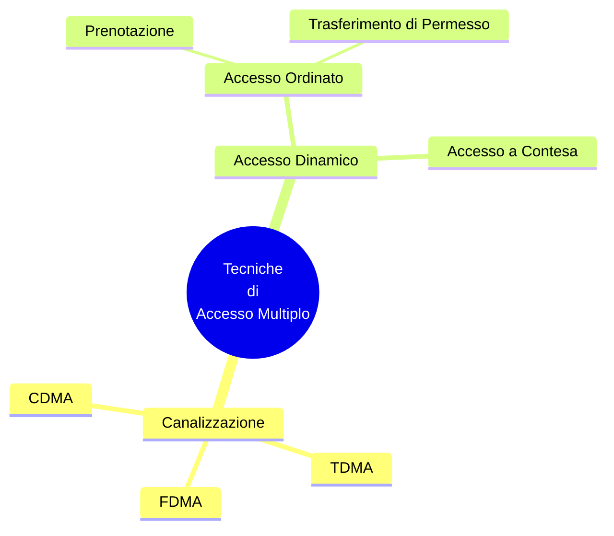

## Local Area Network
---
>[!definizione]
>Una `LAN` è una [[Infrastrutture di Telecomunicazioni|Infrastruttura di Telecomunicazioni]] che consente ad apparati indipendenti di comunicare in un'*area limitata*.

Le `LAN` sono *reti di calcolatori* e devono essere implementate scegliendo protocolli per tutti gli strati dell'[[ISO-OSI|OSI]].
- Le dimensioni limitate rendono convenienti soluzioni particolari per gli strati $1$ e $2$.

### Topologie
> Per le `LAN` inizialmente si sono usate le [[Topologie di Rete|topologie punto-multipunto]].

>[!example] Topologie
- A **BUS** unidirezionale
- A **BUS** bidirezionale
- A doppio **BUS**
- Ad anello
>[!hint] Caratteristiche
>[[Reti IP#Broadcast|Broadcast]]:
>- La `LAN` fornisce in modo nativo una comunicazione *da uno a tutti*.
>
>**Collisione**
>- Su un mezzo di trasmissione condiviso c'è la possibilità che più utenti ***inviino informazioni contemporaneamente***.

### Accesso al Canale di Collegamento
>[!caution] Canali Punto-Punto
>Solo la ***sorgente e la destinazione*** hanno accesso al canale.

La sorgente può liberamente ***impegnare tutta la capacità***.

>[!summary] Canali ad Accesso Multiplo
>Più sorgenti accedono al canale *contemporaneamente*, determinando una "***collisione***".

>[!help] Canali ad Accesso Controllato
>Il canale è *condiviso* ma l'accesso viene ***controllato*** in modo centralizzato o distribuito per **evitare collisioni**.

#### Tassonomia

> I protocolli ad [[LAN#Tassonomia|accesso conteso]] ammettono le collisioni e cercano di gestirle.
#### Con Rilevazione del Canale
>[!info] CAP
>La ***Channel Access Procedure*** è l'insieme delle procedure che la stazione effettua per realizzare l'accesso al canale.

>[!caution] CRA
>Il ***Collision Resolution Algorithm*** è l'insieme delle procedure che la stazione effettua per rilevare e recuperare situazioni di collisione.

##### Parametri della LAN
- $L$: *Lunghezza* massima del frame.
- $C$: *Velocità* massima di trasmissione sul mezzo.
- $d$: Massima *distanza* tra due stazioni.
- $v$: *Velocità* di propagazione del segnale.
- $\theta=\frac{L}{C}$: *Tempo* di trasmissione di un frame.
- $\frac{d}{v}$: *Tempo* di propagazione di un singolo `bit`.
- $\frac{Cd}{v}$: *Capacità* massima della `LAN`

>[!tldr] LAN Ideale
>- `CAP` ideale: Coordina le stazioni per evitare accessi contemporanei.
>- $\theta$ nullo.
>- Trasmissione di frame consecutivi.
>>[!done] In questo caso la `LAN` può essere usata al $100\%$

##### Propagazione Reale
>[!todo] Il frame impiega un tempo non nullo per attraversare la `LAN`

> Topologia a `BUS`.
- $t$: Una stazione `A` inizia la trasmissione.
- $t+\frac{L}{C}$: `A` termina la trasmissione.
- $t+\frac{d}{v}$: `B` riceve il primo `bit`.
- $t+\frac{L}{C}+\frac{d}{v}$ `B` riceve l'ultimo `bit`.

#### Protocollo a Contesa
##### ALOHA
> Nato per collegare le università delle isole Hawaii, predecessore del [[Rete Ethernet#Carrier Sense Multiple Access with Collision Detection|CSMA]].

>[!info]
>Prevede stazione a terra e un [[Legge di Gravitazione#Orbite Geostazionarie|satellite geostazionario]].
>>[!tldr] Idea
>>Le stazioni a terra trasmettono sul medesimo canale radio (*uplink*) e il satellite ritrasmette a terra amplificati i dati su un canale diverso (*downlink*).

> `CAP`
- Quando un trasmettitore deve trasmettere, trasmette senza alcuna verifica.
- Il frame viene ritrasmesso verso tutte le stazioni dal satellite.

> `CRA`
- Quando due stazioni trasmettono contemporaneamente i segnali collidono e si interferiscono sull'**uplink**.
- Il satellite **scarta** i frame non correttamente ricevuti.
- Una stazione che non riceve il proprio frame sul *downlink*, identifica una collisione.
- Non ritrasmette subito ma fa passare un tempo deciso dall'***algoritmo di back-off***.

>[!hint] Algoritmo di Back-off
>*Classico*:
>- Si sceglie a caso il nuovo istante di trasmissione in un intervallo predefinito.
> 
>*Slotted*:
>- Un numero a caso in un range o si ritrasmette nel primo slot libero con probabilità $p_{b}$.  
###### Prestazioni
> Assunzioni: I pacchetti determinino gli arrivi di frame alle stazioni secondo un processo di Poisson con frequenza media $\lambda$.

Tenendo conto delle ritrasmissioni, il numero medio di pacchetti trasmessi al satellite è $\lambda_{r}>\lambda$.

>[!missing] Traffico offerto e smaltito
>Traffico Offerto dalle applicazioni: $A_{0}=\lambda T$
>Traffico offerto al [[Struttura del Data Link#Medium Access Control|MAC]]: $G=\lambda_{r}T$.
>>[!hint] Il traffico smaltito è pari al traffico offerto che viene trasmesso senza collidere

> Si definisce un ***intervallo di vulnerabilità*** $T_{v}$ un intervallo all'interno del quale una trasmissione può dar luogo a una collisione.

Caso `ALOHA`: $T_{v}=2T$

>[!abstract] [[Funzionalità e Prestazioni#Traffico|Throughput]]
> La probabilità di non avere una trasmissione in $2T$ è:
> $$P_{0}=e^{-2\lambda_{r}T}=e^{-2G}$$

Il numero di trasmissioni con successo è pari a:
$$
A_{s}=Ge^{-2G}
$$

###### Slotted ALHOA
> Miglioramento rispetto al precedente.

>[!tldr] Idea
>Il sistema lavora in ***modo sincrono***, i frame vengono trasmessi in corrispondenza di *istanti predefiniti*.

Prima di iniziare le trasmissioni la stazione deve acquisire il sincronismo, inviando ***trame di tentativo***.
- Due frame o si sovrappongono completamente o per nulla.
- L'***intervallo di vulnerabilità*** si riduce a $T$.
- 
### Cablaggio Strutturato
> Una `LAN` moderna viene cablata secondo una ***struttura gerarchica*** di $4$ livelli.

>[!help] Campus Distributor
>Centro stella di **comprensorio** (*cablaggio verticale*).
- Interconnette più armadietti di rete per realizzare una `LAN` estesa

>[!abstract] Building Distributor
>Centro stella di **edificio**, contenitore degli apparati attivi della `LAN`.
- Punto di arrivo del **floor distributor**.
- ***Patch Cord***: Spezzone di cavo che connette le porte dello switch ai *patch panel*.
- ***Patch Panel***: Pannello che presenta un insieme di connettori per cavi [[Rete Ethernet#Doppini|UTP]]. 

>[!caution] Floor Distributor
>Centro stella del **piano** (*cablaggio orizzontale*).
- Cavi che collegano le prese a muro con l'armadio di rete in una ***rete a stella***.

>[!hint] Telecommunication Outlet
>***Prese utente***
- Punto di accesso alla `LAN` per l'utente.

### Interconnessione tra LAN
>[!info]
>Per interconnettere più `LAN` servono ***apparati di interconnessione*** che a seconda della funzionalità prendono *nomi diversi*.

>[!example]
- ***Repeater***
	- Collega 2 o più *mezzi di trasmissione*, opera a [[Descrizione dei Livelli#Physical Layer|Livello 1]], amplifica il segnale, rigenera i `bit` entranti e li *sincronizza*.
- ***Bridge***
	- Opera a [[Descrizione dei Livelli#Data Link Layer|Livello 2]] e può interconnettere `LAN` di **tipo diverso** ([[Rete Ethernet|ethernet]] con *Token Ring*).
		- Separa i dati di uno standard dal suo header e inserisce l'**header** dello standard dell'altra rete.
	- Separa i **domini di collisione**.
- [[Routing#Router|Router]].
- Gateways

#### Switch
>[!definizione]
>Uno ***switch*** è un bridge ad alta densità di porte, ciascuna delle quali è connessa con *una sola stazione*.

È in grado di ***trasferire contemporaneamente*** *frame* da più **porte di ingresso** a più **porte di uscita**.
- Opera una funzione di commutazione a livello 2 basata sull'indirizzo [[Struttura del Data Link#Medium Access Control|MAC]].

>[!caution] Differenza con l'**hub**
- Un `hub` è un `bus` collassato, in grado di fare solamente ***broadcast dei frame***.
- Uno **switch** è in grado di fare una *ritrasmissione selettiva dei frame*.

Internamente uno switch contiene una *tabella*:
- Per ogni indirizzo `MAC` collegato, assegna una **porta dello switch**.