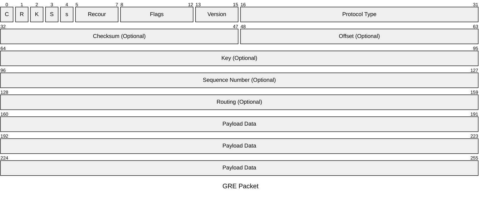

>[!cite] Definizione
>La ***virtualizzazione*** consiste nel creare versioni virtuali di sistemi di computazione, memorizzazione e di rete.
>>[!done] Una versione virtuale di un sistema

Il sistema viene eseguito come elemento software ***logicamente indipendente dall'hardware usato***.
>[!hint] Obbiettivo
>L'obbiettivo principale della virtualizzazione di reti è quello di realizzare topologie o funzionalità sull'***infrastruttura esistente*** *diverse da quelle native*.

Si parla di "*reti overlay*":
- ***Sovrapposte*** logicamente all'infrastruttura fisica.

>[!done] Pro
- Condivisione di risorse fisiche.
- Disaccoppiamento di hardware e software.
- Maggiore Flessibilità

>[!fail] Contro
- Isolamento fra sistemi distinti che condividono l'hardware.
- Sicurezza e privacy.

## Tecnologie di Virtualizzazione

---

>[!example] Lista di Tecnologie
- [[802.X/Virtual LAN|VLAN]] 
- GRE
- VXLAN
- [[VPN]]
- VPWS
- VPLS

### Generic Routing Encapsulation
>[!abstract] [RFC 1701](https://www.rfc-editor.org/rfc/rfc1701.html)
>Il `GRE` è un protocollo per l'incapsulamento di pacchetti generici su protocolli `IP`.

In particolare permette l'incapsulamento di **pacchetti** `IP` su **reti** `IP`.

![[attachements/GRETunnel.png]]

>[!hint] Overlay a Livello di routing
> Incapsulando il [[../../Network Layer/Protocollo IP|pacchetto IP]], si viene a creare una rete logica ***indipendente da quella fisica***.
>>[!done] Una modifica del percorso non viene percepita nel dominio logico
#### Pacchetto

>[!abstract] Parametri

> ***Protocol Type***
- Indica che tipo di protocollo *viene incapsulato*.

>***Checksum***
- [[../Controllo dell'Errore#Internet Checksum|Internet Checksum]]

> ***Key***
- Usato per **autenticare** la sorgente del pacchetto incapsulato.

> ***Routing***
- Determina la politica di [[../../Network Layer/Routing/Routing]] del tunnel.

### Virtual Extensible LAN
>[!info] `VXLAN`
> La `VXLAN` è una *rete di overlay* altamente ***scalabile*** e distribuita per isolare il traffico in **ambienti di cloud computing**.

Viene incapsulato il traffico di [[../../Standards/ISO-OSI|livello 2]] in pacchetti [[../../Transport Layer/UDP]] (*porta* $4789$).

>[!tldr] Concetto
- Una sola network `IP` viene ***estesa sulla rete globale***.
- Viene trasportato il *frame ethernet* sulla rete `IP`.
