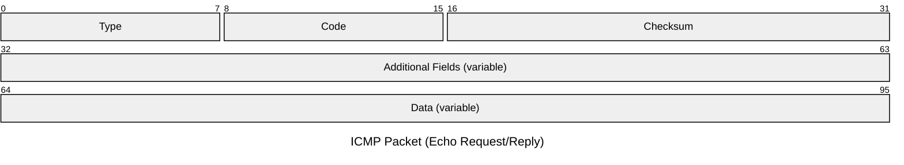

#reti_2
## Internet Control Message Protocol
---
> `ICMP` è un protocollo di controllo per la gestione di *situazioni anomale*.

Segnala errori e malfunzionamenti, ma **non esegue alcuna correzione**.

>[!info] [RFC 792](https://www.rfc-editor.org/rfc/rfc792.html)
>`ICMP` è un protocollo che svolge funzioni di controllo per il [[Protocollo IP]].

`ICMP` utilizza il supporto di base del protocollo `IP` come se fosse un protocollo di livello superiore.
- `ICMP` è *parte integrante* di `IP`.

### Formato del Pacchetto



> ***Type***
- Definisce il *tipo di messaggio*: errore o richiesta di informazione.

> ***Code***
- Descrive il *tipo di errore* e ulteriori *dettagli*.

> ***Checksum***
- Controlla i `bit` **errati** nel messaggio `ICMP`.

> ***Additional Fields***
- Dipendono dal tipo di messaggio `ICMP`.

> ***Data***
- Intestazione e parte dei dati del [[Protocollo IP#Datagram|datagram]] che ha **generato l'errore**.

### Tipi di Errori
>[!missing] Destination Unreachable
- `Type=3`
- Generato da un [[Routing#Ruolo del Gateway|gateway]] quando la sottorete o l'host **non sono raggiungibili**.
- Generato da un host quando si **presenta un errore sull'indirizzo** dell'entità di livello superiore a cui trasferire il datagram.
> Codici errore di `DU`
1. Sottorete *non raggiungibile*.
2. Host *non raggiungibile*.
3. Protocollo *non disponibile*.
4. [[Livello di Trasporto#Numero di Porta|Porta]] *non disponibile*.
5. Frammentazione necessaria e `bit` `DF=1`.

>[!failure] Time Exceeded
- `Type=11`
- Generato da un [[Routing#Router|router]] quando il `TTL` di un datagram si azzera e **viene distrutto**.
- Generato da un host quando un timer si azzera in attesa dei frammenti per **riassemblare un datagram**.

>[!abstract] Source Quench
- `Type=4`
- I datagram arrivano ***troppo velocemente*** rispetto alla capacità di essere processati.

>[!caution] Redirect
- `Type=5`
- Generato da un router per indicare alla sorgente una **strada più conveniente** per raggiungere la destinazione.

### Informazioni
>[!summary] Echo

>[!quote] Echo Reply
- La sorgente invia la richiesta ad un altro host/gateway.
- La destinazione deve rispondere.
- Usato per determinare lo stato di una rete (*tempo di transito*).
>[!tip] Additional Fields
- ***Identifier***: Identifica l'insieme degli echo dello stesso test.
- ***Sequence Number***: Identifica ciascun echo nell'insieme.
- ***Optional Data***: Per inserire dati di verifica.

>[!failure] Timestamp Request

>[!caution] Timestamp Reply
- La sorgente invia alla destinazione un *Originate Timestamp* che indica l'istante di partenza della richiesta.
- La destinazione risponde con un *timestamp* che indica l'istante di ricezione.
- Serve a valutare il ***tempo di transito nella rete***.

>[!question] Address Mask Request

>[!info] Address Mask Reply
- Inviato dal sorgente al broadcast per ottenere la ***subent mask***.

>[!missing] Router Solicitation

>[!warning] Router Advertisement
- Usato per localizzare i router connessi alla rete.

## Applicazioni ICMP
---
### Comando PING
```sh
ping 8.8.8.8
```

Permette di controllare se l'host destinatario è **raggiungibile o meno dalla sorgente**.
- La sorgente invia alla destinazione un pacchetto `echo`.
- Se la destinazione è **raggiungibile dalla sorgente**, risponde con un `echo reply`.

### Comando TRACEROUTE
```sh
traceroute 8.8.8.8
```

Permette di ***conoscere il percorso seguito*** dai pacchetti inviati dalla sorgente e diretti verso la destinazione.
- Attraverso una serie di pacchetti tipo `echo` con un `TTL` *progressivo*.
