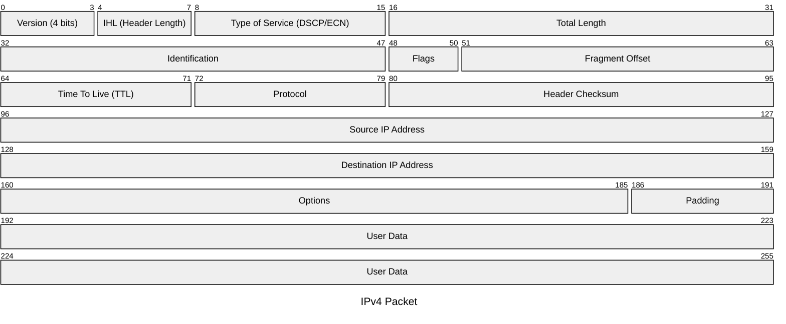

#reti_2
## Internet Protocol
---
>[!info] Definizione
>Il ***protocollo IP*** [RFC 791](https://www.rfc-editor.org/rfc/rfc791.html) fornisce al livello superiore un servizio di trasferimento di tipo "[[Comunicazione#^2e0d0e|connectionless]]" delle unità informative, denominate ***datagrammi*** (*datagram*).

Un datagram può essere duplicato dalla rete e le copie possono seguire ***percorsi diversi con frammentazioni diverse***.

Il protocollo **non fornisce alcuna garanzia** sull'effettivo trasferimento con *successo* dei *datagram*.
- Funziona tramite [[Comunicazione#Commutazione di Pacchetto|commutazione di pacchetto]].

>Questo protocollo interagisce con i protocollo [[TCP]] e [[UDP]] dello strato superiore.

L'indirizzo *IP* identifica i **punti di interconnessione** di un host con la rete.
- Non identifica un host individuale ma ***una delle sue interfacce di rete***.

>[!example] Esempio
>Un router che collega $n$ reti ha:
>- $n$ interfacce di rete
>- $n$ distinti indirizzi *IP*, uno per ciascuna interfaccia.

Il protocollo ***frammenta*** e ***riassembla*** i datagram quando necessario.
- Offre un servizio best effort, non sono previsti meccanismi di affidabilità e [[Controllo di Flusso TCP|Controllo di Flusso]].

### L'indirizzo IP
> Il protocollo identifica `host` e `router` tramite indirizzi di lunghezza fissa, raggruppandoli in reti `IP`.

>[!tip] Indirizzo `IPv4`
>Gli indirizzi della versione $4$ del protocollo, sono indirizzi di lunghezza fissa pari a $32$ `bit`
>I `bit` sono convenzionalmente scritti come **sequenza** di *4* numeri **decimali** con valori compresi tra $0$ e $255$ separati da un punto.
>>[!example] `137.204.212.1`
>
>Il numero massimo teorico di indirizzi è $2^{32}$
>- Nella realtà si riescono a sfruttare un ***numero molto inferiore***

Gli indirizzi sono assegnati dalla [[Enti Importanti#IANA|IANA]].

### Datagram
>[!hint] Formato
>Un datagramma ***IP*** include un *payload* con il contenuto del livello superiore e un *header*.
>L'header della versione $4$ del protocollo (`IPv4`) è mostrato nella figura sotto.



> ***Version***
- Indica il formato dell'intestazione (*Versione* in uso: $4$).

> ***IHL***
- Lunghezza dell'*intestazione*, espressa in word di $32$ `bit`.

> ***Type of Service***
- Indica il *tipo di servizio* richiesto.

> ***Total Length***
- *Lunghezza totale* espressa in `byte`, lunghezza massima $65535$.

> ***Identification***
- Valore che *identifica univocamente* il datagram.
- Nel caso il pacchetto sia ***frammentato*** tutti i frammenti di uno stesso datagram hanno lo stesso valore.

> ***Flag***
- `bit 0`: Sempre a $0$.
- `bit 1`: *Don't Fragment* (`DF=0` si può frammentare).
- `bit 2`: *More Fragments* (`MF=0` Il datagram è l'*ultimo frammento*).

> ***Fragment Offset***
- Indica la posizione del frammento nel datagram, unità: $64$`bit`.
- Il primo blocco del datagram è $0$.

> ***TTL***
- *Time to Live*: Campo che viene aggiornato da ogni [[Routing#Router|router]] attraversato.
- Se un datagram non viene consegnato entro un tempo definito (numero massimo di salti) **viene scartato**.
- Il "*contatore*" parte da un valore (default $64$) e viene ***decrementato ad ogni passo***.

> ***Protocol***
- Specifica il protocollo di livello superiore *che ha originato il datagram*.

> ***Header Checksum***
- Contiene un [[Controllo dell'Errore|codice di rilevazione dell'errore]] sul contenuto del **solo header**.

> ***Source e Destination*** `IP` ***address***
- Indirizzi di sorgente e destinazione.

> ***Options***
- Contiene informazioni aggiuntive opzionali.

> ***Padding***
- Campo di riempimento che serve per garantire che l'*header* abbia una lunghezza multipla di $32$ `byte`.

### Semantica dell'Indirizzo
>[!tldr] Idea
>L'indirizzo `IP` è logicamente suddiviso in due parti:
>- ***Network ID***.
>- ***Host ID***.

> *Network ID*
- Prefisso che identifica la [[Routing|network IP]] a cui appartiene l'indirizzo.
- Tutti gli indirizzi du una medesima network `IP` hanno il medesimo prefisso.

> *Host ID*
- Identifica l'***host*** vero e proprio di una certa **network**.

#### Netmask
>[!info]
>La ***netmask*** è una maschera di $32$ `bit` associata ad un numero `IP`.

I `bit` a $1$ della **netmask** identificano i `bit` dell'indirizzo `IP` che fanno parte del *network ID*.

> **Notazione**: `11111111.11111111.11111111.11000000`
- Dotted-Decimal: `255.255.255.192`
- Esadecimale: `ff.ff.ff.c0`
- Notazione abbreviata: `x.y.z.q/26`.

>[!done] Identificare una Network
>Prendiamo la network: `137.204.191.0`.
>- Scrivendola così si perde l'informazione della lunghezza del ***network ID***.
>
>Per cui si scrive: `137.204.191.0/26`

> `137.204.191.0` viene usato come nome della network
- **NON** si può usare per gli host.

La netmask definisce la *lunghezza* del ***network-ID***.
- Rimarranno per l'***Host-ID*** $H=32-N$ `bit`.
- Quindi sono disponibili: $I=2^{H}-2$ indirizzi `IP`.
### Segmentazione
> Ogni rete prevede uno **specifico valore massimo** della quantità di informazione che può essere trasportata nel payload.

Questo parametro viene denominato `MTU` (***M***aximum ***T***ransmission ***U***nit).
- `MTU` *Minimo*
	- $576$`byte`, tutti i sistemi internet devono elaborarlo senza dar luogo a frammentazione.
- `MTU` *Massimo*
	- Il massimo è dato dalla dimensione massima di un datagram.


>[!summary] Frammenti 
> Il ***protocollo IP*** prevede la possibilità di attuare la *segmentazione* di un datagram in più **frammenti**.
> - Ciascuno viene trasportato come un *datagram indipendente*.

La numerazione tramite offset è stata concepita per rinumerare i **frammenti di un frammento**. 
- Si possono ricevere frammenti che si sovrappongono parzialmente.

>[!question] Chi Frammenta?

Qualunque nodo di rete dotato di protocollo `IP` ***può frammentare un datagramma***.
- I nodi intermedi *non riassemblano*, ma lo fa solamente il **terminale ricevente**.
#### Algoritmi di Riassemblamento
Per il ***riassemblamento*** si utilizza il campo ***fragment offset*** per tutti i segmenti intermedi (`MF=1`).
- Al ricevimento dell'ultimo frammento (`MF=0`) si controlla di avere la sequenza completa.
##### RFC 791

``` title:"RFC 791"
Notation:

FO    -  Fragment Offset
IHL   -  Internet Header Length
MF    -  More Fragments flag
TTL   -  Time To Live
NFB   -  Number of Fragment Blocks
TL    -  Total Length
TDL   -  Total Data Length
BUFID -  Buffer Identifier
RCVBT -  Fragment Received Bit Table
TLB   -  Timer Lower Bound

Procedure:

(1)  BUFID <- source|destination|protocol|identification;
(2)  IF FO = 0 AND MF = 0
(3)     THEN IF buffer with BUFID is allocated
(4)             THEN flush all reassembly for this BUFID;
(5)          Submit datagram to next step; DONE.
(6)     ELSE IF no buffer with BUFID is allocated
(7)             THEN allocate reassembly resources
					 with BUFID;
					 TIMER <- TLB; TDL <- 0;
(8)          put data from fragment into data buffer with
			 BUFID from octet FO*8 to
								 octet (TL-(IHL*4))+FO*8;
/* (FO * 8) => 64byte boundary */
(9)          set RCVBT bits from FO
								to FO+((TL-(IHL*4)+7)/8);
(10)         IF MF = 0 THEN TDL <- TL-(IHL*4)+(FO*8)
(11)         IF FO = 0 THEN put header in header buffer
(12)         IF TDL # 0
(13)          AND all RCVBT bits from 0
									 to (TDL+7)/8 are set
(14)            THEN TL <- TDL+(IHL*4)
(15)                 Submit datagram to next step;
(16)                 free all reassembly resources
					 for this BUFID; DONE.
(17)         TIMER <- MAX(TIMER,TTL);
(18)         give up until next fragment or timer expires;
(19) timer expires: flush all reassembly with this BUFID; DONE.
```

>[!warning] Algoritmo non Efficace

##### RFC 815
[RFC 815](https://www.rfc-editor.org/rfc/rfc815.html)
>[!tldr] Idea
> Utilizza il concetto di "*hole*".

`hole.first`
- Indica l'offset dell'***inizio di un hole***.
`hole.last`
- Indica l'offset della ***fine di un hole***.

Si crea una ***lista ordinata di hole*** che è inizialmente composta da un solo buco uguale a tutto il pacchetto.
- Istante iniziale: Ricezione di un primo frammento con *informazioni identificative non registrate*.
- Si crea una lista con un elemento solo che ha `hole.first=0` e `hole.last=infty`.

Ricevuto un frammento si procede a controllare la **lista dei hole**:
- Se `fragment.first > hole.last` si passa al **hole** *successivo*.
- Se `fragment.last < hole.first` si passa al **hole** *precedente*.
- Se nessuna delle precedenti è vera il segmento intercetta l'**hole** corrente che va sostituito da un nuovo **hole**.
	- Se `fragment.first > hole.first` il nuovo **hole** avrà: `hole.first=hole.first` e `hole.last=fragment.first`.
	- Se `fragment.last < hole.last` il nuovo **hole** avrà: `hole.first=fragment.last` e `hole.last=hole.last`.

>[!done] L'algoritmo termina quando non ci sono più buchi