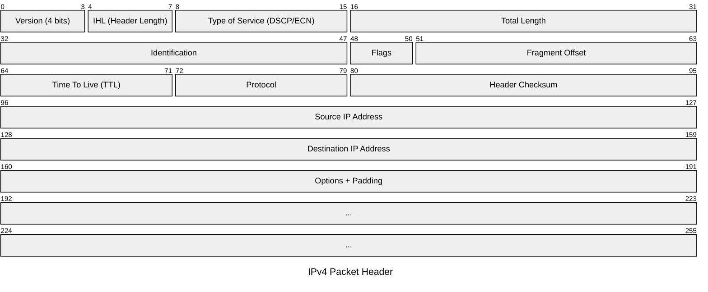

>[!info] Definizione
>Il ***protocollo IP*** (\[RFC791\]) fornisce al livello superiore un servizio di trasferimento di tipo "[[Comunicazione#Tipi di Trasferimento dei Dati|connectionless]]" delle unità informative, denominate ***datagrammi***.

Il protocollo **non fornisce alcuna garanzia** sull'effettivo trasferimento con *successo* dei datagrammi.

>Questo protocollo interagisce con i protocollo #addLink **TCP** e **UDP** dello strato superiore

L'indirizzo *IP* identifica i **punti di interconnessione** di un host con la rete.
- Non identifica un host individuale ma ***una delle sue interfacce di rete***.

>[!example] Esempio
>Un router che collega $n$ reti ha:
>- $n$ interfacce di rete
>- $n$ distinti indirizzi *IP*, uno per ciascuna interfaccia.
### Datagramma
>[!hint] Formato
>Un datagramma ***IP*** include un *payload* con il contenuto del livello superiore e un *header*.
>L'header della versione $4$ del protocollo (`IPv4`) è mostrato nella figura sotto.

## L'indirizzo IP
---
>[!tip] Indirizzo `IPv4`
>Gli indirizzi della versione $4$ del protocollo, sono indirizzi di lunghezza fissa pari a $32$ `bit`
>I `bit` sono convenzionalmente scritti come **sequenza** di *4* numeri **decimali** con valori compresi tra $0$ e $255$ separati da un punto.
>>[!example] `137.204.212.1`
>
>Il numero massimo teorico di indirizzi è $2^{32}$
>- Nella realtà si riescono a sfruttare un ***numero molto inferiore***

