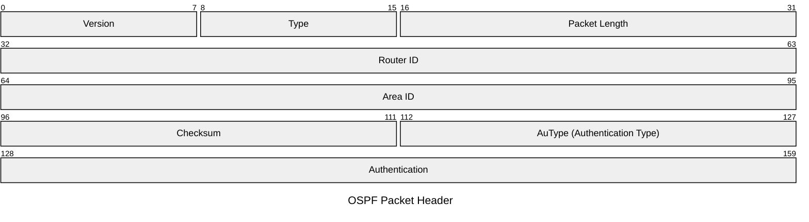

## OSPF
---
> È il più diffuso [[Routing Globale#Interior Gateway Protocol|IGP]].

>[!info]
>L'`OSPF` è il protocollo generalmente usato in un [[Routing Globale|Autonomous Systems]] di medie o grandi dimensioni (`ISP` di [[../../Standards/Enti Importanti#Internet Service Provider|primo o secondo livello]]).

Progettato per operare correttamente con reti:
- *Point to Point*, *Broadcast Multi-Access* e *Non-Broadcast Multi-Access*.
### Aree di Routing
> Nel caso di `AS` molto grandi è possibile suddividere l'`AS` in più aree.

>[!tip] Routing Area
>Una ***Routing Area*** è una area logicamente separata dalle altre.
>Le `RA` sono interconnesse da una ***backbone***.

Ciascuna area si comporta come un `AS` dal punto di vista dell'`OSPF`.
- Le diverse aree possono usare *metriche per la distanza differenti*.
- Ciascun router di un'area è a ***conoscenza della topologia della propria area***.
- Le informazioni sulle altre aree sono *limitate*.

>[!example] Classificazione Gerarchica delle Aree
- Una unica ***backbone area*** che comprende un *backbone router* che svolge il ruolo di interconnessione fra aree.
- Diverse **aree** connesse *necessariamente* alla backbone attraverso l'***area border router***.
	- Internamente le aree hanno uno o più *internal router*.
- Uno o più *backbone router* svolgono il ruolo di ***AS boundary router*** fornendo connettività con altri `AS` (attraverso [[Routing Globale#Protocolli di Routing|EGP]]).

> Ogni router ha un ***identificativo*** che di default è l'indirizzo `IP` più alto fra le interfacce del router.
- Ogni router ha anche una *priorità* (`0-255`).

![[attachements/OSPFArea.png]]

>[!caution] Classificazione di Route
- Route ***intra-area***: Aggiornamento delle informazioni di routing *dell'area*.
- Route ***inter-area***: Aggiornamento delle informazioni di routing di *diverse aree* da quella considerata.
- Route ***esterni***: Aggiornamenti delle informazioni di route proveniente da *altri protocolli*.

>[!help] Classificazione di Aree

- ***Area Normale***: Accetta **tutti** i tipi di route.

>[!stub] Stub Area
> Una ***stub area*** è una area *non-backbone* progettata per *ridurre la grandezza* delle routing table bloccando specifici pacchetti **Link State Advertisement**.
- ***Stub Area***: Accetta route **intra** e **inter** area.
	- I router hanno una "*default route*" verso destinazioni fuori dell'`AS`.
- ***Totally Stub Area***: Propagati solo le route *intra area* e route di *default*.
- ***Not so Stubby Area***: Stub Area che importa alcune route esterne.

### Caratteristiche
>[!todo] Bilanciamento del Carico

Se un router ha più percorsi di uguale lunghezza, il **carico è distribuito equamente**.
 
>[!done] Autenticazione

È prevista una autenticazione con **password** e uso di **crittografia**.

>[!help] Routing dipendente dal grado di servizio (***Fondamentale***)

I router scelgono il percorso sulla base dell'*indirizzo* e del campo `Type of Service` dell'[[../Protocollo IP#Datagram|Header IP]].
- Si adottano ***diverse metriche di corso*** in base al tipo di servizio richiesto, creando instradamenti diversi.
- ***Tipi di Servizio***:
	- *Affidabilità*, *Massimizzazione Throughput*, *Minimizzazione del Ritardo*.

### Tipologie di Messaggio
> Il protocollo `OSPF` definisce cinque tipi di messaggi.

| Tipo | Nome                          | Acronimo | Funzione                                                        |
| ---- | ----------------------------- | -------- | --------------------------------------------------------------- |
| $1$  | **Hello**                     | —        | Scoperta e mantenimento della relazione di vicinanza tra router |
| $2$  | **Link State Database**       | `LSDB`   | Comunicazione dello stato dei collegamenti                      |
| $3$  | **Link State Request**        | `LSR`    | Richiesta di informazione sullo stato dei collegamenti          |
| $4$  | **Link State Update**         | `LSU`    | Aggiornamento sullo stato dei collegamenti                      |
| $5$  | **Link State Acknowledgment** | `LSA`    | Riscontro dei messaggi LSU ricevuti                             |
#### Pacchetti
>[[../Protocollo IP|!hint]].

Si compongono di un'**intestazione comune** e informazioni aggiuntive

> **AuType**
- $0$ - **Nessuna** autenticazione.
- $1$ - Autenticazione **Semplice**.
- $2$ - Autenticazione **Crittografica**.

##### Protocolli
>[!info] Hello Protocol

> I pacchetti `hello` sono inviati ***periodicamente*** secondo il parametro `Hello Interval` ($2$ `byte`).

Il pacchetto include:
- Lista dei vicini.
- La priorità.
- Il *designated router* e il **backup** (per l'elezione).
- Network Mask
- Eventuali **Options**.

>[!caution] Exchange Protocol

Usato una volta ***stabilite le adiacenze*** per sincronizzare i *database*.
- Si sceglie un **master** e uno **slave**.
	- Il *master* invia pacchetti `LSDB` contenenti gli `LSA` del nodo.
	- Lo *slave* risponde con gli `LSA` del proprio `DB`.

>[!abstract] Flooding Protocol

Si diffondono gli `LSA` a ***tutti i router della rete***.
#### Funzionamento
> `OSPF` è un protocollo di tipo ***link state***.

> ***Comunicazione***
1. Ogni nuovo router invia un messaggio di `hello` ai **router vicini** (*Hello Protocol*).
	1. A cadenza periodica viene inviato il packet `hello` per **mantenere la mappa della rete**.
2. I router adiacenti rispondono un messaggio `LSDB` che fornisce le ***informazioni aggiornate sui collegamenti*** (per sincronizzare i rispettivi *Link State Database*).
3. Il costo dei collegamenti viene aggiornato con ***cadenza periodica***, attraverso `LSU` o attraverso ***richieste esplicite*** (`LSR`).
4. Ogni ricevimento di un `LSU` è riscontrato con un `LSA` (`ACK`).

I messaggi `LSU` vengono instradati con la tecnica di [[Senza Routing Table#Flooding|flooding]].

>[!caution] Le informazioni costruiscono il ***grafo della rete***
>I percorsi vengono poi calcolati attraverso l'[[../../../Algoritmi e Strutture Dati/Strutture Dati/Grafi/Cammini Minimi/Algoritmo di Dijkstra]].

Lo ***shortest path tree*** è rappresentato dal *Link State Database* presente in ogni router.
##### Caso Rete Multi Access
>[!info] Designated Router
>Il ***designated router*** è uno solo dei router che supportano le *reti multi access*.
>Il ***designated router*** è l'unico autorizzato a inviare messaggi `LSU` agli altri e unico a comunicare la raggiungibilità di *router e host al mondo esterno*.

Procedura di elezione del *designated router* 
1. Ciascun Router esamina la *lista dei vicini* ed elimina dalla lista i router non eleggibili (es ***priorità nulla***).
2. Fra quelli rimasti sceglie il router con **priorità maggiore** (`ID` maggiore in caso di parità).
3. Elegge il router selezionato.

Si individua anche un **router di backup**, con la stessa procedura.
