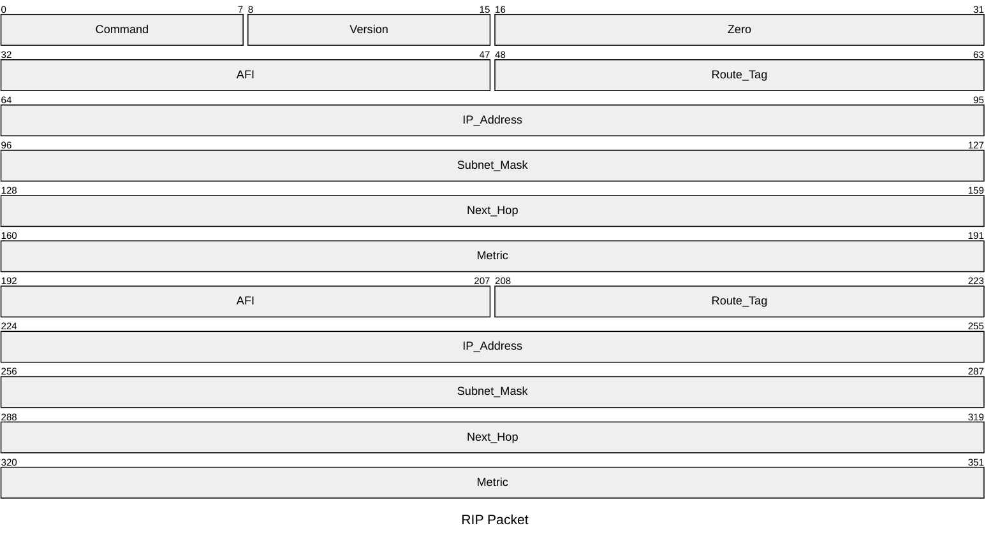
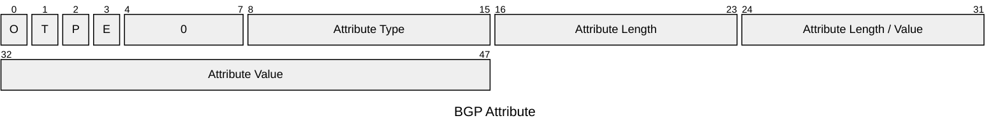

#reti_2
## Routing Gerarchico
---
>[!cite] Autonomous System
>Un ***autonomous system*** è un insieme di router gestiti da un'unica amministrazione che usa un solo protocollo i routing e una logica per definire le metriche.
>
>>[!definizione] Definizione Moderna [RFC 1930](https://www.rfc-editor.org/rfc/rfc1930.html)
>>Un `AS` è un insieme di [[Protocollo IP#Semantica dell'Indirizzo|prefissi di rete]] `IP`, definite secondo la logica [[Reti IP#CIDR|CIDR]].
>> - Un `AS` può avere uno o più enti gestori che utilizzano una o più tecnologie.

È una area di [[Routing]] in un sistema di *routing gerarchico*.
- L'***Internet Routing Registries*** è un database con le politiche di routing degli `AS`.

Un `AS` può essere ulteriormente diviso in porzioni dette ***routing area*** (`RA`) interconnesse da una **backbone**.

Gli `AS` decidono autonomamente i ***protocolli*** e le ***politiche di routing*** che adottano all'interno.
- I protocolli interni ad un `AS` sono detti "***I***nterior ***G***ateway ***P***rotocols" (`IGPs`).
- I protocolli esterni ad un `AS` sono detti "***E***xterior ***G***ateway ***P***rotocol**s**" (`EGPs`).

Gli `AS` non sono vincolati ad aree geografiche.
- ***Internet Region***: Porzione di internet contenuta in una area geografica.
	- Una *internet region* può essere servita da più [[Enti Importanti#Internet Service Provider|ISP]] un `ISP` può servire più `IR`.

>[!tldr] Concetto
>I ***routing gerarchico*** è l'identificazione di sottoinsiemi di rete *autonomi per l'instradamento* e di *punti di contatto fra sotto sistemi*.
### Routing a  livello Globale
> Tipologie di [[I Grafi|grafo]]:

- [[Topologie di Rete|Topologia]] dei sottoinsiemi della rete (*grafi di dettaglio*).
- Topologie dei sottoinsiemi interconnessi (*grafo semplificato*).
>[!hint] A ciascun livello non si ha conoscenza dell'altro

### Protocolli di Routing
>[!abstract] Un `AS` deve implementare il routing al suo interno usando uno o più `IGP`.
- ***RIP*** e [[Open Shortest Path First|OSPF]].

>[!caution] Un `AS` deve comunicare con gli altri `AS` per implementare routing fra `AS`
- Attraverso un protocollo `EGP`.
- BGP.

#### Interior Gateway Protocol
>[!abstract] RIP
>Il ***Routing Information Protocol*** è la vecchia implementazione del [[Con Routing Table#Routing Distance Vector|distance vector]].

Utilizza ***due tipologie di messaggi***:
- `REQUEST`: Per chiedere esplicitamente informazioni ai nodi vicini.
- `RESPONSE`: Per inviare informazioni di routing (*distance vector*).
	- Inviato periodicamente, come risposta ad una richiesta o a seguito di un cambiamento (*triggered update*).

I messaggi `RIP` sono trasportati da [[UDP]] e usano la [[Livello di Trasporto#Numero di Porta|porta]] $520$.

Il `RIP` usa una tabella di routing con:
- ***Indirizzo*** di destinazione.
- ***Distanza*** dalla destinazione.
- Next-Hop.
- Due contatori
	- ***Timeout***: Se una route non viene aggiornata dopo $T_{o}$ secondi, la distanza è posta a $\infty$.
	- ***Garbage Collection***: Dopo ulteriori $G$ secondi la route **viene eliminata**.

La tabella viene aggiornata alla ricezione di ciascuna `RESPONSE`.

>[!fail] Problemi
- Non supporta [[Reti IP#CIDR|CIDR]].
- Protocollo insicuro.

>[!failure] RIP versione 2
- Introduce il subnetting, `CIDR` e autenticazione.
##### Pacchetto

- Il pacchetto è ripetuto fino ad avere massimo $25$ **record**.
- Molti `bit` ridondanti rispetto alla quantità di informazioni da inviare.

>[!info] Significato dei Campi

> `command`
- Distingue le richieste e le risposte.

> `address family identifier`
- Indica il tipo di indirizzo di rete usato.

> `address`
- Identifica la destinazione per cui viene data la distanza.

> `metric`
- Distanza dalla destinazione indicata.

#### Exterior Gateway Protocols
> Applicati nel routing tra diversi `AS`.

>[!danger] `EGP != EGPs`
##### Exterior Gateway Protocol
>[!info] [RFC 827](https://www.rfc-editor.org/rfc/rfc827.html)
>***Primo protocollo*** tra `AS`.

> Caratterizzato da tre funzionalità:
- ***Neighbour Acquisition***: Ricerca di un accordo per essere vicini.
- ***Neighbour Reachability***: Controllo delle connessioni tra vicini.
- ***Network Reachability***: Scambio di informazioni sulle reti raggiungibili.

Protocollo simile al [[Con Routing Table#Routing Distance Vector|distance vector]].
- Con informazioni di **raggiungibilità**.

>[!missing] Limitazioni

- Progettato per una ***topologia specifica*** (Una dorsale con vari domini connessi ad un solo router: `ARPAnet`).
- Funziona per una [[Topologie di Rete|topologia ad albero]].
	-  Fatica in **presenza di cicli**.
- Non si adatta velocemente alle modifiche.
- Poca sicurezza.

##### Border Gateway Protocol
> Sostituto di `EGP`

>[!info] [RFC 1771](https://www.rfc-editor.org/rfc/rfc1771.html)
>I router scambiano informazioni tramite connessioni [[TCP]] (porta $179$) chiamate ***sessioni*** `BGP`.

>[!example] Tipologie di Sessioni

> `eBGP` (*extern* `BGP`)
- Instaurate tra router appartenenti ad `AS` *diversi*.

> `iBGP` (*internal* `BGP`)
- Instaurate tra router appartenenti gli *stessi* `AS`.

>[!abstract] Path Vector
- Evoluzione del ***Distance Vector***, risolve il problema dei *percorsi ciclici*.
	- Quando un *border router* di un `AS` riceve un path vector controlla se il suo `AS` è ***già elencato***.
	- Nel vettore dei percorsi vengono elencate tutti gli `AS` da attraversare per raggiungere la destinazione.

> ***Attributi***:
- A ciascun path vector sono associati attributi che ne *specificano la natura*.

***Well Known***:
- Riconoscibile da tutte le implementazioni `BGP`, può essere:
	- *Mandatory*: deve essere presente nel ***path vector***.
	- *Discretionary*: può non essere presente.

***Optional***:
- Può non essere riconosciuta dai router, può essere:
	- *Transitive*: Deve essere presente anche se non riconosciuti.
	- *Non-Transitive*: Deve essere ***ignorato*** se non riconosciuto.

***Partial***:
- Si tratta di un attributo *optional-transitive* che è stato **ritrasmesso senza modifiche**.

- `O` -> $1=$Optional - $0=$Well-known.
- `T` -> $1=$Transitive - $0=$Non-Transitive.
- `P` -> $1=$Partial.
- `E` -> $0=$ $1$`byte` - $1=$ $2$`byte`.

>[!example] Attributi
- **Origin** (*well-known* e *mandatory*)
	- $0=$ `IGP` Informazione proveniente dal protocollo interno all'`AS`.
	- $1=$ `EGP` Informazione appresa dal protocollo `EGP`.
	- $2=$ `incomplete`: Indica che il percorso è stato determinato **in un altro modo**.
- `AS` **path** (*well-known* e *mandatory*)
	- Elenco degli `AS` da attraversare.
- **Next Hop** (*well-known* e *mandatory*)

>[!summary] Formato dei Messaggi
- ***Marker***: Campo per l'autenticazione.
- ***Length***: Numero di `byte`.
- ***Type***: Assume uno dei valori:
	- *Open*: Primo messaggio trasmesso all'arrivo di una connessione.
	- *Update*: Contiene il path vector.
	- *Notification*
	- *Keepalive*: Comunica che il trasmettitore è attivo anche se silente.
###### Politiche di Routing
>[!missing] Export Policies
>Si comunicano ai vicini solo i ***path vector*** relativi alle destinazioni verso le quali si vuole *permettere il transito*.

>[!abstract] Import Policies
>Dal ***path vector*** è possibile risalire agli `AS` da attraversare per raggiungere una destinazione, se sono presenti uno o più `AS` incompatibili *esso viene ignorato*.

