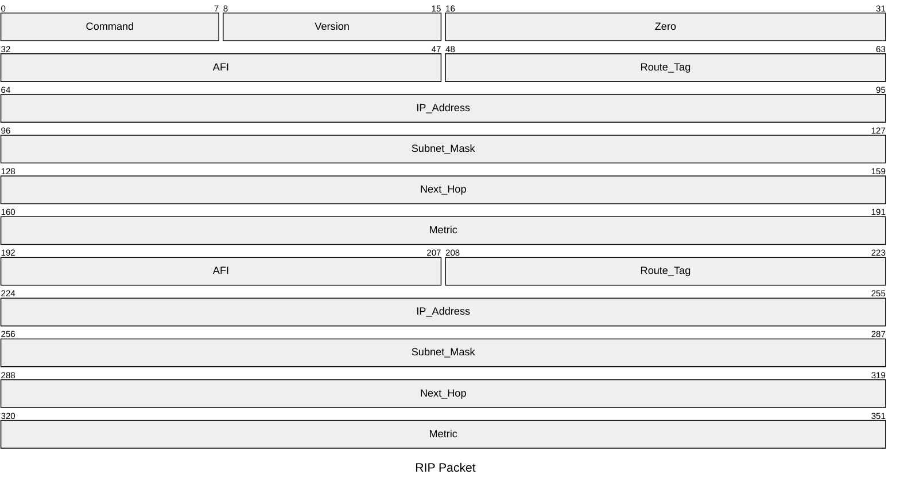

#reti_2
## Routing Gerarchico
---
>[!cite] Autonomous System
>Un ***autonomous system*** è un insieme di router gestiti da un'unica amministrazione che usa un solo protocollo i routing e una logica per definire le metriche.
>
>>[!definizione] Definizione Moderna [RFC 1930](https://www.rfc-editor.org/rfc/rfc1930.html)
>>Un `AS` è un insieme di [[Protocollo IP#Semantica dell'Indirizzo|prefissi di rete]] `IP`, definite secondo la logica [[Reti IP#CIDR|CIDR]].
>> - Un `AS` può avere uno o più enti gestori che utilizzano una o più tecnologie.

È una area di [[Routing]] in un sistema di *routing gerarchico*.
- L'***Internet Routing Registries*** è un database con le politiche di routing degli `AS`.

Un `AS` può essere ulteriormente diviso in porzioni dette ***routing area*** (`RA`) interconnesse da una **backbone**.

Gli `AS` decidono autonomamente i ***protocolli*** e le ***politiche di routing*** che adottano all'interno.
- I protocolli interni ad un `AS` sono detti "***I***nterior ***G***ateway ***P***rotocols" (`IGPs`).
- I protocolli esterni ad un `AS` sono detti "***E***xterior ***G***ateway ***P***rotocol**s**" (`EGPs`).

Gli `AS` non sono vincolati ad aree geografiche.
- ***Internet Region***: Porzione di internet contenuta in una area geografica.
	- Una *internet region* può essere servita da più [[Enti Importanti#Internet Service Provider|ISP]] un `ISP` può servire più `IR`.

>[!tldr] Concetto
>I ***routing gerarchico*** è l'identificazione di sottoinsiemi di rete *autonomi per l'instradamento* e di *punti di contatto fra sotto sistemi*.
### Routing a  livello Globale
> Tipologie di [[I Grafi|grafo]]:

- [[Topologie di Rete|Topologia]] dei sottoinsiemi della rete (*grafi di dettaglio*).
- Topologie dei sottoinsiemi interconnessi (*grafo semplificato*).
>[!hint] A ciascun livello non si ha conoscenza dell'altro

### Protocolli di Routing
>[!abstract] Un `AS` deve implementare il routing al suo interno usando uno o più `IGP`.
- ***RIP*** e [[Open Shortest Path First|OSPF]].

>[!caution] Un `AS` deve comunicare con gli altri `AS` per implementare routing fra `AS`
- Attraverso un protocollo `EGP`.
- BGP.

#### Interior Gateway Protocol
>[!abstract] RIP
>Il ***Routing Information Protocol*** è la vecchia implementazione del [[Con Routing Table#Routing Distance Vector|distance vector]].

Utilizza ***due tipologie di messaggi***:
- `REQUEST`: Per chiedere esplicitamente informazioni ai nodi vicini.
- `RESPONSE`: Per inviare informazioni di routing (*distance vector*).
	- Inviato periodicamente, come risposta ad una richiesta o a seguito di un cambiamento (*triggered update*).

I messaggi `RIP` sono trasportati da [[UDP]] e usano la [[Livello di Trasporto#Numero di Porta|porta]] $520$.

Il `RIP` usa una tabella di routing con:
- ***Indirizzo*** di destinazione.
- ***Distanza*** dalla destinazione.
- Next-Hop.
- Due contatori
	- ***Timeout***: Se una route non viene aggiornata dopo $T_{o}$ secondi, la distanza è posta a $\infty$.
	- ***Garbage Collection***: Dopo ulteriori $G$ secondi la route **viene eliminata**.

La tabella viene aggiornata alla ricezione di ciascuna `RESPONSE`.

>[!fail] Problemi
- Non supporta [[Reti IP#CIDR|CIDR]].
- Protocollo insicuro.

>[!failure] RIP versione 2
- Introduce il subnetting, `CIDR` e autenticazione.
##### Pacchetto

- Il pacchetto è ripetuto fino ad avere massimo $25$ **record**.
- Molti `bit` ridondanti rispetto alla quantità di informazioni da inviare.

>[!info] Significato dei Campi

> `command`
- Distingue le richieste e le risposte.

> `address family identifier`
- Indica il tipo di indirizzo di rete usato.

> `address`
- Identifica la destinazione per cui viene data la distanza.

> `metric`
- Distanza dalla destinazione indicata.