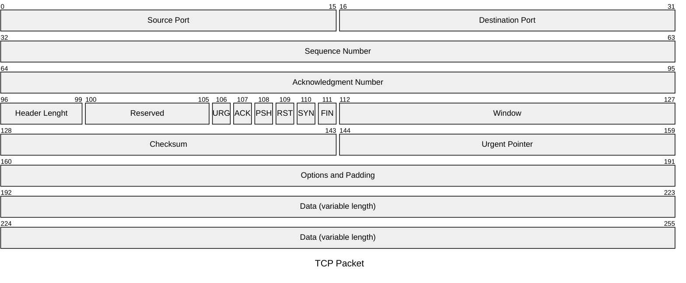

## Transmission Control Protocol
---
>[!info] TCP
>Il protocollo **TCP** \[RFC793\] definisce una modalità di trasferimento "*affidabile*" tra applicazioni.
>Protocollo di tipo "*connection-oriented*".
>Il protocollo svolge le funzioni necessarie a **ricostruire il flusso di dati** originale a fronte di **perdite**, **duplicazioni** o consegna **fuori sequenza**.

L'affidabilità si basa sulla *numerazione* `byte` per `byte` dei dati trasferiti nelle ***due direzioni della connessione***.

### Formato del Messaggio

> ***Sequence Number***:
- Indica il *numero d'ordine* del primo `byte` di dati nel **payload** dell'unità informativa all'interno del flusso inviato dalla sorgente.

> ***Acknowledgement Number***:
- Indica il *numero d'ordine* del prossimo `byte` che il sistema terminale si aspetta di ricevere con il **prossimo segmento**.

> ***Header Length***:
- Indica la *lunghezza dell'header* in unità di $4$ `byte`; Il segmento ha lunghezza variabile da **minimo** $20$ `byte` a **massimo** $60$ `byte`.

>[!abstract] Flags
>> *Urgent*
>- Indica (`URG=1`) la presenza nel segmento `TCP` di dati da *consegnare con urgenza* alla destinazione, la cui posizione è indicata dal campo "*urgent pointer*".
> 
>> *Acknowledgment*
>- Indica se il numero di riscontro è valido (`ACK=1`) o se deve essere *ignorato* dal terminale ricevente (`ACK=0`).
>
>> *Push*
>- Richiede (`PSH=1`) al terminale ricevente di *consegnare* all'applicazione di destinazione il **payload del segmento**.
>  
>> *Reset*
>- Segnala (`RST=1`) il **rilascio della connessione**, il *rifiuto* di una **richiesta** di connessione o il *rifiuto* di un **segmento**.
>
>> *Synchronize*
>- Usato (`SYN=1`) per instaurare una connessione `TCP`
>
>> *Finalize*
>- Usato (`FIN=1`) per richiedere il rilascio della connessione `TCP`.

> ***Window***:
- Indica l'apertura della *finestra di ricezione*; Il numero di `byte` che la sorgente è disposta a ricevere dal `TCP` remoto.
- Una finestra di valore $y$ indica che si **autorizza** a emettere un numero $y$ di `byte` a partire dal `byte` `AN`$=x$ indicato nello stesso segmento, e quindi fino al `byte` numero $x+y-1$.

> ***Checksum***:
- Codice di controllo per la rilevazione di errori sul segmento `TCP`.
- Calcolato applicando l'**Internet Checksum** allo *pseudo-header*.
	- [[Protocollo IP|Indirizzi IP]] *Sorgente* e *destinazione*-
	- Protocollo
	- Lunghezza in `byte` del segmento.

> ***Urgent Pointer***:
- Indica dove i *dati urgenti* sono posizionati nel *segmento*, ha senso se `URG=1` .

> ***Options***:
- Campo di *lunghezza variabile* (si aggiunge il **padding** per renderla a $32$ `bit`).
- Consente lo scambio di informazioni aggiuntive.
	- Comprende 3 *voci*

>[!summary] Options
>> ***Kind***:
>- Tipo di opzione.
>	- `1`-> Riservato significato di Padding
>	- `2` -> Specifica la Maximum Segment Size (**MSS**) in `byte` del segmento; Opzione specificata all'**instaurazione della connessione**.
>		- Dimensione massima: $2$ `byte` -> **MSS**$=65536$. 
> 
>> ***Length***:
>- Lunghezza complessiva in byte della opzione.
>
>> ***Data***:
>- Contenuto dell'opzione.

## Macchina a Stati Finiti del TCP
---
>[!check] Stato
>Le **condizioni** che descrivono il software del protocollo in un particolare calcolatore in un *determinato istante*.

>[!caution] Transizione
>Il passaggio da uno **stato** ad *un altro*.

>[!help] Evento
> Qualunque cosa che provochi una ***transizione di stato*** per il protocollo.

>[!abstract] Azione
>Qualcosa che il *software* del protocollo **fa** in un dispositivo come ***risposta ad un evento*** prima di effettuare un transizione di stato.

![[TCPFinateStateMachine.png]]

> *Legenda*
- Linee Tratteggiate: Azioni tipiche del **server**.
- Linee Nere: Azioni tipiche di un **client**.
- Linee Chiare: Eventi **inusuali**.
- Transizioni: **Causa**/**Effetto**.

## Gestione della Connessione
---
### Apertura della Connessione
>[!check] Three Way Handshake
>L'*instaurazione* di una connessione `TCP` avviene mediante **scambio di segmenti** con la procedura detta "***three way handshake***".

^bd3d55

>[!question] Request

La procedura consiste in una ***prima fase*** in cui la sorgente $A$ inoltra un segmento di **richiesta di connessione**,
- *Connection Request* `CR`.
verso la stazione $B$, specificando il numero iniziale di conteggio dei `byte ISN` che la stazione sceglie per il *flusso di uscita*. 

Il segmento `CR` è caratterizzato da:
- `SYN=1`.
- `ACK=0`.
- `SN`$=x$.

>[!caution] Acknowledgment

Nella ***seconda fase*** il destinatario $B$, che ipotizziamo accettare la connessione, risponde con un *segmento di riscontro* (*acknowledgment*, `ACK`).
- Il segmento specifica a sua volta il numero `ISN` che $B$ sceglie per il *proprio flusso di dati*.

Il segmento `ACK` è caratterizzato da:
- `SYN=1` (*Accettato*).
- `ACK=1`.
- `SN`$=y$.
- `AN`$=x+1$

>[!done] Connection

Nella ***terza fase*** la stazione $A$ invia l'ultimo *messaggio finale di riscontro*.

Il segmento di risposta `ACK` è caratterizzato da:
- `SYN=0`.
- `ACK=1`.
- `SN`$=x+1$.
- `AN`$=y+1$.

![[ThreeWayHandshake.png]]

La procedura di selezione dell'`ISN` è di tipo ***pseudocasuale***.
- Si basa su un *contatore interno* a ogni host che **conta ciclicamente** tra $0$ e $2^{32}-1$.
- Incrementato ogni $4\ \mu sec$ (Ripete la sequenza ogni $2^{32}\cdot4\times10^{-6}\simeq 4.77h$)

Al momento dell'apertura della connessione, l'host sceglierà come `ISN` il **valore corrente del contatore**.

>È opportuno che i numeri di sequenza delle diverse connessioni **identifichino** intervalli di numerazione ***non sovrapposti***.

>[!hint] Quiet Time
>Dopo un *qualunque riavvio* un host attende un $MSL$ prima di riaprire le connessioni `TCP`.

>[!warning] Attenzione
>Potrebbe verificarsi il caso in cui un **segmento** inviato su una connessione che nel frattempo ***è stata chiusa*** venga ricevuto quando è stata attivata una *nuova connessione* tra le stesse ***socket***.
>Questo **segmento** potrebbe *interferire* con il flusso di segmenti della *nuova connessione* se il suo numero di sequenza `SN` rientra tra quelli "***ammissibili***" nell'ambito della nuova connessione `TCP`.

La scelta pseudocasuale risolve il problema descritto.

>Può accadere che entrambe le stazioni terminali $A$ e $B$ inviino una all'altra un messaggio di *richiesta di connessione*.

In questo caso se le porte di *sorgente* e *destinazione* coincidono, viene instaurata ***una unica connessione***.
![[FullDuplexConnection.png]]
#### Maximum Segment Lifetime
>[!question] I numeri di sequenza possono essere riutilizzati?

Solo se si è sicuri che ***non esistano più in rete vecchi segmenti*** numerati con tali numeri.

>[!info]
>Per evitare che una stazione terminale possa ricevere due byte con ***stesso numero di sequenza*** si prevede che *ogni segmento* `TCP` possa permanere nella rete per un **tempo massimo**.
>- Valore consigliato è $MSL=2min$

Il valore di $MSL$ dipende dalla *capacità della connessione* espressa in $bit/s$.
- Connessioni di maggiore capacità impiegano meno tempo per esaurire il ***ciclo di numerazione***.

> Si richiede di soddisfare la seguente **relazione**:

$$
MSL< \displaystyle{\frac{2^{32}\cdot8}{C}}
$$
$C$ è la capacità della connessione.
- $C=10\ Mbit /s \implies MSL=2min$

### Rilascio della Connessione
>[!cite] Chiusura
>La procedura di ***chiusura*** della connessione viene iniziata da *una delle due stazioni*.

>[!question] Request

La stazione $A$ invia su indicazione della propria applicazione un segmento `TCP` "*disconnect request*" (`DR`)
- Caratterizzato con `FIN=1`.
dopo avere svuotato il proprio **buffer di trasmissione**.

>[!caution] Acknowledgment

La stazione $B$ invia un segmento `ACK` (`ACK=1`) di *riscontro*, informando l'applicazione della ***richiesta di chiusura***.
- Una volta completato l'invio dei segmenti dati nel *proprio buffer*, la stazione $B$ emette a sua volta un segmento `DR` (`FIN=1`)

>[!done] Close

Infine, la stazione $A$ conclude la connessione con un segmento `ACK` (`ACK=1`).

![[TCPCloseConnection.png]]

### Svolgimento del Dialogo
> Si vuole rappresentare l'interazione tra due host attraverso il **protocollo** `TCP`.

La figura mostra la **successione delle operazioni** che hanno luogo tra applicazioni *client*/*server*.
![[TCPDialog.png|500]]

Viene utilizzato il protocollo [[ARQ]] per ***rendere affidabile il dialogo***.

>[!info] Numerazione in `TCP`
>Per avere la massima flessibilità, si scegli di assegnare un numero non ai segmenti ma ai singoli `byte` *trasportati nei segmenti*.
>>[!tldr] Idea
>>I dati trasportati sono pensati come un unico ***stream*** di `byte`.

La conferma di avvenuta ricezione viene data mettendo nel campo "*Acknowledgment Number*" il numero del `byte` successivo all'ultimo ricevuto.
- Il primo `byte` che ci si *aspetta di ricevere*.

### Acknowledgment
> I messaggi di conferma sono ***cumulativi***.

>[!info] Conferma
>I riscontri inviati sono *solo positivi*.
>Un segmento con `AN`$=x+1$ indica al **ricevente** che il **trasmittente** ha ricevuto correttamente i dati fino al `byte` numero $x$.

> Possibilità

- [[ARQ#Anknowledge|Piggybacking]] (`ACK=1`).
- Conferma esplicita (*Default*), il ricevitore trasmette un `ACK` per ogni segmento ricevuto
- `ACK` ***Ritardati***

>[!abstract] Delayed **ACK**
> La conferma viene inviata ogni ***due segmenti*** e comunque *entro un dato intervallo di tempo* (es. $500ms$).
> - Per minimizzare il numero di `ACK`

#### Ricezione
> Il ricevitore ha ricevuto fino a `SN`$=N$.

Attende un segmento con `SN`$=N+1 \% M$
- Riceve un segmento `SN`$=x\neq N+1\% M$

>[!case] $x< N$
>Il segmento è considerato un ***duplicato ritardato*** e viene scartato.

>[!cite] $x>N$
>Il segmento è ***fuori sequenza*** (manca qualcosa).

> Casi possibili:
- Uno o più segmenti sono andati ***persi***
- Un segmento trasmesso dopo un altro lo ha ***superato*** a causa dei *diversi percorsi* possibili e dei *ritardi variabili* in rete.

>[!done] Soluzione
> Il ricevitore memorizza il segmento $x$ se è entro una finestra predefinite $W_{R}$, e ritrasmette l'*ultima conferma inviata*.

#### Trasmissione
> Il trasmettitore invia il segmento `SN`$=N$

Se riceve un `ACK` con `ACKN`$=N+1$ *toglie il segmento dalla memoria* e fa ***scorrere la finestra di trasmissione***.

Se non lo riceve allo scadere dell'`RTO` (**R**etransmission **T**ime-**O**ut), *ritrasmette il segmento*.