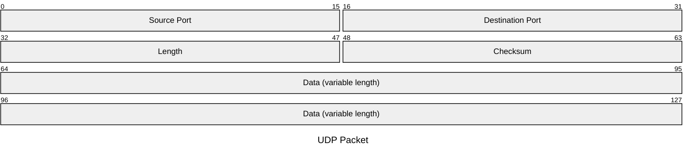

## User Datagram Protocol
---
>[!info] UDP
>Il protocollo **UDP** [RFC 768](https://www.rfc-editor.org/rfc/rfc768.html)\[RFC768\] è un protocollo di *livello transport* di tipo "*connectionless*".
>>[!quote] Cioè
>>Ogni messaggio è **indipendente** da tutti gli altri.
>
>Il pacchetto **UDP** viene chiamato ***datagramma*** (*Datagram*).

Protocollo pensato per invio di ***blocchi di dati di limitate dimensioni*** e per comunicazione fra applicazioni che **non** *richiedono un controllo della qualità del trasporto*.
- [[Posta Elettronica]], [[DNS]], ...

Solitamente usato in *reti ad alta affidabilità*.

>[!done] Pro

- **Non** è richiesto alcun tipo di connessione per inviare i dati.
- **Efficiente** in termini di **spazio**.
- Protocollo *molto leggero*.

>[!fail] Contro

- Può verificarsi la **consegna fuori sequenza** dei *datagrams*.
- **Non** assicura la **consegna** del *datagram*.
### Pacchetto UDP

> Campi del *datagram*
- **Length**, indica la lunghezza in `byte` dell'intera unità informativa.
- **Checksum**, (opzionale) codice di controllo per [[Controllo dell'Errore|rilevare errori]].
