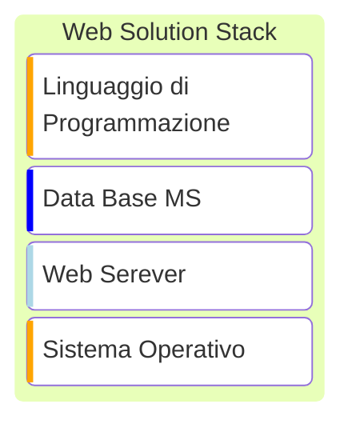

>[!question] Che cos'è il Web?

>[!definizione] Definizione da Wikipedia
>"The `World Wide Web` is an information space where *documents* and other *web resources* are identified by [[URL|Uniform Resource Locators]], interlinked by ***hypertext*** links, and can be accessed via the Internet".

Gli ***hypertext links*** sono documenti dotati di link che permettono di accendere ad *altri documenti collegati*.

La prima definizione di `WWW` era contenuta nella ***prima pagina web***, pubblicata il 6 agosto 1991.
- [The World Wide Web project](https://info.cern.ch/hypertext/WWW/TheProject.html)

## Tecnologie
---
> Sono 3 le tecnologie fondamentali che sono alla base del funzionamento del Web.

### Principi Architetturali
>[!attention] Formato

La disponibilità di applicazioni (*browser*) sul computer ricevente e la corretta identificazione del ***formato*** dati con cui la risorsa è stata comunicata permette di *accedere al suo contenuto* in maniera non ambigua.

>[!tldr] Identificazione

Il `WWW` è uno spazio informativo in cui ogni elemento di interesse è chiamato **risorsa** ed è identificato da un ***identificatore globale*** chiamato `URI`.

>[!abstract] Interazione

Un protocollo di comunicazione chiamato [[HTTP]] permette di ***scambiare messaggi*** su una rete informatica.

#### HTML
>[!tip] `HTML`
>***HyperText Markup Language***
>- Linguaggio di markup per il *formato delle pagine*.

***HTML*** è un *linguaggio di markup* progettato per dare formato a documenti con **struttura ipertestuale**.
- Il contenuto del documento è inframezzato da elementi di markup chiamati ***tag*** che ne definiscono la *struttura e semantica*.
- I *tag* sono stringhe contenute tra ***<*** e ***>***

```html title:example
<html>
<title>Title</title>
<body>
	<h1>Sub Title</h1>
	<p>text</p>
</body>
```

##### CSS
> Gli aspetti presentazionali della pagina sono gestiti attraverso un linguaggio specifico che ne definisce gli stili

>[!abstract] Cascading Style Sheets

Consente di mantenere separata la presentazione (`CSS`) e il contenuto (`HTML`)
```css title:example
.body {
  color: maroon;
  margin-left: 40px;
}
```

#### URI

>[!help] `URI`
>***Uniform Resource Identifier***
>- Per l'*identificazione* delle risorse.

Sono una sintassi nota usata in `www` per definire i nomi e indirizzi di oggetti (*risorse*) su **internet**.
- Risolvono il problema di creare un ***meccanismo di accesso unificato*** alle risorse.

Gli uri sono definiti come:
- [[URL]]: Sintassi che contiene informazioni immediatamente utilizzabili per accedere alla risorsa (es. *Indirizzo di rete*).
- ***URN***: *Uniform Resource Name*, una sintassi che permetta una etichettatura permanente e non ripudiabile della risorsa.


>[!summary] Risorsa
>Una ***risorsa*** è qualunque struttura che sia oggetto di scambio tra applicazioni all'interno del `web`.
#### HTTP
>[!abstract] [[HTTP]]
>***HyperText Transfer Protocol***
>- Per l'*interazione* tra client e server sopra a [[TCP]].

Il `web` si basa su un protocollo internet di [[Protocolli Applicativi|livello applicativo]] basato sul modello *client* e *server*.
- Il client (*browser*)  è un **visualizzatore di documenti ipertestuali**.
	- Inizia l'interazione.
	- I browser hanno anche ***plug-in*** che permettono di visualizzare ogni tipo di formato speciale e un linguaggio di programmazione `{js icon} javascript` interno.
- Il *server* è una applicazione in grado di rispondere a ***richieste di risorse locali***.

> Pull
- Il client attira (`PULL`) i contenuti richiesti.

> Push
- In certi casi si vuole prediligere l'immediata disponibilità dell'informazione
- Il server spinge (`PUSH`) i contenuti (Funzionamento di sistemi di ***instant messaging***)

##### Javascript
>[!info] Linguaggio
> `{js icon} javascript` è un linguaggio di scripting *orientato* agli ***oggetti*** e agli ***eventi***, utilizzato nella programmazione `web` lato client.

È un linguaggio ***interpretato debolmente tipizzato***, debolmente orientato agli oggetti.
- È possibile usarlo anche *lato server*.

###### AJAX
>[!definizione]
>***Asynchronus JavaScript and XML***, è un gruppo di tecnologie usate per la realizzazione di applicazioni `web` client-side e server-side ***fortemente interattive***.

Si basa su uno scambio di dati in background fra client e server.
- Consente l'aggiornamento dinamico di una pagina `web` senza esplicito ricaricamento da parte dell'utente.
## Evoluzione
---
> L'architettura del `web` è basata sulla struttura originaria.

Nel tempo si è arricchita per fornire:
- ***Servizi avanzati*** agli utenti e ***strumenti efficaci*** per gli sviluppatori.

L'evoluzione ha riguardato numerosi aspetti come:
- ***Complessità*** dei Contenuti
- ***Dinamicità*** dei Contenuti
- ***Sicurezza*** delle Transazioni
- ***Distribuzione*** dei Servizi
- ***Espressività*** dei Linguaggi

## Sviluppo
---
### Web Solution Stack
>[!info]
>Un ***solution stack*** è un insieme di componenti o sottosistemi software che sono necessari per creare una *piattaforma completa* in modo che nessun software aggiuntivo sia **indispensabile** allo *sviluppo di applicazioni*.

Per lo sviluppo `web` un solution stack è costituito da $4$ elementi:


##### Alcuni Esempi
>[!tldr] LAMP
>Uno dei solution stack più noti.
>- `Linux`
>- `Apache`
>- `{sql icon} MySql`
>- `{Php icon} PHP`, `{py icon} Python`, `{perl icon} perl`

Lo stack è completamente ***open source***.

>[!help] WAMP
>Come `LAMP` ma con windows al posto di Linux.

###### PHP
>[!todo] `PHP`
>È un ***linguaggio di scripting interpretato***, concepito per la programmazione di pagine `web` *dinamiche* lato server.

L'interprete è un software libero distribuito sotto la `PHP` licence.
