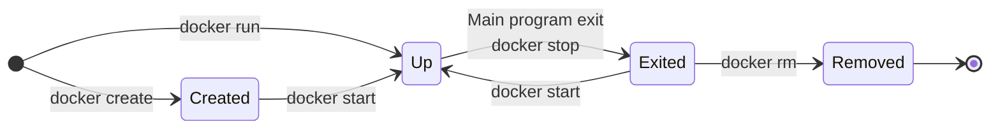

![[DockerArchitecture.png]]


### Stati di un Container


```sh
docker ps
# CONTAINER ID  | IMAGE | COMMAND | CREATED | STATUS | PORTS | NAMES
```
Lo status se è exit, mostra l'exit code del container, che molto spesso corrisponde all'[[Exit Status|Exit Code]] del processo principale.