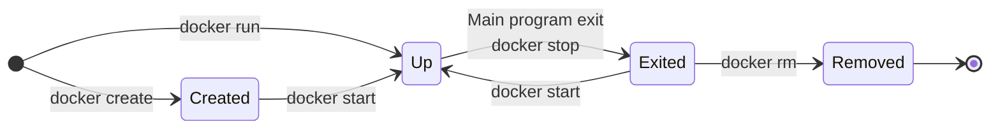

## Architettura
---
>[!abstract] Architettura di Docker
>`{dockerfile icon} Docker` utilizza una ***architettura client- server***.
>Il client parla al **docker** [[Container#^f4ae14|daemon]], che gestisce il building, l'esecuzione e la distribuzione dei [[Container]].

Il client e il daemon di docker comunicano attraverso [[../Scenari di Integrazione#^8d35e7|REST API]] con socket `UNIX` o una network intrerface.

![[../attachements/DockerArchitecture.png]]

>[!failure] Daemon
>Il `{docker icon} Docker` ***daemon*** (`dockerd`) ascolta per richieste `API` e gestisce oggetti come immagini docker, container e network.

Un *daemon* è in grado di comunicare con altri *daemon* per gestire servizi **Docker**.

>[!hint] Client
> Il `{docker icon} Docker` ***client*** (`docker`) è la modalità principale con cui gli utenti docker interagiscono con *docker*.

Quando si eseguono comandi come `{docker icon} docker run` il client invia questi comandi al daemon, che dovrà gestirli.

Un client può comunicare con più di un **daemon**.

>[!example] Registry
>Un `{docker icon} Docker` ***registry*** immagazzina le *immagini docker*.

**Docker Hub** è un registry pubblico che può essere usato da chiunque.
- Docker cerca le immagini su docker hub di *default*.
### Daemon di Docker
>[!failure] Daemon Docker
> In un host linux, in cui è installato docker esistono due servizi di docker che nel loro complesso costituiscono il ***daemon docker***.

> `docker.service`
- Il primo servizio è l'effettivo daemon di docker, effettua le operazioni di gestione dei container come *creazione*, [[File System del Container#Mounts|mount]], terminazione, etc...

> `docker.socket`
- Riceve le richieste `API` e le inoltra al `docker.service`.
- Accetta richieste `API` di docker engine che sono `API HTTP RESTful`.

>[!warning] Attenzione
>Se si termina il servizio `docker.service`, il `docker.socket` rimane attivo e potrebbe risvegliare il servizio docker.

La configurazione del daemon di docker è nel file in formato `{json icon} json`: `/etc/docker/daemon.json`
- [[https://docs.docker.com/reference/cli/dockerd/#daemon-configuration-file]]
### Docker Objects
> Quando si usa docker, vengono create e usate immagini, container, plugin e altri oggetti.

>[!todo] Images
>Un ***immagine*** è un template **read-only** con l'infrastruttura per creare un container.

Spesso le immagini sono basate su altre immagini con in aggiunta delle personalizzazioni.

Puoi creare le **tue immagini** o usare quelle **create dagli altri**.
- Per creare la tua immagine si deve creare un `{docker icon} Dockerfile` attraverso una semplice sintassi per *definire gli step* necessari per **creare** l'immagine e **eseguirla**.

>[!tldr] Containers
>Un ***container*** è un'istanza eseguibile di un'immagine.
>Puoi *creare*, *iniziare*, *fermare*, *spostare* o *eliminare* un container, usando le `API` o attraverso la linea di comando.

È possibile collegare un container a uno o più [[../../Reti/Network Layer/Reti IP|reti]], attaccare uno starage, o creare una nuova immagine basata sullo [[#Stati di un Container|stato]] corrente.
Di default un container è ben isolato da altri container e l'[[../Virtualizzazione|host]].

Un container è definito dalla sua ***immagine*** e da una ***configurazione*** fornita in all'avvio.
- Quando un container è eliminato, un qualsiasi cambiamento che non è salvato in una memoria persistente è persa.
### Esempio
> Analizziamo quello che avviene all'esecuzione del seguente comando:

```docker
docker run -i -t ubuntu /bin/bash
```

Assumendo che si utilizza la configurazione di default:
1. Se non si ha l'immagine `ubuntu` in locale, **docker** la scarica automaticamente dai ***registry*** configurati, come se avessi eseguito `docker pull ubuntu`.
2. Docker crea un nuovo container, come se avessi eseguito `docker container create`.
3. Docker alloca un ***filesystem*** al container. Questo permette al container in esecuzione di *creare* e/o *modificare* files e directories nel filesystem ***locale***.
4. Docker crea un'interfaccia network per connettere il container alla rete. Questo include un assegnamento di un [[../../Reti/Network Layer/Protocollo IP#L'indirizzo IP|indirizzo IP]] al container.
5. Docker fa partire il container ed esegue `/bin/bash`. Poiché il container è eseguito **interattivamente** (`-i`) e **attaccato al terminale** (`-t`), è possibile fornire input da tastiera e l'output verrà visualizzato sul terminale.
6. Quando viene eseguito `exit` per terminare il comando `/bin/bash` il container è fermato ***ma non viene rimosso***.

#### Nome di una Immagine Docker
>[!hint] Nome Completo
>Il nome completo di un'immagine docker è composta da quattro parti:
>`[REGISTRY_HOST]/[NAMESPACE]/REPOSITORY:[TAG]`

> Dove:
- Il ***registry host***, facoltativo, indica l'host del registry, deve avere almeno un punto, come i [[../../Reti/Application Layer/DNS|domain names]] (`docker.io`, `my-registry.com:5000`).
- Il ***namespace***, facoltativo, indica l'utente o l'organizzazione proprietaria dell'immagine.
- La ***repository***, indica il nome logico dell'immagine.
- Il ***tag***, facoltativo, specifica la versione dell'immagine (es. `:latest`, `:1.0`).

Per le immagini sul registry *docker hub*, se nella richiesta:
- Viene omesso il namespace, viene messo di default `library`.
- Viene omesso il tag, viene messo di default `:latest`.
### Stati di un Container
> I container possono assumere diversi stati durante la loro esistenza:



>[!status] Un container può trovarsi in 4 stati:

> ***Created***
- Il container è **creato** ma **non** è in esecuzione.
- Può essere fatto partire o può essere **eliminato**.

> ***Up*** (***running***)
- Il container è in esecuzione
- Può essere **fermato**, diventando *exited*, oppure direttamente essere eliminato.

> ***Exited***
- Il container ha terminato l'esecuzione ma non è stato rimosso dal sistema.
- La terminazione dell'esecuzione restituisce un ***exit status***.
	- Exit status ***del container*** che molto spesso corrisponde all'[[../../Sistemi Operativi/Bash/Exit Status|Exit Code]] del processo principale.
- La terminazione non elimina il container, può essere fatto ripartire, tornando in stato **running**.
- Il riavvio di un container terminato avvia il *processo principale*, il container rimane lo stesso,

> ***Removed***
- Non è un vero stato, il container a questo punto ***non esiste più***.

#### Terminazione dei Container
> La terminazione del container determina un `exit status`

| Exit Code | Significato                                                                                                               |
| --------- | ------------------------------------------------------------------------------------------------------------------------- |
| $0$       | Il processo si è concluso con successo.                                                                                   |
| $125$     | Il processo ha riscontrato un errore interno o un'uscita forzata.                                                         |
| $126$     | Indica che il comando specificato è stato trovato ma non può essere eseguito.                                             |
| $127$     | Indica che il comando non è stato trovato.                                                                                |
| $128$     | Il processo è stato terminato a causa di un errore fatale di docker stesso.                                               |
| $128+N$   | Il processo è stato interrotto da un segnale unix, dove $N$ è il numero del segnale ($130 = 128+2$, dove $2$ è `SIGINT`). |
#### Policy di Restart dei Container
> Il modo con cui docker reagisce alla terminazione di un container è stabilito dalla ***restart policy***.

La restart policy è definita nel momento in cui faccio partire il container.
```docker
docker run -d --restart <policy_name> myImage
```

Se non specificata, si usa la policy di default: `no-restart` che ***non fa ripartire il container***.

> Policy possibili:
- `always`: Il container viene riavviato sempre, a prescindere dal codice di uscita.
- `on-failure`: Il container viene riavviato solo se l'exit code è diverso da $0$ quindi anche se è stato fermato manualmente.
- `unless-stopped`: Il container si riavvia solo se non è stato fermato manualmente.
- `no`: Il container non si riavvia, indipendentemente dal codice di uscita.