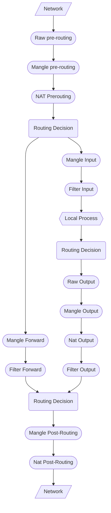

## Container Networking
---
>[!caution] Container Networking
>Con il termine ***container*** [[../../Reti/Network Layer/Reti IP|networking]], si riferisce all'abilità di un container di connettersi e comunicare con altri [[Container]] e altri servizi **non-docker**.

I container hanno il *networking* abilitato di default, e sono in grado di creare connessioni all'esterno.
- Un container ***non ha conoscenza*** su che tipo di rete è connesso o se i suoi [[../../Reti/Introduzione/Comunicazione#Peer to Peer|peer]] sono altri container, vede solo un'interfaccia con un [[../../Reti/Network Layer/Protocollo IP|indirizzo IP]], un **gateway**, una [[../../Reti/Network Layer/Routing/Routing#Tabella di Routing IP|routing table]] e altri dettagli della rete.

### Comandi
> Docker fornisce diversi comandi per la gestione delle reti.

- `{sh icon} docker network create`
	- Usato per creare una rete di docker con opzioni precise.
- `{sh icon} docker network connect`
	- Usato per connettere un container ad una rete esistente.
- `{sh icon} docker network ls`
	- Listing delle reti di docker esistenti
- `{sh icon} docker network rm networkName|networkId`
	- Usato per eliminare una rete (se nessun container è connesso)
- `{sh icon} docker network disconnect`
	- Comando duale del comando connect.
- `{sh icon} docker network inspect`
### User-defined networks
> Può essere utile separare gruppi di container che dovrebbero avere completo accesso tra di loro, ma accesso ristretto ad altri gruppi.

>[!todo] User Networks
>Si possono creare delle ***reti personalizzate***, e connettere *gruppi di container* alla stessa rete.

Una volta connessi ad una rete user-defined, i container possono comunicare con gli altri usando ***indirizzi*** `IP` o ***nomi dei container***.

>[!warning] Importante
>È raccomandato l'utilizzo dell'opzione `--subnet` quando viene creata una rete.
>Se non è specificato, il daemon docker sceglie *automaticamente* una **subnet** per la rete che ***potrebbe sovrapporsi*** con una subnet nella infrastruttura dell'host che *non è gestita da docker*.

Oltre alla subnet (`--subnet=192.168.0.0/16`) è possibile definire:
- Gateway: `--gateway=192.168.0.10`
- Aux address: `--aux-address="my-router=192.168.1.3"`, assegna dei nomi host a degli indirizzi che devono essere visti dai container.

>[!caution] Opzioni

> ***Ip masquerade*** ([[../../Reti/Network Layer/Network Security/Network Address Translation|NAT]]).
- `--ip-masq`.

> ***Host binding ipv4***
- Serve a definire a quale indirizzo ip dell'host deve essere associata una porta esposta da un container sull'host.
- `--ip`.

> ***Internal***
- Quando specificata *impedisce che la rete creata possa comunicare con l'host*.
- Usata per avere una comunicazione privata tra container.
- `--internal`.

>[!abstract] Connessione con un contaner

Per connettere un container ad una ***rete user-defined*** è sufficiente eseguire il comando `{sh icon} docker run` con il parametro [[Docker Cheatsheet#Parametri del comando Run|--network]] indicando il nome della rete appena creata.
- Cosi facendo verrà creata una interfaccia di rete virtuale al container che si affaccia alla rete specificata.
### Drivers
> Il sottosistema di rete di docker è collegabile, utilizzando i **driver**.

Esistono diversi *driver di default* che forniscono funzionalità di rete di base.

| Driver       | Description                                                         |
| :----------- | :------------------------------------------------------------------ |
| [[#Bridge]]  | The default network driver.                                         |
| [[#Host]]    | Remove network isolation between the container and the Docker host. |
| None         | Completely isolate a container from the host and other containers.  |
| [[#Overlay]] | Swarm Overlay networks connect multiple Docker daemons together.    |
| [[#IPVlan]]  | Connect containers to external VLANs.                               |
| [[#MACVlan]] | Containers appear as devices on the host's network.                 |
Il tipo di rete che un container utilizza è indifferente dal punto di vista del container.
- Il container vede: [[../../Reti/Network Layer/Protocollo IP|indirizzo IP]], un **gateway**, una [[../../Reti/Network Layer/Routing/Routing#Tabella di Routing IP|routing table]], i servizi [[../../Reti/Application Layer/DNS|DNS]] e altri servizi.

#### Bridge
> Quando docker engine inizia per la prima volta ha una singola rete chiamata "***default bridge***".

Una rete bridge risiede su un singolo host che esegue una istanza di ***docker engine***.

>[!definizione]
>In termini di docker, una ***rete bridge*** utilizza un bridge software, che permette ai container connessi alla *stessa rete bridge* di comunicare, garantendo un'isolazione dai container che **non** appartengono alla stessa rete bridge.

Il container viene connesso al *default bridge* in automatico quando viene eseguito un container senza l'opzione `--network`
- Container connessi al **default bridge** hanno accesso ai servizi di rete al di fuori dell'host.
- Solitamente usate quando le applicazioni vengono eseguite in container stand-alone che necessitano di una comunicazione tra di loro.

Permettono la **connessione a servizi esterni**.

>[!info]
>Ogni container connesso ad un ***bridge*** è connesso ad una **sottorete** `IPv4`.

> Di default:
- Permette accesso senza restrizioni ai container connessi nella rete dell'host e da altri container connessi allo stesso **bridge**.
- Blocca l'accesso da altri container in reti al di fuori della rete host.
	- Per abilitarlo, è necessario: configurare il kernel per permettere `IP` forwarding e cambiare le policy delle tabelle `IP FORWARD` da `DROP` a `ACCEPT`.
- Supporta la pubblicazione di porte dove il traffico è inoltrato tra i container.

>[!warning]
>Il default bridge è considerato un dettaglio ***legacy*** di *docker*, è consigliato utilizzare una **user-defined network** per utilizzo in [[../../Ingegneria del Software/Ciclo di Vita del Software/Il Ciclo di Vita del Software#Attività|esercizio]]. 
#### Host
>[!info]
>***Rimuove l'isolazione*** di rete tra il container e l'host docker, il container utilizzerà direttamente la rete dell'host.

#### Overlay
>[!info]
>Gli ***overlay network*** connettono diversi [[Docker#Architettura|Docker daemon]] insieme e abilitano servizi di gruppo per comunicare con gli uni gli altri.

Questa strategia rimuove la necessità di fare ***routing*** a livello del [[../../Sistemi Operativi/Teoria/3 - Livelli del Sistema Operativo#Introduzione|sistema operativo]] tra i container.

#### MacVlan
>[!info]
>Le ***macVlan*** permettono di assegnare indirizzi [[../../Reti/Data Link Layer/Struttura del Data Link#Medium Access Control|MAC]] al container, rendendolo un dispositivo fisico nella rete.

Il ***docker daemon*** indirizza il traffico ai container attraverso gli indirizzi `MAC`.
- I driver ***macVlan*** è la miglior scelta quando si parla di applicazioni legacy che si aspettano di essere connessi direttamente alla rete fisica.

### Porte Pubblicate
>[!help]
>Di default un container **non** ha nessuna porta aperta al mondo esterno, per aprirla si deve usare il comando `--publish` o `-p`, con la seguente sintassi:
>- `{sh} -p hostPort:containerPort`

- Questo crea una regola del [[../../Reti/Network Layer/Network Security/Firewall|firewall]] che ***mappa*** una porta del container a una porta dell'host docker.

| Flag Value                            | Description                                                                                                                                               |
| ------------------------------------- | --------------------------------------------------------------------------------------------------------------------------------------------------------- |
| `{sh} -p 8080:80`                     | Map a [[../../Reti/Transport Layer/TCP\|TCP]] port `80` in the container to the port `8080` in the host                                                   |
| `{sh} -p 192.168.10.100:8080:80`      | Map a `TCP` port `80` in the container to port `8080` on the docker host for connections to `IP` `192.168.10.100` of the host.                            |
| `{sh} -p 8080:80/tcp -p 8080:80/udp ` | Maps a `TCP` port `80` in the container to `TCP` port `8080` in the host and map an `UDP` port `80` in the container to the `UDP` port `8080` in the host |

Per vedere tutte le porte definite in un container, esegui il comando:  `{docker icon} docker port containerID`.

### Impostare un indirizzo IP
> Di default, al container è assegnato un indirizzo `IP` per ogni rete docker a cui si connette.

L'indirizzo è assegnato da una ***pool di indirizzi*** assegnata alla rete.

>[!note] DHCP
> Il ***docker daemon*** agisce come un server [[../../Reti/Application Layer/DHCP|DHCP]] per ogni container.
> Ogni rete ha una **subnet mask** e un **gateway** di default.

Quando un container viene inizializzato può essere connesso ad una singola rete usando il flag `--network`.
> Si può:
- Specificare l'indirizzo `IP` assegnato usando i flag `--ip` o `--ip6`
- Specificare l'hostname del container tramite il flag `--hostname`.

>[!done] Aggiunta di altre reti

Per potere aggiungere collegamenti di rete a *container in esecuzione*, si deve usare il comando `docker network connect`.
### DNS
> Di default il container eredita la **configurazione** [[../../Reti/Application Layer/DNS|DNS]] dell'host.

>[!help] Docker DNS
>Il ***DNS embedded*** di docker, oltre a mappare i nomi dei container agli indirizzi `IP`, mappa anche l'indirizzo `IP` del container con il servizio #addLink che il container implementa.

Si possono sovrascrivere queste opzioni di base quando si ***creano i container***.
## Netfilter
---

> Schema di gestione pacchetti di un host all'interno del ***kernel Linux*** da parte di netfilter.

>[!tldr] Idea
>***Ip-tables*** (*comando*) e ***netfilter*** (*insieme di moduli di kernel*) sono una coppia di strumenti forniti dal sistema linux.
>Questa coppia permette di definire una struttura di regole da seguire, definite da ip-tables e gestite da netfilter.

Vengono definiti alcuni ***stati*** in cui si trovano i pacchetti funzione di come arrivano nel sistema e di quali operazioni devono svolgere.

>[!example] Esempio

Quando un pacchetto viene ricevuto da una macchina.
1. Si verifica a chi è indirizzato il pacchetto.
	- In questo momento il pacchetto è in stato di ***prerouting***.